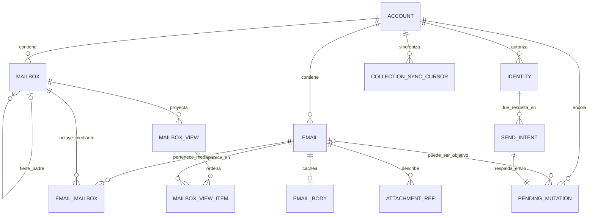

# Modelo de dominio local del cliente

**Estado:** D-01→D-10 implementadas y documentadas; Domain Final Audit #2 aprobado; Domain Freeze completo y Domain cerrado. El diseño de Ports está habilitado.

## 1. Alcance y criterio de modelado

Este documento define el **modelo lógico compartido** del cliente. No es un espejo de SQLite ni de una respuesta JMAP y no modela el servidor, su base de datos, su acceso al proveedor real ni sus interfaces IMAP/SMTP.

Domain es independiente de infraestructura. Sus reglas de ubicación e imports se definen en [layers.md](layers.md); este documento conserva únicamente vocabulario, semántica, relaciones e invariantes. SQLite row IDs, DTOs JMAP, tipos de una librería, comandos Tauri y detalles de serialización quedan fuera.

El modelo sigue la semántica remota de JMAP porque es el único protocolo entre este cliente y el servidor propio. La compatibilidad IMAP existe detrás del servidor y no introduce UIDs, carpetas IMAP ni reglas de traducción en el cliente.

SQLite + SQLCipher es la fuente local de verdad para las lecturas de UI; el servidor JMAP sigue siendo la autoridad remota. Los cambios remotos se normalizan y proyectan localmente. Las acciones del usuario pueden aplicarse optimistamente, pero su cambio local y la `PendingMutation` correspondiente deben persistirse de forma atómica. Una ausencia local nunca autoriza a la UI a consultar la red directamente.

Se usan cuatro marcas de autoridad:

* **`[SERVIDOR → LOCAL]`:** dato emitido por JMAP y normalizado en el modelo local.
* **`[LOCAL → SERVIDOR]`:** dato respaldado por el servidor que el cliente puede cambiar optimistamente.
* **`[SOLO LOCAL]`:** dato operativo durable del cliente que no es una entidad remota.
* **`[DERIVADO]`:** dato reconstruible desde otras fuentes locales autoritativas.

### 1.1 Domain lógico frente a schema físico

Los nombres y las identidades de este documento son semánticos. `src-tauri/src/db/migrations/0001_initial.sql` es una migración física histórica y mínima, no una materialización uno-a-uno del Domain. Sus `INTEGER PRIMARY KEY` son exclusivamente surrogates de persistencia y nunca cruzan al Domain.

Es deliberadamente posible que el Domain requiera conceptos todavía ausentes de `0001`, incluidos `AccountKey`, `ServiceKey`, `Identity`, addresses, `sentAt`, counts y rights de Mailbox, `MailboxView`, `queryState` y un `MutationId` separado. Esos gaps se resolverán mediante evolución futura de persistencia; no se debilita el modelo lógico para hacerlo coincidir con `0001` y no se modifica esa migración.

### 1.2 Frontera con Ports

`ReadRepository` servirá a Application y `SyncPort` a Coordinator/Outbox, pero sus firmas, errores, receipts, DTOs IPC y operaciones concretas se diseñan **después** de implementar y verificar Domain. Este documento solo fija las necesidades semánticas que esos contratos deberán respetar; no diseña sus APIs.

### 1.3 Estado de Application: fuera del modelo durable

Pinia no añade entidades a este modelo. Mantiene únicamente proyecciones y estado efímero: runtime, selección, página visible, load state y Composer en edición.

`LocalReady + RemoteAnonymous` es válido. La selección actual no identifica una Account, el estado de autenticación no forma parte de Account y el Composer no es `SendIntent`. Pinia no conserva DEK ni token. Los diagnósticos de sync y Outbox son proyecciones operativas separadas de `CollectionSyncCursor` y `PendingMutation`; el flujo visible continúa siendo `SQLite → onChange → ReadRepository → Pinia → Vue`.

## 2. Vista de relaciones



La relación `Email`–`Mailbox` es N:M. Un correo JMAP puede pertenecer a varias mailboxes sin duplicarse. `MailboxView` no reemplaza esa relación: conserva una ventana ordenada y parcial de una consulta exacta.

## 3. Entidades proyectadas desde JMAP

### 3.1 Account

`Account` es la representación durable local de una JMAP Account concreta. Es la raíz de pertenencia de mailboxes, identidades, mensajes, cursores y mutaciones incluso durante un arranque offline o después de logout.

**Core D-01**

* `key: AccountKey` — **`[SOLO LOCAL]`**. Identidad estable de la Account dentro de esta instalación y caché.
* `remoteRef: RemoteAccountRef` — binding remoto compuesto exclusivamente por `serviceKey: ServiceKey` + `jmapAccountId: JmapAccountId`.

`name`, `isPersonal`, `isReadOnly`, capabilities y límites remotos no forman parte del core `Account` D-01. Si una iteración futura necesita proyectar esa metadata, deberá modelarla sin redefinir la identidad ni filtrar DTOs JMAP al Domain.

`ServiceKey` es la identidad local de una configuración o servicio JMAP conocido por el cliente. No es hostname, URL, username, token ni un identificador que el servidor deba proporcionar. Cambios de endpoint reconocidos como el mismo servicio no cambian por sí solos `ServiceKey` ni `AccountKey`.

**Invariantes**

* `AccountKey` no es JMAP Account ID, SQLite `accounts.id`, Session URL, `apiUrl`, token, username ni identidad de persona.
* Dos JMAP Account IDs textualmente iguales, vinculados a servicios distintos, no identifican por sí solos la misma Account local.
* `AccountKey` sobrevive restart, logout, token refresh y cambios de endpoint reconocidos bajo el mismo `ServiceKey`.
* `AccountKey` termina con el reset explícito de caché y no se presume estable después de reinstall.
* Ninguna credencial remota, token JMAP ni DEK SQLCipher forma parte de `Account`.
* Todo concepto sincronizable y toda mutación pertenece a una Account; ninguna relación puede cruzar Accounts.
* La Account seleccionada es estado efímero de Application, no identidad durable.

### 3.2 Identidades scoped

Los IDs JMAP de objetos son componentes remotos, no identidades globales del cliente. La identidad lógica completa de cada objeto hijo incorpora su `AccountKey`:

```text
ScopedMailboxId  = AccountKey + JMAP Mailbox ID
ScopedEmailId    = AccountKey + JMAP Email ID
ScopedIdentityId = AccountKey + JMAP Identity ID
ScopedThreadId   = AccountKey + JMAP Thread ID
ScopedBlobId     = AccountKey + JMAP Blob ID
```

Los componentes JMAP son obligatorios para entidades remotas confirmadas. `Email` y `Mailbox` Domain nunca representan objetos provisionales ni aceptan un remote ID nullable. No se usa una unión `string | number` para mezclar una identidad remota, una identidad lógica y una surrogate física.

### 3.3 Identity

JMAP `Identity` representa una identidad que el servidor autoriza para enviar correo. No representa persona, usuario, sesión, Account, token ni credential. Debe poder cachearse para preparar un envío offline; esa copia es la última autorización conocida y JMAP conserva la autoridad remota final.

**Campos mínimos**

* `ScopedIdentityId` — identidad remota account-scoped.
* `name` — **`[SERVIDOR → LOCAL]`**.
* `email` — **`[SERVIDOR → LOCAL]`**.
* `replyTo` — **`[SERVIDOR → LOCAL]`**.
* `bcc` — **`[SERVIDOR → LOCAL]`**.

**Invariantes**

* El cliente no inventa una dirección remitente ni asume que cualquier dirección de la Account puede enviar.
* Una Identity wildcard puede representarse, pero no es seleccionable para Send en el MVP.
* La edición o administración de identities no forma parte del bloque mínimo.
* Signatures quedan fuera del MVP.

### 3.4 Mailbox

`Mailbox` es una entidad remota confirmada y account-scoped que representa un conjunto nombrado de Emails. No es una carpeta física que contiene copias; la pertenencia se expresa aparte mediante `EmailMailbox`.

**Campos mínimos**

* `ScopedMailboxId` — identidad remota account-scoped.
* `name` — **`[SERVIDOR → LOCAL]`**, conocido y no vacío.
* `parent` — **`[SERVIDOR → LOCAL]`**, `ScopedMailboxId` nullable para top-level.
* `role` — **`[SERVIDOR → LOCAL]`**, nullable y extensible.
* `sortOrder` — **`[SERVIDOR → LOCAL]`**.
* `totalEmails` y `unreadEmails` — **`[SERVIDOR → LOCAL]`**.
* `MailboxRights` — **`[SERVIDOR → LOCAL]`**.

`MailboxRights` contiene exactamente el subconjunto funcional del MVP: `mayReadItems`, `mayAddItems`, `mayRemoveItems`, `maySetSeen`, `maySetKeywords` y `maySubmit`. No incorpora otros rights solo porque JMAP los defina.

**Invariantes**

* La jerarquía tiene una sola fuente canónica: `parent`; no existe `children[]` canónico.
* Parent y child pertenecen a la misma Account y la jerarquía es acíclica.
* Dos mailboxes hermanas no pueden compartir simultáneamente el mismo parent y name.
* Los roles desconocidos válidos se preservan; Application puede reconocer roles conocidos sin cerrar el vocabulario Domain.
* Los counts proceden del servidor y nunca se derivan contando la caché local, que puede ser parcial.
* `totalThreads`, `unreadThreads`, `isSubscribed`, `mayCreateChild`, `mayRename` y `mayDelete` quedan fuera del core MVP.
* El cliente MVP no crea, renombra, reparenta ni destruye Mailboxes.
* Mover, archivar o enviar a Trash modifica `EmailMailbox`, no `Mailbox` ni una copia de `Email`.
* Reconocer un role de drafts no introduce drafts locales durables ni sincronizados.

### 3.5 ThreadId: agrupación no materializada

La conversación que entrega JMAP no se materializa como entidad `Thread`. Cada `Email` conserva su `ScopedThreadId` **`[SERVIDOR → LOCAL]`** y una proyección puede agrupar por `AccountKey + JMAP Thread ID`.

**Invariantes**

* El cliente no calcula hilos comparando asuntos o cabeceras.
* `ScopedThreadId` es distinto de `ScopedEmailId` aunque sus componentes remotos tengan el mismo texto.
* El orden y la agrupación de presentación son derivados; no constituyen una segunda autoridad.

### 3.6 EmailAddress y headers de dirección

`EmailAddress` es el value object readonly compartido por las direcciones de correo del Domain. Contiene exactamente `name: string | null` y `email: string`. Conserva el valor inbound sin trim, lowercase, parsing ni validación outbound; incluso una dirección vacía o sintácticamente imperfecta es representable.

En Email, `sender`, `from`, `replyTo`, `to`, `cc` y `bcc` conservan `readonly EmailAddress[] | null`:

* `null` es ausencia conocida o resultado conocido del parsing; nunca significa “todavía no descargado”.
* Si una propiedad no fue solicitada en un DTO JMAP parcial, no se normaliza artificialmente como `null`.
* `from = null` es representable para mensajes excepcionales o anómalos; no se describe como el caso normal.
* `sender = null` es normal cuando no existe un agente de envío distinto del autor.
* En lenguaje de producto, “remitente” normalmente corresponde a From; Sender no se usa como sinónimo informal de From.
* El parsing inbound es tolerante. La validación outbound pertenece a la creación de `SendIntent` y será más estricta.

RFC Message-ID, In-Reply-To y References quedan fuera del core MVP. Una representación física o de transporte puede conocerlos, pero no forman parte del Email mínimo ni identifican un Email Domain.

### 3.7 Email

`Email` es una entidad remota confirmada, account-scoped y una proyección mínima-completa de metadata. Solo existe en Domain cuando todas las propiedades del core se conocen con su semántica final; optionality no representa “unloaded”.

Una respuesta JMAP parcial no es un Email Domain incompleto:

```text
JMAP partial DTO
        ↓
normalization / merge
        ↓
valid Domain Email
```

**Core obligatorio**

* `ScopedEmailId` — identidad del Email confirmado.
* `ScopedBlobId` — identidad account-scoped del blob remoto asociado.
* `ScopedThreadId` — agrupación remota account-scoped.
* `sender`, `from`, `replyTo`, `to`, `cc`, `bcc` — con la semántica de `EmailAddress[] | null` ya definida.
* `subject`, `sentAt`, `receivedAt`, `size`, `preview`, `hasAttachment` — **`[SERVIDOR → LOCAL]`**.
* `KeywordSet` — **`[LOCAL → SERVIDOR]`** cuando cambia optimistamente y **`[SERVIDOR → LOCAL]`** al reconciliar.

`KeywordSet` conserva keywords JMAP conocidos y desconocidos/custom. `$seen`, `$flagged` y otros valores no se duplican como fuentes de verdad booleanas; read/unread y flagged se derivan del set.

`hasAttachment` es metadata derivada por el servidor. No se recalcula desde `AttachmentRef.length`, porque la metadata de attachments local puede estar incompleta.

**Relaciones deliberadamente fuera de Email**

* `EmailMailbox` es la representación canónica de membership; no existe un `Email.mailboxIds` duplicado.
* `EmailBody` es una caché lazy separada y puede estar ausente sin volver incompleto al Email.
* `AttachmentRef` no se almacena como array inline dentro de Email.
* `PendingMutation` y cualquier estado operativo de mutación se proyectan separadamente.
* Composer y `SendIntent` no forman parte de Email.

**Invariantes**

* Un cambio optimista de `KeywordSet` o membership y su `PendingMutation` se persisten conceptualmente en una sola transacción local.
* Ningún DTO JMAP ni partial patch cruza como Email válido antes de normalization/merge.
* Un mismo JMAP Email ID bajo otra Account identifica otro Email.
* Un envío todavía no confirmado existe como `SendIntent` dentro de una `PendingMutation<Send>`; nunca como fake Email, Email temporal o Email con ID nullable.

### 3.8 EmailMailbox

`EmailMailbox` es la proyección canónica de la relación N:M entre Emails y Mailboxes. La propiedad remota `mailboxIds` se normaliza hacia esta relación; no se mantiene una segunda fuente de verdad inline en Email.

**Campos mínimos**

* `ScopedEmailId` — referencia a Email.
* `ScopedMailboxId` — referencia a Mailbox.

La relación es **`[LOCAL → SERVIDOR]`** cuando el usuario mueve, archiva o restaura un correo; fuera de una mutación pendiente es **`[SERVIDOR → LOCAL]`**.

**Invariantes**

* La pareja `(ScopedEmailId, ScopedMailboxId)` es única.
* Email y Mailbox pertenecen a la misma `AccountKey`.
* Añadir o quitar membership localmente exige una `MailboxMembershipMutation` en la misma transacción.
* Cambiar membership no duplica ni cambia la identidad de Email.

### 3.9 D-09 — EmailBody · CLOSED

`EmailBody` es la representación visible completa, ya normalizada y cacheada de un Email remoto confirmado. Es un value object readonly con exactamente:

* `emailId: ScopedEmailId`.
* `text: string | null`.
* `html: string | null`.

Su identidad es `ScopedEmailId`; no existe `BodyId`. La ausencia del objeto significa que el cuerpo completo no está cacheado. Su presencia significa que la normalización terminó y la representación completa quedó cacheada. Dentro de un `EmailBody`, `null` significa que esa representación no existe y `""` que existe completa pero vacía. `text = null` y `html = null` simultáneamente es un resultado completo válido sin representación textual o HTML utilizable por el MVP.

No existen `fetchedAt`, `isComplete`, `isTruncated`, `bodyAvailability`, MIME tree, `bodyValues` ni `sanitizedHtml`. Un resultado JMAP truncado permanece en transporte/normalización y no puede producir un `EmailBody`; la factory Domain no puede demostrar esa precondición a partir de strings. Un problema de decoding best-effort sin truncation no crea un estado parcial durable.

El HTML cacheado es raw y no confiable. Domain lo conserva exactamente; la sanitización en cada render, el sandbox y CSP pertenecen a la frontera Presentation/Security descrita en [security.md](security.md).

### 3.10 D-10 — AttachmentRef · CLOSED

`AttachmentRef` es un value object readonly de metadata, owned por un Email remoto confirmado, para una parte leaf/no-multipart cuyo binario podría obtenerse después. No es el archivo, un MIME part genérico, una operación de descarga ni un DTO JMAP.

**Shape exacta**

* `emailId: ScopedEmailId`.
* `partId: AttachmentPartId`.
* `blobId: ScopedBlobId`.
* `name: string | null`.
* `mediaType: string`.
* `size: number`.
* `disposition: string | null`.
* `cid: string | null`.

`AttachmentPartId` es un string branded, opaco y preservado exactamente. Puede ser `""`, no es un JMAP Id ni es global: solo adquiere scope completo junto con `ScopedEmailId`.

**Identidad e invariantes**

* La identidad es `ScopedEmailId + AttachmentPartId`; `BlobId`, row ID, UUID y `name` no participan.
* Un mismo Blob puede aparecer en varias parts del mismo Email o en Emails distintos; los refs no se deduplican por `blobId`.
* `emailId.accountKey == blobId.accountKey`; no existe un `AccountKey` redundante.
* `name`, `disposition` y `cid` distinguen `null` de `""` y se preservan exactamente.
* `mediaType` es requerido, no vacío y no puede comenzar por `multipart/` sin importar case; Domain no hace normalización MIME completa.
* `size` es un safe integer mayor o igual que cero.
* `disposition` conserva vocabulario abierto; `cid` conserva metadata aunque el renderer CID esté diferido.
* El objeto no contiene bytes, binary cache, filesystem/localPath, download URL/status, timestamps, MIME tree, `bodyValues`, charset, language, location, headers, subparts ni renderer CID.

`Email.hasAttachment` continúa siendo metadata server-derived y no equivale a contar `AttachmentRef`. La disponibilidad de la colección de refs —no cacheada, cacheada vacía o cacheada con elementos— queda diferida al futuro contrato de lectura/persistencia; no añade flags a `AttachmentRef`.

## 4. Intención durable de envío

### 4.1 Composer no es SendIntent

Composer es estado efímero y mutable de Application. Al pulsar Send, Application valida la entrada y resuelve los defaults de la Identity seleccionada antes de construir la intención durable:

```text
Composer
    ↓ validation
resolution of Identity defaults
    ↓
immutable SendIntent
    ↓
PendingMutation<Send>
```

### 4.2 SendIntent

`SendIntent` conserva el snapshot exacto e inmutable que el usuario autorizó:

* `identityId: ScopedIdentityId`; su `AccountKey` se obtiene del ID scoped y no se duplica.
* `from: EmailAddress`, derivado exclusivamente de la `Identity` seleccionada.
* `replyTo`, `to`, `cc` y `bcc` como listas readonly ya resueltas.
* `subject: string`.
* `body: SendBody`, con `text: string` y `html: string | null`.

Reply-To y Bcc defaults se resuelven antes de crear `SendIntent`; Bcc conserva el orden y deduplica únicamente por email exacto durante el merge de user/default. Debe quedar al menos un recipient efectivo. Una Identity wildcard es representable pero no crea un `SendIntent` en el MVP. Outbox no relee la Identity actual para reinterpretar el mensaje. Si la Identity desapareció o ya no autoriza el envío, no se sustituye silenciosamente por otra; la intención falla o requiere una nueva decisión del usuario.

`SendIntent` no contiene `MutationId`, Email ID, EmailSubmission ID, token, SMTP envelope ni attachments outbound. Su validación outbound mínima exige email no vacío, sin CR/LF/NUL y con contenido a ambos lados de `@`; un display name no puede contener CR/LF/NUL. La autoridad de validación final sigue siendo el servidor.

## 5. Proyecciones y estado exclusivo del cliente

### 5.1 MailboxView

`MailboxView` no es una entidad remota. Es la proyección local y descartable de una consulta JMAP ordenada sobre una Mailbox.

**Campos mínimos**

* `spec: MailboxViewSpec`, compuesto por `mailboxId: ScopedMailboxId`, `filter` y `sort`; el Account scope procede de `mailboxId` y no se duplica.
* En el MVP implementado, `filter` representa `all` y `sort` ordena `receivedAt` ascendente o descendente.
* `queryState` — token **`[SERVIDOR → LOCAL]`** de esa consulta exacta.
* `total` — tamaño remoto conocido de la consulta.
* coverage/window — posiciones materializadas localmente.
* ordered `MailboxViewItem` — resultados conocidos dentro de la cobertura.

La identidad semántica es `ScopedMailboxId + canonical FilterSpec + canonical SortSpec`; `ScopedMailboxId` ya incorpora `AccountKey`. Un `viewId`, `filterHash` o `sortHash` puede existir después como optimización interna, pero nunca es autoridad de igualdad: una colisión no vuelve iguales dos specs distintas. La serialización canónica concreta y la estrategia de hashing quedan abiertas.

**Invariantes**

* `queryState` pertenece exclusivamente a esa ViewSpec y no a un collection cursor.
* `total` y coverage son independientes. Una vista puede conocer `total = 12,700` y materializar solo positions `0..99`.
* Local-first no exige descargar toda la Mailbox para tener una vista válida.
* La vista no sustituye `Email` ni `EmailMailbox`; puede reconstruirse sin borrar esos objetos.
* El algoritmo exacto de `Email/queryChanges`, movimiento de posiciones, prefetch y tamaño de ventanas queda para Coordinator.

### 5.2 MailboxViewItem

Representa la posición y el orden de un Email dentro de una snapshot/view concreta. No redefine Email ni EmailMailbox.

**Campos mínimos**

* `ScopedEmailId`.
* `position` dentro de la cobertura conocida.

El item no almacena una referencia redundante a la ViewSpec; pertenece a la colección ordered de una `MailboxView` concreta y debe compartir su Account scope.

La estrategia para desplazar posiciones queda abierta para Coordinator.

### 5.3 CollectionSyncCursor

`CollectionSyncCursor` es el checkpoint durable de una colección JMAP. Su identidad conceptual es `AccountKey + DataType` y conserva un `state` opaco.

**Campos mínimos**

* `AccountKey`.
* `DataType`, al menos para Email, Mailbox e Identity.
* `state` — **`[SERVIDOR → LOCAL]`**, opaco y no interpretable.

**Invariantes**

* La ausencia del cursor significa que esa colección nunca se ha sincronizado localmente; no existe un cursor con `state = null` para representar ese caso.
* Collection state no es entity ID ni `queryState`; `queryState` pertenece a `MailboxView`.
* Status, lastError y timestamps son diagnóstico operacional separado, no identidad ni contenido del checkpoint. Este freeze no inventa su entidad definitiva.
* Remote batch changes y el nuevo collection state se aplican conceptualmente de forma atómica. Si falla la transacción, permanece el state anterior.
* `cannotCalculateChanges` significa que el historial incremental no está disponible y exige refetch/rebase del scope correspondiente, no reset automático completo de DB. El algoritmo queda para Coordinator.
* Los cursors sobreviven restart y logout; terminan con cache reset.
* Un `StateChange` WebSocket solo dispara sincronización; no reemplaza el cursor ni contiene el delta.

### 5.4 PendingMutation

`PendingMutation` es una familia discriminada de intenciones durables locales. El Domain no la reduce a `kind: string + payload: unknown`, aunque una persistencia futura pueda usar un encoding genérico internamente.

**Envelope común**

* `MutationId` — identidad local estable.
* `AccountKey` — scope obligatorio; la identidad lógica completa de la mutación es `AccountKey + MutationId`.
* discriminante de familia.
* status.
* lifecycle/retry metadata cuando corresponda.
* payload semántico específico de la familia.

`MutationId` no es row ID, nunca se reutiliza, sobrevive restart y retries, termina con cache reset y nunca se transforma en Email ID.

**Familias MVP**

1. `SendMutation`: su payload semántico es `SendIntent`; no crea fake Email.
2. `KeywordMutation`: target `ScopedEmailId` y cambio semántico de keywords.
3. `MailboxMembershipMutation`: target `ScopedEmailId` y cambio semántico de membership.

El codec durable, `payload_version` y representación física se deciden después; no alteran esta familia Domain ya discriminada.

**Lifecycle**

Los estados `pending`, `inFlight`, `retrying`, `confirmed` y `failedTerminal` distinguen intención no intentada, request actualmente enviado o outcome remoto incierto, fallo retryable, confirmación/reconciliación y fallo terminal.

**Invariantes**

* La optimistic local projection y la creación de `PendingMutation` se persisten conceptualmente de forma atómica.
* Un cambio durable nunca puede perder su intención durable de sincronización.
* `inFlight`, especialmente para Send, puede significar que el request llegó al servidor pero el cliente aún desconoce el resultado.
* Después de crash no se reintenta ciegamente una `SendMutation` inFlight; Outbox debe reconciliar antes de decidir si otra submission es segura.
* `confirmed` no significa necesariamente “el servidor respondió una vez”; la mutación puede permanecer durable hasta reconciliar la autoridad relevante.
* El payload sensible queda cifrado en reposo por SQLCipher.
* Un fallo de transporte no elimina la mutación ni revierte silenciosamente la intención visible; un fallo terminal sigue siendo visible localmente.
* Reconciliation, idempotencia, backoff, orden y conflictos pertenecen al algoritmo posterior de Outbox/Coordinator y no se diseñan aquí.

## 6. Límites del estado editable

El texto que el usuario está editando existe únicamente en memoria del store de composición. El MVP no tiene entidad o tabla `Draft`, autosave, persistencia durable ni sincronización JMAP `$draft`.

Al pulsar **Enviar**, los datos se validan, se resuelven los defaults de Identity y se congelan en `SendIntent`; luego se crea la `SendMutation` durable. Solo después de confirmar esa persistencia se limpia el Composer. Si falla, los campos permanecen intactos. Cerrar un Composer con contenido exige confirmación; un cierre o crash antes de Send puede perder la redacción y se acepta como limitación explícita del MVP.

## 7. Clasificación y fronteras del Domain

| Categoría | Conceptos |
| --- | --- |
| Entidades remotas durables | `Account`, `Mailbox`, `Email`, `Identity` |
| Values e identidades scoped | `AccountKey`, `ServiceKey`, `RemoteAccountRef`, scoped IDs, `EmailAddress`, `MailboxRole`, `MailboxRights`, `KeywordSet`, `AttachmentPartId` |
| Proyecciones locales | `EmailMailbox`, `MailboxView`, `MailboxViewItem` |
| Estado operativo local durable | `CollectionSyncCursor`, `PendingMutation`, `MutationId`, `SendIntent`, `SendBody` |
| Proyecciones owned/lazy separadas | `EmailBody`, `AttachmentRef` |

Quedan fuera de Domain: Composer, selección y load state de UI, auth projection, token, DEK, secure-store handles, SQLite row IDs, SQL, Tauri IPC, DTOs o librerías JMAP, HTML sanitization/render policy, Coordinator algorithm y Outbox algorithm.

## 8. Implemented Domain map

La implementación D-01→D-10 está materializada en módulos pequeños e independientes de infraestructura:

```text
src/domain/
├── ids.ts
├── account.ts
├── address.ts
├── identity.ts
├── email.ts
├── mailbox.ts
├── mailbox-view.ts
├── sync-cursor.ts
├── pending-mutation.ts
├── email-body.ts
└── attachment-ref.ts
```

La estrategia concreta de generación/encoding durable de IDs y la organización de exports siguen separadas de la semántica ya implementada.

## 9. Ciclos de vida mínimos

### 9.1 Correo recibido

1.  WebSocket informa un `StateChange`.
2.  Coordinator usa el `CollectionSyncCursor` anterior para solicitar el delta y los DTOs JMAP necesarios.
3.  Las respuestas parciales se normalizan o mergean hasta producir Emails completos y scoped.
4.  En una transacción local se aplican `Email`, `EmailMailbox`, las proyecciones afectadas y el nuevo collection state.
5.  `onChange` hace que Pinia vuelva a leer mediante `ReadRepository`; Vue no consume la respuesta JMAP directamente.

### 9.2 Correo abierto

1.  `ReadRepository` devuelve `Email` y, si existe, `EmailBody` desde SQLite.
2.  Si el cuerpo falta, `ensureMessageBody` registra o deduplica el trabajo y su `Promise` resuelve sin convertir la red en dependencia de la UI.
3.  Cuando llega un body completo y normalizado conforme a D-09, el motor lo persiste y notifica el cambio mediante `onChange`; un resultado truncado no produce `EmailBody`.
4.  La UI vuelve a leer y aplica la frontera de seguridad a cualquier HTML raw; nunca lo inserta libremente en el DOM privilegiado.
5.  Marcar como leído actualiza `KeywordSet` y crea su `KeywordMutation` en una transacción independiente del fetch del cuerpo.

### 9.3 Correo enviado

1.  Application valida Composer y resuelve la Identity seleccionada para producir `SendIntent`.
2.  El motor guarda una `SendMutation` cuyo payload es ese snapshot; solo entonces Pinia limpia Composer. Si falla, conserva la redacción.
3.  Outbox traduce la intención a JMAP sin fabricar un Email provisional ni releer defaults de Identity.
4.  Si el resultado remoto queda incierto, `inFlight` permanece durable y Outbox reconcilia antes de cualquier nuevo intento.
5.  El `Email` confirmado aparece únicamente mediante sync autoritativo; la política exacta de reconciliación y cleanup queda para Outbox/Coordinator.

## 10. Límites de persistencia y seguridad

*   El MVP Tauri usa SQLite nativo cifrado con SQLCipher; no usa WASM ni OPFS.
*   Rust genera una DEK aleatoria de 32 bytes y la conserva en el secure store del SO. La DEK no se deriva de WebAuthn PRF, no entra en este modelo y nunca atraviesa IPC.
*   El token JMAP vive solo en memoria del Worker. No se persiste en Pinia, SQLite, `localStorage`, configuración ni logs.
*   La base local puede estar abierta sin sesión remota. Logout/expiración no cierra SQLite; reiniciar offline permite leer la caché.
*   Si se pierde la DEK, la recuperación es un reset explícito de caché y secreto, nueva DEK, nueva base cifrada y full JMAP resync. Terminan `AccountKey`, `MutationId`, cursors y estado exclusivamente local de esa caché; especialmente puede perderse `PendingMutation`, y debe advertirse.
*   No existe fallback a una base en texto plano.
*   Web/PWA está **MOVED TO FUTURE WEB ITERATION**. wa-sqlite/OPFS, cifrado Web, credenciales y multi-tab no se resuelven aquí ni bloquean el MVP Tauri.

## 11. Fuera del bloque mínimo

*   Entidades o lógica del servidor, proveedor real, IMAP o SMTP.
*   Contactos y agenda: no son necesarios para sostener el flujo mínimo; el autocompletado queda fuera hasta que se solicite.
*   Reglas, filtros, calendario, múltiples perfiles de caché y administración de carpetas.
*   Drafts durables o JMAP, binarios/operaciones de adjuntos y render inline CID.
*   RFC Message-ID, In-Reply-To y References dentro del core MVP.
*   La entrega Web/PWA durante el MVP actual; permanece como iteración futura, no descartada.
*   Clasificación de spam y embeddings de búsqueda. Compute-at-the-edge queda únicamente como punto de extensión futuro de Fase 2, apagado por defecto; no altera este modelo.

## 12. Trabajo deliberadamente abierto después de D-01→D-10

D-01→D-10 están implementadas, documentadas y cerradas. Domain Final Audit #2 concluyó `PASS`: el Domain Freeze está completo, Domain queda cerrado y el diseño de `ReadRepository`/`SyncPort` puede comenzar. No son blockers del Domain las decisiones posteriores sobre generación/encoding durable de IDs, error model de Ports, serialización canónica adicional de `FilterSpec`, mutation codec y `payload_version`, IPC DTOs, mapping/schema/migrations posteriores, APIs de `ReadRepository`/`SyncPort`, normalización JMAP, `queryChanges`/`ChangeBatch`/Push, algoritmos de Coordinator/Outbox, flattening concreto de bodies, disponibilidad de la colección de AttachmentRefs, descarga/caché binaria/filesystem, renderer CID/Content-Location, sanitización de Presentation ni cache eviction.

## 13. Nota para el diseño del servidor

La elección de JMAP o IMAP en la conexión entre el servidor y el proveedor real pertenece al adaptador del servidor y no modifica este dominio local. El cliente solo habla JMAP con el servidor propio. La nota se registra para el diseño futuro del servidor, sin introducir aquí entidades, flags ni lógica de traducción.
