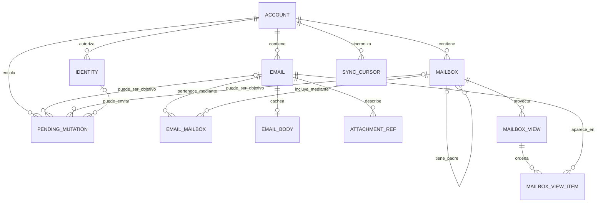

# Modelo de dominio local del cliente

## 1. Alcance y criterio de modelado

Este documento define el modelo que vive en el SQLite local del cliente. No modela el servidor, su base de datos, su acceso al proveedor real ni sus interfaces IMAP/SMTP.

El modelo sigue la semántica de JMAP porque JMAP es el único protocolo entre este cliente y el servidor propio. La compatibilidad IMAP existe detrás del servidor y no introduce UIDs, carpetas IMAP ni reglas de traducción en el cliente.

La fuente de verdad para cada lectura de la interfaz es el SQLite local cifrado con SQLCipher. El servidor sigue siendo la autoridad remota: sus cambios se proyectan en SQLite mediante sincronización, mientras que las acciones del usuario se representan primero de forma local y se sincronizan después. Una ausencia local nunca autoriza a la UI a consultar la red directamente.

Se usan cuatro marcas de autoridad:

*   **`[SERVIDOR → LOCAL]`:** dato emitido por JMAP y proyectado localmente. La UI puede leerlo, pero no editarlo por sí sola.
*   **`[LOCAL → SERVIDOR]`:** dato respaldado por el servidor que el cliente puede cambiar de forma optimista. El cambio local y su `PendingMutation` deben persistirse juntos.
*   **`[SOLO LOCAL]`:** dato operativo del cliente que no se publica como entidad del servidor.
*   **`[DERIVADO]`:** dato reconstruible a partir de otras filas locales.

Los nombres de campos descritos aquí son semánticos. El schema físico inicial adoptado está en `src-tauri/src/db/migrations/0001_initial.sql`, con la justificación en `docs/research/minimal-secure-compatible-initial-sql-schema.md`. Sus ocho tablas son el mínimo durable, no una materialización uno-a-uno de todas las entidades y proyecciones lógicas de este documento: `Identity`, `MailboxView` y `MailboxViewItem`, entre otras, no tienen tabla en `0001`. Todavía no existen migration runner, Local Engine, repositories, queries ni inicialización runtime de la DB. La futura implementación Web deberá conservar este modelo lógico y entrar en la misma suite de conformidad, pero está fuera del MVP actual.

### 1.1 Contratos de acceso al dominio

La antigua frontera genérica Repository queda dividida en dos contratos:

*   **`ReadRepository`:** lo consume exclusivamente Pinia/UI. Expone lecturas locales, registro de mutaciones optimistas y envíos, `ensureFolderWindow`, `ensureMessageBody` y `onChange`.
*   **`SyncPort`:** lo consumen exclusivamente el Coordinador de sincronización y Outbox. Expone cursores, vistas, lotes normalizados y el ciclo durable de `PendingMutation` sin filtrar SQL ni detalles del motor.

Los errores de ambos contratos son tipados: `not_found | conflict | storage_unavailable | encryption_locked | migration_failed`.

`ensureFolderWindow` y `ensureMessageBody` son no bloqueantes respecto de la red: su `Promise` resuelve cuando la solicitud queda registrada o deduplicada. La llegada o actualización de datos se anuncia después mediante `onChange` para que Pinia vuelva a leer.

El entregable de implementación del contrato es un mock en memoria de `ReadRepository` + `SyncPort` y una suite de conformidad reutilizable contra ese mock y Motor Tauri. La futura iteración Web añadirá su motor a la misma suite sin cambiar la semántica congelada.

### 1.2 Estado de Application: fuera del modelo durable

Pinia no añade entidades a este modelo. Mantiene únicamente proyecciones y estado efímero:

* `runtime.local`: `opening | ready | error`.
* `runtime.auth`: `anonymous | authenticating | authenticated | expired`.
* `runtime.connectivity`: `online | offline`.
* `mail`: selección, página visible y `loadState: idle | loading | ready | error`.
* `composer`: campos en edición y `phase: idle | editing | queueing | error`.

`LocalReady + RemoteAnonymous` es válido. El ciclo de apertura SQLCipher no depende del login JMAP; Pinia no conserva DEK ni token. Los estados de sincronización y Outbox se proyectan de `SyncCursor` y `PendingMutation`, y el flujo de actualización es siempre `SQLite → onChange → ReadRepository → Pinia → Vue`.

## 2. Vista de relaciones

La relación `Email`–`Mailbox` es N:M. Un correo JMAP puede pertenecer a varias carpetas sin duplicarse. `MailboxView` no reemplaza esa relación: conserva una ventana ordenada de resultados para responder rápidamente a la vista actual y poder aplicar `Email/queryChanges`.

## 3. Entidades proyectadas desde JMAP

### 3.1 Account

Representa una cuenta JMAP accesible durante la sesión. Es la raíz de pertenencia de mailboxes, identidades, mensajes, cursores y mutaciones.

**Campos mínimos**

*   `accountId` — **`[SERVIDOR → LOCAL]`**. Identificador JMAP estable dentro de la sesión.
*   `name` — **`[SERVIDOR → LOCAL]`**. Nombre presentado por el servidor.
*   `isPersonal` — **`[SERVIDOR → LOCAL]`**, si la sesión JMAP lo suministra.
*   `isReadOnly` — **`[SERVIDOR → LOCAL]`**, si aplica.
*   `capabilities` y límites — **`[SERVIDOR → LOCAL]`**. Se conservan tal cual llegan del servidor, incluido, por ejemplo, el tamaño máximo de adjunto; el cliente no los desarma campo por campo en columnas de dominio.

**Invariantes**

*   Ninguna credencial remota, token JMAP ni DEK SQLCipher forma parte de `Account`.
*   Todo registro sincronizable pertenece a una cuenta para evitar mezclar estados o mutaciones entre cuentas.
*   La selección de cuenta actual es estado efímero de Pinia, no autoridad de dominio.

### 3.2 Identity

Representa una identidad autorizada por JMAP para redactar y enviar.

**Campos mínimos**

*   `identityId` — **`[SERVIDOR → LOCAL]`**.
*   `accountId` — **`[SERVIDOR → LOCAL]`** como pertenencia.
*   `name` — **`[SERVIDOR → LOCAL]`**.
*   `email` — **`[SERVIDOR → LOCAL]`**.
*   `replyTo` — **`[SERVIDOR → LOCAL]`**, conforme al modelo estándar JMAP.

**Invariantes**

*   El cliente no inventa una dirección remitente ni asume que cualquier dirección de la cuenta puede enviar.
*   La edición o administración de identidades no forma parte del bloque mínimo.
*   La firma automática queda fuera del bloque mínimo.

### 3.3 Mailbox

Representa una carpeta JMAP. Su jerarquía es una relación padre–hijo entre mailboxes; la pertenencia de correos se expresa aparte mediante `EmailMailbox`.

**Campos mínimos**

*   `mailboxId` — **`[SERVIDOR → LOCAL]`**.
*   `accountId` — **`[SERVIDOR → LOCAL]`** como pertenencia.
*   `name` — **`[SERVIDOR → LOCAL]`**.
*   `parentId` — **`[SERVIDOR → LOCAL]`**, anulable para una raíz.
*   `role` — **`[SERVIDOR → LOCAL]`**. El bloque mínimo reconoce los roles JMAP estándar Inbox, Drafts, Sent, Trash y Junk cuando el servidor los declare.
*   `sortOrder` — **`[SERVIDOR → LOCAL]`**.
*   `totalEmails` y `unreadEmails` — **`[SERVIDOR → LOCAL]`** como contadores proyectados.
*   `rights` — **`[SERVIDOR → LOCAL]`**. Solo se proyectan cuatro capacidades: ver, marcar leído, mover hacia y mover desde.

**Invariantes**

*   La organización de mailboxes es JMAP, no IMAP.
*   Reconocer el rol `Drafts` permite proyectar una carpeta que el servidor ya exponga; no implica que este cliente cree, autoguarde o sincronice borradores propios en el MVP.
*   Crear, renombrar, mover o borrar carpetas está fuera del flujo mínimo y no se especifica aquí.
*   Mover un mensaje significa cambiar su conjunto de `mailboxIds`; no copiar una fila `Email`.

### 3.4 ThreadId: agrupación no materializada

La conversación que entrega JMAP no se materializa como una entidad o tabla `Thread` separada. Cada `Email` conserva su `threadId` **`[SERVIDOR → LOCAL]`** y `ReadRepository` agrupa por ese campo en la consulta que necesite presentar una conversación.

**Invariantes**

*   El cliente no calcula hilos comparando asuntos o cabeceras.
*   El orden y la agrupación de presentación son derivados de consultas sobre `Email`; no constituyen una nueva autoridad ni una segunda copia durable.

### 3.5 Email

Es la entidad central. Conserva metadatos suficientes para listar, buscar dentro del alcance mínimo ya sincronizado y decidir si el cuerpo debe solicitarse en background.

**Identidad y contenido de solo lectura**

*   `emailId` — **`[SERVIDOR → LOCAL]`**. Identificador JMAP del correo confirmado.
*   `accountId` — **`[SERVIDOR → LOCAL]`** como pertenencia.
*   `threadId` — **`[SERVIDOR → LOCAL]`**.
*   `blobId` — **`[SERVIDOR → LOCAL]`**, cuando JMAP lo suministre.
*   `messageId`, `inReplyTo` y `references` — **`[SERVIDOR → LOCAL]`**.
*   `from`, `sender`, `replyTo`, `to`, `cc` y `bcc` — **`[SERVIDOR → LOCAL]`**.
*   `subject`, `sentAt`, `receivedAt`, `size` y `preview` — **`[SERVIDOR → LOCAL]`**.
*   Indicador de adjuntos — **`[SERVIDOR → LOCAL]`**. El árbol MIME crudo no forma parte de `Email`.

**Campos mutables de forma optimista**

*   `keywords` — **`[LOCAL → SERVIDOR]`**. Incluye, entre otros, el estado de leído o destacado admitido por JMAP.
*   La pertenencia a mailboxes — **`[LOCAL → SERVIDOR]`**, representada por filas `EmailMailbox`.

**Estado operativo local**

*   `bodyAvailability` — **`[DERIVADO]`** de la presencia de `EmailBody`; si se materializa como columna, debe poder reconstruirse.
*   Estado de actualización o error — **`[DERIVADO]`** de una `PendingMutation` cuyo `targetEmailId` coincide y cuyo estado es `inFlight`, `retrying` o `failedTerminal`. `Email` no guarda un campo propio para esta marca.

**Invariantes**

*   Un cambio optimista de `keywords` o mailboxes y la creación de su `PendingMutation` ocurren en una sola transacción local. No puede existir una apariencia de éxito sin intención durable de sincronizar.
*   Los campos de cabecera, remitentes, fechas, cuerpo y estructura MIME nunca se editan sobre un correo recibido.
*   Un `emailId` confirmado no se reutiliza para otra cuenta.
*   Un envío todavía no confirmado se representa únicamente mediante `PendingMutation` y su proyección de Outbox. No se crea un `Email` falso ni un placeholder con ID temporal.

### 3.6 EmailMailbox

Es la tabla de unión que materializa `Email.mailboxIds`.

**Campos mínimos**

*   `emailId` — referencia a `Email`.
*   `mailboxId` — referencia a `Mailbox`.

La relación es **`[LOCAL → SERVIDOR]`** cuando el usuario mueve, archiva o restaura un correo; fuera de una mutación pendiente es una proyección **`[SERVIDOR → LOCAL]`**.

**Invariantes**

*   La pareja `(emailId, mailboxId)` es única.
*   Añadir o quitar pertenencia localmente exige una `PendingMutation` en la misma transacción.
*   La reconciliación posterior no duplica `Email`, aunque cambie su pertenencia a varias carpetas.

### 3.7 EmailBody

Es la caché opcional del contenido descargado bajo demanda. Su ausencia es un estado normal: permite listar mensajes sin descargar cuerpos pesados.

**Campos mínimos**

*   `emailId` — referencia única a `Email`.
*   `text` — **`[SERVIDOR → LOCAL]`**, cuando exista una representación de texto.
*   `html` — **`[SERVIDOR → LOCAL]`** y siempre considerado contenido no confiable.
*   El Cliente JMAP aplana las partes antes de cruzar los contratos Repository y entrega únicamente `{ text, html }`. El árbol MIME crudo nunca se expone a `ReadRepository` ni `SyncPort`.
*   `fetchedAt` — **`[SOLO LOCAL]`**, diagnóstico de disponibilidad, no criterio autónomo de verdad remota.

**Invariantes de seguridad**

*   `html` se persiste en su forma raw no confiable y únicamente dentro de SQLite cifrado. No existe una segunda copia sanitizada.
*   Cada render vuelve a pasar el HTML por DOMPurify con allow-list estricta y lo muestra en un `iframe sandbox` bajo CSP restrictiva.
*   Scripts, forms, handlers, URLs peligrosas y recursos remotos quedan fuera; el HTML de correo no comparte libremente el DOM privilegiado de Application.
*   El adaptador JMAP elige una representación HTML preferida o usa texto plano. No concatena como raw múltiples partes MIME.
*   Cambiar DOMPurify o la política de render no requiere migrar la base.

### 3.8 AttachmentRef

Describe un adjunto o una parte inline sin asumir que su contenido binario ya está descargado.

**Campos mínimos**

*   `emailId` — referencia a `Email`.
*   `partId` y/o `blobId` — **`[SERVIDOR → LOCAL]`**, según la respuesta JMAP.
*   `name`, `mediaType`, `size`, `disposition` y `cid` — **`[SERVIDOR → LOCAL]`** cuando existan.

**Invariantes**

*   Los metadatos pueden vivir en SQLite sin que el binario exista localmente.
*   El MVP persiste solo metadata y puede mostrar nombre, tipo y tamaño. No guarda bytes en SQLite ni en filesystem.
*   Caché binaria, descarga/guardado, subida, envío con adjuntos, render inline por CID, limpieza y cuotas están **OUT OF CURRENT MVP**.
*   `partId`/`blobId` se conservan para habilitar esas operaciones en una iteración posterior sin rediseñar la referencia.
*   Una parte inline no se resuelve ni puede eludir DOMPurify, sandbox o CSP en el MVP.

## 4. Proyecciones y estado exclusivo del cliente

### 4.1 MailboxView

Representa una consulta ordenada y paginada de una carpeta, necesaria para que `listMessagesForView` responda solo con SQLite y `ensureFolderWindow` pueda mantener una ventana en background.

**Campos mínimos**

*   `viewId` — **`[SOLO LOCAL]`**, derivado o asociado de forma estable a la identidad de la vista.
*   `accountId` y `mailboxId` — referencias locales y parte de la identidad.
*   `filterHash` y `sortHash` — **`[SOLO LOCAL]`**. La identidad completa de una vista es `(accountId, mailboxId, hash(filter), hash(sort))`.
*   `queryState` — token **`[SERVIDOR → LOCAL]`** emitido por JMAP para esa consulta.
*   `total` — **`[SERVIDOR → LOCAL]`** cuando la respuesta JMAP lo incluya.
*   Indicador local de cobertura de la ventana — **`[SOLO LOCAL]`**.

Las ventanas se solicitan mediante paginación `position + limit`; ni offset implícito ni cursores de UI alternativos forman parte del contrato.

**Invariantes**

*   Una vista es una proyección descartable; `Email` y `EmailMailbox` conservan los objetos locales.
*   Si JMAP rechaza el `queryState` o la vista diverge, el cliente puede reconstruir esta proyección sin borrar innecesariamente los correos cacheados.
*   Abrir una carpeta primero devuelve la ventana disponible; completar huecos se agenda en background.

### 4.2 MailboxViewItem

Une una vista con un mensaje y conserva su posición estable dentro de la ventana conocida.

**Campos mínimos**

*   `viewId` — referencia a `MailboxView`.
*   `emailId` — referencia a `Email`.
*   `position` — **`[DERIVADO]`** de la consulta JMAP aplicada localmente.

La clave y la estrategia para desplazar posiciones al aplicar `Email/queryChanges` quedan **OPEN para la implementación del Coordinador en Fase 2**. No bloquean Gate 0.

### 4.3 SyncCursor

Conserva los tokens necesarios para pedir únicamente cambios incrementales.

**Campos mínimos**

*   `accountId` — ámbito del cursor.
*   `dataType` — **`[SOLO LOCAL]`**; distingue al menos los estados requeridos para Mailbox, Email y vistas de consulta.
*   `state` o `queryState` — **`[SERVIDOR → LOCAL]`**.
*   `lastSuccessfulSyncAt` — **`[SOLO LOCAL]`**.
*   `status` — **`[SOLO LOCAL]`** con valores `idle | syncing | error`.
*   `lastError` — **`[SOLO LOCAL]`**, presente cuando `status = error`, con valores `network | auth | serverError | stateInvalid`.

**Invariantes**

*   Un cursor avanza en la misma transacción que aplica completamente los cambios que representa.
*   Si la transacción falla, el cursor anterior se conserva y el lote puede repetirse.
*   Un evento WebSocket `StateChange` es una señal para sincronizar, no un sustituto del cursor ni el contenido del cambio.

### 4.4 PendingMutation

Representa una intención durable creada por el cliente que aún no ha sido confirmada por JMAP. Es la base del Outbox y de las actualizaciones optimistas.

**Campos mínimos**

*   `mutationId` — **`[SOLO LOCAL]`**, único y estable durante todos los reintentos.
*   `accountId` — ámbito obligatorio.
*   `kind` — **`[SOLO LOCAL]`**. El bloque mínimo necesita como mínimo envío, cambio de keywords y cambio de pertenencia a mailboxes.
*   `targetEmailId` — **`[SOLO LOCAL]`**, cuando la mutación actúa sobre un correo ya confirmado.
*   `payload` — **`[SOLO LOCAL]`**. Contiene solo los datos necesarios para traducir la intención a JMAP.
*   `status` — **`[SOLO LOCAL]`**. Su ciclo válido es `pending → inFlight → (confirmed | retrying → inFlight | failedTerminal)`.
*   `attemptCount`, `nextAttemptAt` y `lastError` — **`[SOLO LOCAL]`**, usados por los reintentos y el diagnóstico durable.
*   `createdAt` y `updatedAt` — **`[SOLO LOCAL]`**.

**Contenido mínimo de una intención de envío**

*   Identidad remitente seleccionada.
*   Destinatarios, asunto y representaciones de cuerpo necesarias.
*   Un identificador local estable que permita correlacionar reintentos y la posterior confirmación.

El compositor del MVP no admite adjuntos. Cuando esa capacidad se diseñe, reutilizará `AttachmentRef` sin alterar el alcance actual de `PendingMutation` de envío.

**Invariantes**

*   Todo el payload queda cifrado en reposo por SQLCipher porque puede contener el correo completo.
*   El procesador toma una mutación de forma exclusiva para impedir dos envíos simultáneos dentro de una misma entrega.
*   Un fallo de transporte no elimina la mutación ni revierte silenciosamente la intención visible.
*   Un fallo terminal queda visible para la UI mediante datos locales; no se oculta como éxito.
*   `confirmed` no se elimina al recibir la respuesta JMAP. Permanece hasta la siguiente sincronización exitosa y solo entonces se limpia.
*   La estrategia de idempotencia que evita duplicar un envío después de una respuesta perdida queda **OPEN para la implementación posterior de Outbox/Coordinator**. No bloquea Gate 0-D, pero sí la aceptación del flujo de envío de producción.
*   La política de conflicto para cambios concurrentes de keywords o mailboxes —rebase, reversión o intervención del usuario— queda **OPEN para la implementación de Outbox en Fase 2**. No bloquea Gate 0; la siguiente sincronización siempre vuelve a obtener la autoridad del servidor.

## 5. Redacción antes de pulsar Enviar

El texto que el usuario está editando existe únicamente en memoria del store de composición. El MVP no tiene entidad o tabla `Draft`, autosave, persistencia durable ni sincronización JMAP `$draft`.

Al pulsar **Enviar**, el contenido necesario se convierte en una `PendingMutation` durable. Solo después de que `ReadRepository` confirme esa persistencia se limpia el compositor. Si la operación falla, los campos permanecen intactos. Cerrar un compositor con contenido exige confirmación; un cierre o crash antes de Enviar puede perder la redacción y se acepta como limitación explícita del MVP.

## 6. Ciclos de vida mínimos

### 6.1 Correo recibido

1.  WebSocket informa un `StateChange`.
2.  El coordinador usa el `SyncCursor` anterior para solicitar `Email/changes` y los `Email/get` necesarios por HTTPS.
3.  En una transacción local se insertan o actualizan `Email`, `EmailMailbox` y las vistas afectadas; los hilos se derivan después agrupando por `Email.threadId`.
4.  Solo al finalizar se avanza el cursor y se emite una señal de cambio local.
5.  `onChange` hace que Pinia vuelva a leer mediante `ReadRepository`; Vue no consume la respuesta JMAP directamente.

### 6.2 Correo abierto

1.  `ReadRepository` devuelve `Email` y, si existe, `EmailBody` desde SQLite.
2.  Si el cuerpo falta, `ensureMessageBody` registra o deduplica el trabajo y su `Promise` resuelve sin convertir la red en dependencia de la UI.
3.  Cuando JMAP devuelve el cuerpo ya aplanado como `{ text, html }`, `SyncPort` hace que el motor lo persista y notifique el cambio mediante `onChange`.
4.  La UI vuelve a leer, sanitiza `html` con DOMPurify y lo renderiza en un contexto sandbox bajo CSP; nunca lo inserta libremente en el DOM privilegiado.
5.  Marcar como leído actualiza `keywords` y crea su `PendingMutation` en una transacción local independiente del fetch del cuerpo.

### 6.3 Correo enviado

1.  Pinia entrega la intención sin adjuntos a `ReadRepository` y entra en `queueing`.
2.  El motor guarda la `PendingMutation` de envío cifrada; solo entonces Pinia limpia el compositor. Si falla, conserva la redacción.
3.  El procesador de pendientes usa `SyncPort` y traduce la intención a las operaciones estándar de JMAP para crear y enviar el correo.
4.  La confirmación lleva la mutación a `confirmed`; la siguiente sincronización exitosa incorpora el `Email` autoritativo y limpia la mutación confirmada.
5.  Sin red, la mutación permanece durable y la UI muestra su estado desde SQLite.

## 7. Límites de persistencia y seguridad

*   El MVP Tauri usa SQLite nativo cifrado con SQLCipher; no usa WASM ni OPFS.
*   Rust genera una DEK aleatoria de 32 bytes y la conserva en el secure store del SO. La DEK no se deriva de WebAuthn PRF, no entra en este modelo y nunca atraviesa IPC.
*   El token JMAP vive solo en memoria del Worker. No se persiste en Pinia, SQLite, `localStorage`, configuración ni logs.
*   La base local puede estar abierta sin sesión remota. Logout/expiración no cierra SQLite; reiniciar offline permite leer la caché.
*   Si se pierde la DEK, la recuperación es un reset explícito de caché y secreto, nueva DEK, nueva base cifrada y full JMAP resync. Puede perderse estado exclusivamente local, especialmente `PendingMutation`, y debe advertirse.
*   No existe fallback a una base en texto plano.
*   Web/PWA está **MOVED TO FUTURE WEB ITERATION**. wa-sqlite/OPFS, cifrado Web, credenciales y multi-tab no se resuelven aquí ni bloquean el MVP Tauri.

## 8. Fuera del bloque mínimo

*   Entidades o lógica del servidor, proveedor real, IMAP o SMTP.
*   Contactos y agenda: no son necesarios para sostener el flujo mínimo; el autocompletado queda fuera hasta que se solicite.
*   Reglas, filtros, calendario, múltiples perfiles de caché y administración de carpetas.
*   Drafts durables o JMAP, binarios/operaciones de adjuntos y render inline CID.
*   La entrega Web/PWA durante el MVP actual; permanece como iteración futura, no descartada.
*   Clasificación de spam y embeddings de búsqueda. Compute-at-the-edge queda únicamente como punto de extensión futuro de Fase 2, apagado por defecto; no altera este modelo.

## 9. Nota para el diseño del servidor

La elección de JMAP o IMAP en la conexión entre el servidor y el proveedor real pertenece al adaptador del servidor y no modifica este dominio local. El cliente solo habla JMAP con el servidor propio. La nota se registra para el diseño futuro del servidor, sin introducir aquí entidades, flags ni lógica de traducción.
