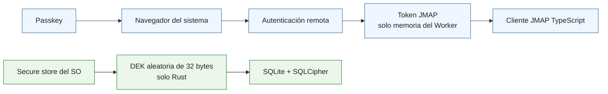
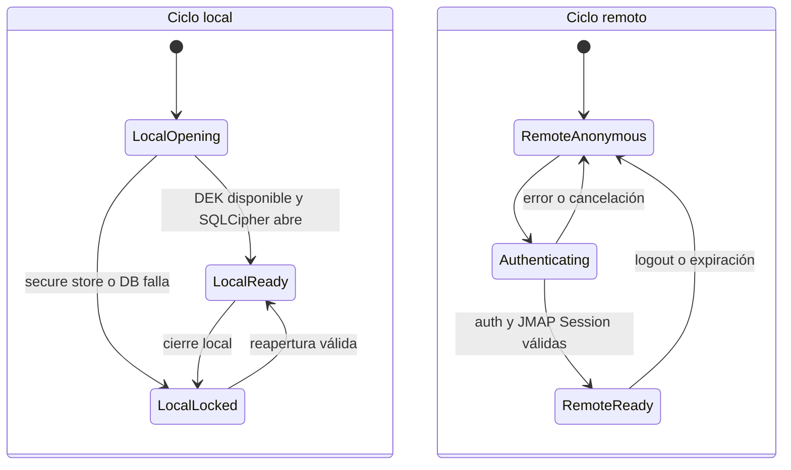

# Security — modelo de amenazas y capas de defensa del cliente

## Estado de decisión

**Gate 0-C está cerrado para el MVP Tauri.** SECURE-BOOTSTRAP-01 implementa la custodia nativa de la DEK, el bootstrap SQLCipher crash-safe, la distinción entre pérdida y falta temporal de acceso, el lock entre procesos y el core de reset autorizado. El detalle operativo canónico está en [secure-local-cache.md](secure-local-cache.md).

La decisión provisional `Passkey → PRF → SQLCipher` queda sustituida para el MVP por dos mecanismos independientes:



El Passkey autentica a la persona ante el servidor. La DEK protege el archivo SQLite local. Ninguno depende del otro para funcionar.

## Modelo de amenazas del MVP

1. **HTML activo o malicioso** dentro de un correo, intentando ejecutar código, interferir con Application, rastrear al usuario o iniciar navegación no controlada.
2. **Robo o pérdida del dispositivo**, con copia de la caché SQLite.
3. **Phishing o robo de sesión remota**.
4. **Escalación mediante IPC de Tauri** si el webview llega a comprometerse.
5. **Actualizaciones falsas o no firmadas**.
6. **Ejecución de desarrollo con identidad Production**, que podría abrir por accidente la caché y credencial reales.
7. **Pruebas que reutilicen namespaces Development o Production** y alteren secretos durables.

No se promete protección frente a un sistema operativo ya comprometido ni frente al acceso físico a un proceso ya desbloqueado.

## Ciclos local y remoto independientes

La vida de la base local y la vida de la sesión JMAP no forman una única máquina de estados:



`LocalReady + RemoteAnonymous` es deliberadamente válido. La aplicación puede arrancar sin red, abrir la base y mostrar correo cacheado. El logout o la expiración remota detienen JMAP pero no cierran SQLite. Un error local tampoco se presenta como error de red.

Pinia proyecta este ciclo sin custodiar secretos: `runtime.local = opening | ready | error`, `runtime.auth = anonymous | authenticating | authenticated | expired` y `runtime.connectivity = online | offline`. `LocalLocked` se expone como error local tipado, por ejemplo `encryption_locked`; `RemoteReady` se proyecta como `authenticated`, y una expiración vuelve a estado remoto anónimo conservando la causa `expired` para la UI.

## Capas de defensa obligatorias

### 1. Frontera Tauri default-deny

Tauri v2 parte de cero capacidades y habilita únicamente comandos Rust explícitos, mínimos y validados por ventana. El **Isolation Pattern** intercepta el puente IPC antes de alcanzar el núcleo nativo.

La ubicación y dirección de esta frontera se rige por [layers.md](layers.md): los adaptadores TypeScript concentran el IPC, SQLCipher/DEK permanecen en Rust y el networking JMAP no cruza el Local Engine. ADR-008/ADR-009 sitúan IMAP/SMTP en una capa Rust separada del Local Engine y sin traducción a JMAP. Su MVP plaintext falla cerrado salvo que la resolución completa del destino sea loopback.

Reglas:

* No se expone shell genérico, filesystem genérico, SQL arbitrario ni acceso libre al secure store.
* Los adaptadores Tauri del webview solo invocan operaciones semánticas de `ReadRepository`/`SyncPort` necesarias para persistencia.
* SQLCipher, la DEK y el secure store existen únicamente en Rust.
* La DEK nunca se serializa ni atraviesa IPC hacia TypeScript.
* Production y Development usan identificadores Tauri, roots y credenciales distintos. El runtime rechaza identidad Production bajo `tauri dev` o `debug_assertions` antes de cualquier side effect de caché.
* Los smokes nativos usan servicios aleatorios `*.test.<RUN_ID>.local-cache`; ninguna entrada de test puede seleccionarse desde IPC o Application.
* Cliente JMAP, Coordinador y Outbox siguen en el Worker TypeScript y usan `fetch`/WebSocket directo; Rust no retransmite ni custodia la sesión JMAP.
* Frontera remota (ADR-008/ADR-009): Coordinator/Outbox nunca reciben secretos ni tipos concretos de protocolo. IMAP/SMTP mantiene credenciales solo en memoria Rust, no las devuelve por IPC ni las persiste. Sin TLS solo se permite contra destinos cuya resolución completa sea loopback; TLS externo sigue diferido.

### 2. Renderizado de HTML en defensa en profundidad

Solo se persiste el HTML JMAP original, cifrado dentro de SQLCipher. No se guarda una segunda copia sanitizada.

```text
HTML raw no confiable
        ↓
SQLite cifrado
        ↓
DOMPurify con allow-list estricta, en cada render
        ↓
iframe sandbox sin permisos peligrosos
        ↓
CSP restrictiva
```

La política mínima elimina scripts, forms, handlers de eventos, `iframe`/`object`/`embed`, SVG/MathML, etiquetas `style`, atributos `style`, URLs `javascript:` y recursos remotos de imagen o media. Los enlaces `http`/`https` se abren solo mediante código controlado y nunca navegan el webview principal.

El cuerpo del correo no comparte libremente el DOM privilegiado de Application. No se concatena HTML crudo de múltiples partes: el adaptador JMAP elige una única representación HTML preferida o cae a texto plano. Actualizar DOMPurify o endurecer la política se aplica al siguiente render sin migrar datos.

### 3. Autenticación remota con Passkeys

El login usa Passkeys/WebAuthn en el **navegador del sistema**, no dentro del webview embebido. La aplicación recibe únicamente el resultado de sesión que defina el protocolo de autenticación del servidor; no recibe una private key ni un resultado PRF.

La extensión PRF no participa en el desbloqueo de SQLCipher del MVP. Un eventual uso de PRF queda diferido y no puede reintroducirse como dependencia del cliente Tauri sin una nueva decisión explícita.

El mecanismo exacto de callback navegador→aplicación queda **OPEN como contrato de integración con el sistema de autenticación**. Debe cerrarse antes del E2E de login y probar callback válido, cancelado, repetido, inválido y expirado. No se asume OAuth ni se diseña aquí lógica del servidor; este detalle no reabre la frontera ya cerrada de 0-C.

### 4. Token JMAP solo en memoria

El token de acceso o sesión JMAP vive únicamente en memoria del Worker TypeScript. Está prohibido persistirlo en Pinia, SQLite, `localStorage`, archivos de configuración o logs. El Worker lo recibe al inicializar la sesión y no lo devuelve.

Logout y expiración eliminan la referencia en memoria y detienen nuevas llamadas JMAP. Cerrar la aplicación descarta el token; al relanzarla se requiere autenticación remota de nuevo, mientras la caché local continúa disponible.

**Hallazgo abierto — CSP (CSP-01):** la CSP del webview (`src-tauri/tauri.conf.json`, heredada sin cambios por los perfiles `dev`/`demo1`/`demo2`) fija `connect-src 'self' ipc: http://ipc.localhost`, sin ningún origen `https:`/`wss:`. Mientras esto no cambie, el propio navegador bloquea cualquier `fetch`/`WebSocket` del Worker hacia un servidor JMAP externo — el `JamClientAdapter` real fallaría por CSP, no por un defecto de código. No se resuelve aquí porque el origen exacto depende del deployment JMAP elegido; hay que añadirlo explícitamente por perfil, nunca con un wildcard, antes de la primera prueba contra ese origen (ver roadmap CSP-01). Servidor-Boxplot es solo el harness IMAP/SMTP local de pruebas y no define este origen productivo.

### 5. Cifrado local con DEK aleatoria y SQLCipher

En el primer provisioning, Rust genera una DEK criptográficamente aleatoria de 32 bytes. La guarda mediante el secure store del sistema operativo y la aplica a SQLCipher antes de cualquier acceso a la base.

La baseline nativa conserva `rusqlite 0.40.2` y selecciona `bundled-sqlcipher-vendored-openssl` mediante el patch local y auditable de `libsqlite3-sys 0.38.2`. Linux usa source SQLCipher `4.17.0 community`/SQLite `3.53.3` y OpenSSL vendored, con identidad runtime exacta fail-closed; no descubre SQLCipher/OpenSSL del host ni admite SQLite plaintext. La aceptación Windows/MSVC del mismo source pin permanece pendiente en host Windows real.

Invariantes:

* La misma DEK reabre la misma base tras reiniciar.
* Una clave distinta no abre la base.
* Si el secure store no está disponible, el motor falla cerrado con `encryption_locked` o su error tipado equivalente.
* No existe fallback a SQLite en texto plano.
* La verificación de implementación debe cubrir que SQLCipher está activo, que la clave incorrecta falla y que la integridad criptográfica de la base es válida.

Esta estrategia protege una caché copiada en reposo. No implementa por sí sola un segundo factor de “app lock” contra una sesión de sistema operativo ya abierta.

### 6. Recuperación de la caché local

La caché cifrada se considera reconstruible desde la autoridad JMAP. Si se pierde la DEK o la entrada del secure store, no se intenta adivinar la clave ni degradar el cifrado:

```text
DB local inaccesible
        ↓
advertencia y aprobación explícita
        ↓
reset de caché local y secreto
        ↓
nueva DEK + nueva DB cifrada
        ↓
autenticación remota + full JMAP resync
```

El reset puede destruir estado exclusivamente local, especialmente `PendingMutation` todavía no confirmadas. La UI debe advertirlo antes de ejecutar la recuperación. La recuperación de la cuenta o del Passkey es un problema distinto del servidor de autenticación y queda fuera del diseño de este cliente.

### 7. Actualizaciones firmadas

La distribución Tauri usa su mecanismo de actualización con verificación de firma. No se aceptan binarios de actualización fuera del canal autorizado.

## Web/PWA diferida

La futura entrega Web/PWA deberá resolver por separado OPFS, wa-sqlite, cifrado en navegador, custodia de credenciales, multi-tab y `SharedWorker`. Esos puntos están **MOVED TO FUTURE WEB ITERATION**: no se consideran resueltos y no bloquean Gate 0-C ni el MVP Tauri.

## Criterios de verificación de 0-C durante implementación

* Inicio offline con base existente: correo cacheado legible sin sesión remota.
* Token expirado o logout: SQLite sigue legible y JMAP se detiene.
* Fallo de secure store o clave incorrecta: error local cerrado, sin iniciar sincronización.
* Búsqueda de un token canario tras cerrar: cero ocurrencias en DB, Pinia, configuración y logs.
* Comandos y capabilities revisados en default-deny; sin shell/filesystem genéricos.
* HTML hostil no ejecuta scripts, no envía forms y no provoca requests remotos.

## Qué no cubre este documento

* Compromiso del sistema operativo subyacente.
* Acceso físico a un dispositivo y proceso ya desbloqueados.
* Recuperación de cuenta/passkey del servidor de autenticación.
* Seguridad del servidor, VPS, IMAP o SMTP.
* Diseño de la futura entrega Web/PWA.
