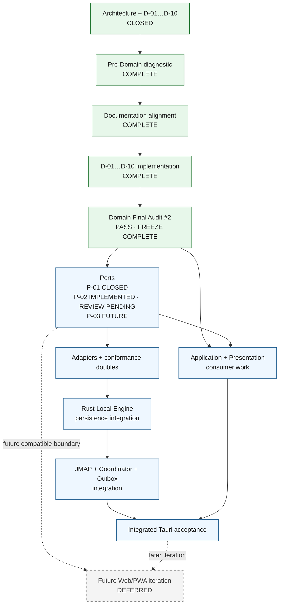

# Roadmap ejecutable del MVP Tauri

## 1. Propósito y estado

Este roadmap ordena dependencias reales; no asigna fechas ni confunde una decisión cerrada con código implementado. El MVP actual es **Tauri-only**. Web/PWA sigue siendo una dirección arquitectónica futura, pero no forma parte de sus fases ni de su aceptación.

### Gate status

| Gate | Estado | Qué quedó cerrado |
| --- | --- | --- |
| **0-A** | **CLOSED** | Cliente JMAP + Coordinador + Outbox: una implementación TypeScript en Worker; red directa; Rust solo persistencia/cifrado/secure store. |
| **0-B** | **CLOSED** | Modelo lógico D-01…D-10: identities scoped, Email completo, addresses, Identity/SendIntent, Mailbox, MailboxView, CollectionSyncCursor, PendingMutation, EmailBody y AttachmentRef. |
| **0-C** | **CLOSED FOR TAURI MVP** | DEK aleatoria en Rust/secure store, auth Passkey separada, token memory-only, ciclos local/remoto independientes, recuperación por reset/resync y frontera Tauri. |
| **0-D** | **CLOSED FOR TAURI MVP** | Pinia efímero, drafts memory-only, solo `PendingMutation` para send, metadata de adjuntos y render HTML en defensa en profundidad. |

El Gate 0 arquitectónico está cerrado. La implementación aislada y la documentación de Domain D-01→D-10 están completas. Domain Final Audit #2 concluyó `PASS`: el **Domain Final Freeze está completo**, Domain está cerrado y el diseño de Ports está habilitado como fase siguiente, separada de adapters, motores e integración remota.

La baseline de toolchains/dependencias del **13 de agosto de 2026** también está congelada en `docs/development/stack.md`. Esto cierra selección y pinning, no los PoCs de provisioning SQLCipher, conformance JMAP ni matriz WebView/OS.

## 2. Orden de construcción vigente

La secuencia obligatoria del core es:

1. Architecture/Domain decisions D-01→D-10 — completadas.
2. Repository diagnostic — completado.
3. Documentation alignment — completado.
4. Isolated Domain implementation D-01→D-10 — completada.
5. Domain Final Audit #2 y freeze final — completados.
6. Ports — P-01 cerrado; P-02 implementado con review pendiente; P-03 futuro.
7. Adapters y conformance doubles.
8. Rust Local Engine y persistence integration.
9. JMAP, Coordinator y Outbox integration.

Domain no espera SQLite, Rust, JMAP, Pinia ni Ports. Ports sí esperan un Domain implementado y verificado. Adapters esperan Ports. La persistencia y los algoritmos remotos se integran después sin redefinir identidades ni entidades.

Application y Presentation siguen siendo capas consumidoras independientes; este orden no convierte a Persona B en intermediario organizativo entre A y C. Solo expresa dependencias de artefactos compartidos.

## 3. Topología vigente del MVP

| Elemento | Decisión Tauri MVP |
| --- | --- |
| Runtime de JMAP/Coordinator/Outbox | Worker normal TypeScript dentro del webview |
| Persistencia | `SyncPort`/`ReadRepository` → adaptadores Tauri TypeScript → `invoke()` validado → Rust → SQLite + SQLCipher |
| Red JMAP | `fetch` + WebSocket directos desde TypeScript; nunca por Rust |
| Cambios locales | Commit → futuro `LocalChangeSource` P-03 → invalidación → relectura local |
| Clave local | DEK aleatoria 32 bytes, creada/recuperada y usada solo en Rust |
| Sesión remota | Passkey en navegador del sistema; token solo en memoria del Worker |
| Background | Política Tauri `backgroundThrottling: "throttle"`; riesgo acotado aceptado |

## 4. Diagrama de fases y paralelismo

Web/PWA no participa en la aceptación del MVP. Su nodo documenta continuidad futura, no trabajo concurrente ni gate presente.

## 5. Fase 0 — decisiones y documentation freeze

### Gate de entrada

Fuentes de verdad disponibles y aceptación de que el informe técnico reciente sustituye las decisiones provisionales de 0-C/0-D para el MVP Tauri.

### Frentes de decisión cerrados

#### 0-A — topología

Una implementación TypeScript de Cliente JMAP, Coordinador y Outbox. En Tauri corre en Worker normal, usa JMAP directo y cruza a Rust solo mediante los adaptadores Tauri que satisfacen `ReadRepository`/`SyncPort`. Rust no aloja JMAP.

#### 0-B — Domain D-01…D-10

Quedaron congelados e implementados `AccountKey`/`RemoteAccountRef`, scoped IDs, Email mínimo completo, `EmailAddress`, `Identity`/`SendIntent`, Mailbox/rights, la identidad semántica de `MailboxView`, `CollectionSyncCursor`, la familia discriminada `PendingMutation`, `EmailBody` completo/lazy y la metadata `AttachmentRef`. Domain Final Audit #2 aprobó el freeze; P-01 está cerrado, P-02 está implementado con review pendiente y P-03 permanece futuro.

`0001_initial.sql` es una migración histórica y mínima: sus gaps no redefinen Domain ni implican que el Local Engine esté implementado.

#### 0-C — seguridad para Tauri

Passkey en navegador del sistema autentica la sesión remota. SQLCipher usa una DEK aleatoria guardada en el secure store y accesible solo por Rust. El token JMAP es memory-only. `LocalReady + RemoteAnonymous` es válido. La pérdida de DEK se recupera mediante reset explícito de caché, nueva DEK y full resync, advirtiendo sobre `PendingMutation` locales.

PRF-derived DB unlock, SQLCipher Web/OPFS y custodia Web están **DEFERRED / MOVED TO FUTURE WEB ITERATION**.

#### 0-D — Application y alcance

Pinia guarda proyecciones y estado efímero; SQLite es la fuente durable. Drafts son memory-only. Send pendiente existe solo como `PendingMutation` con identidad estable. Attachments conservan metadata, no bytes ni operaciones. HTML raw se cifra y se sanitiza en cada render dentro de sandbox + CSP, sin copia sanitizada persistente.

La idempotencia ante respuesta ambigua está **MOVED TO PHASE 2 · OUTBOX**; no bloquea el cierre arquitectónico de 0-D.

### Criterio de salida

Cumplido: los cuatro gates tienen decisiones inequívocas, el diagnóstico del repositorio está completo y la documentación canónica refleja D-01→D-10. Domain existe como código aislado; esto no afirma que Ports, adapters o motores estén implementados.

## 6. Fase 1 — Domain aislado

### Gate de entrada

Implementación y alineación documental D-01→D-10 completadas.

### 1-A — Materialización de Domain

**Completado.** `src/domain/` materializa D-01, primitives D-03, D-02, D-04, D-05, D-06, D-07, D-08, D-09 y D-10 sin importar Vue, Pinia, Tauri, SQLite, Rust, transporte JMAP ni librerías externas.

### 1-B — Verificación y freeze de Domain

Las verificaciones por bloque y el Domain Final Audit #1 comprobaron identidades scoped, ausencia de row IDs, completitud de Email, null semántico, fronteras de envío/mailbox/view/sync/mutations/body y aislamiento de infraestructura. El único blocker hallado —`AttachmentRef` faltante— fue resuelto por D-10. Domain Final Audit #2 verificó esa corrección, descartó regresiones y declaró `DOMAIN FREEZE: COMPLETE`, `DOMAIN: CLOSED` y `PORT DESIGN: READY`.

### Criterio de salida

* D-01→D-10 compilan y se verifican de forma aislada.
* Domain no contiene infraestructura, DTOs de transporte ni estados Application.
* Domain no adapta sus invariantes a `0001`.
* Documentación e implementación están alineadas y el freeze final fue aprobado por Domain Final Audit #2.

## 7. Fase 2 — Ports y adapters

### Gate de entrada

**Cumplido.** Domain Final Audit #2 fue aprobado y el freeze final está declarado. El diseño de Ports puede comenzar sin reabrir Domain.

### 2-A — Ports

P-01 `ReadRepository` está **CLOSED** como consulta pura del estado local committed. P-02 `SyncPort` está **IMPLEMENTED / REVIEW PENDING** con diez transiciones semánticas atómicas y sin row IDs, DTOs JMAP, Emails parciales, hashes como identidad de View ni payloads arbitrarios. P-03 `LocalChangeSource` permanece futuro y separado; las solicitudes de materialización remota siguen diferidas a orquestación Application → Coordinator.

### 2-B — Adapters y conformance doubles

Implementar adapters memory y la suite observable. Después se materializan los adapters Tauri contra la misma semántica, sin diseñar SQL ni JMAP dentro de TypeScript adapters.

### Criterio de salida

* Ports dependen solo de Domain y errores propios del contrato.
* Adapters satisfacen Ports sin alterar las identidades o invariantes.
* Domain permanece sin dependencias hacia consumers.

## 8. Fase 3 — Local Engine e integración remota

### 3-A — Rust Local Engine y persistencia

Implementar SQLCipher lifecycle, migrations posteriores a `0001` cuando correspondan, mapping entre identities Domain y surrogates físicas, queries, transacciones, comandos semánticos y eventos. `0001` no se reescribe para simular alineación.

Las dos atomicidades obligatorias son:

* optimistic local projection + `PendingMutation`;
* remote batch + nuevo `CollectionSyncCursor.state`.

### 3-B — JMAP, Coordinator y Outbox

El JMAP Client normaliza DTOs parciales antes de producir Domain. Coordinator separa collection state de View queryState y trata `cannotCalculateChanges` mediante refetch/rebase scoped. Outbox procesa las tres familias discriminadas, conserva `SendIntent` y reconcilia un Send inFlight antes de cualquier retry potencialmente duplicado.

### 3-C — Application y Presentation integration

Conectar Vue/Pinia con `ReadRepository`, Tauri adapters y Local Engine. La UI releerá SQLite tras invalidaciones del futuro `LocalChangeSource`, mantiene Composer efímero y nunca consume respuestas JMAP directamente.

## 9. Fase 4 — aceptación Tauri

Validar recibir/abrir/sync, redactar/encolar/enviar, offline/restart/logout, cache reset advertido, SQLCipher fail-closed, token memory-only y render HTML seguro.

### Criterio de salida del MVP

* Toda lectura visible procede de SQLite local; JMAP nunca bloquea la UI.
* Las dos atomicidades y la reconciliación segura de Send están probadas.
* No existe fake Email, row ID en Domain ni fallback plaintext.
* DEK, token, HTML hostil, drafts y attachments respetan sus fronteras vigentes.

## 10. Tabla de trazabilidad de los componentes

| Componente | Construcción principal | Integración / aceptación |
| --- | --- | --- |
| Domain | **D-01→D-10 implementados; Final Audit #2 PASS; CLOSED** | Base congelada de Ports y todas las integraciones |
| `ReadRepository` + `SyncPort` | **P-01 CLOSED; P-02 IMPLEMENTED / REVIEW PENDING** | Adapters; Fase 3; aceptación |
| Memory/Tauri adapters | **Fase 2 · 2-B** | Local Engine y conformance |
| Presentación segura (Vue 3) | Consumidor posterior a Domain/Ports | Fase 3-C; aceptación |
| Estado de aplicación (Pinia) | Consumidor posterior a Domain/Ports | Fase 3-C; aceptación |
| Motor Tauri/Rust | **Fase 3 · 3-A** | 3-B/3-C; aceptación |
| Motor Web/OPFS | **MOVED TO FUTURE WEB ITERATION** | No participa en el MVP Tauri |
| Cliente JMAP | **Fase 3 · 3-B** | Aceptación remota |
| Coordinador de sincronización | **Fase 3 · 3-B** | Aceptación receive/sync |
| Procesador de Pending Mutations | **Fase 3 · 3-B** | Aceptación send |

## 11. Registro de decisiones vigente

### De `docs/architecture/components.md`

| ID | Estado actual | Resultado / destino |
| --- | --- | --- |
| C-01 | **RESOLVED · 0-A** | JMAP/Coordinator/Outbox TypeScript únicos. |
| C-02 | **RESOLVED · 0-C FOR TAURI MVP** | Ciclos local/remoto independientes y recuperación local definida. |
| C-03 | **RESOLVED · 0-D** | Vocabulario de `runtime`, `mail` y `composer` fijado. |
| C-04 | **RESOLVED · 0-D** | Draft memory-only; sin autosave/JMAP/persistencia. |
| C-05 | **P-01 CLOSED · P-02 IMPLEMENTED / REVIEW PENDING** | Lecturas, transiciones atómicas y futuras invalidaciones P-03 permanecen separadas. |
| C-06 | **SPLIT** | Lifecycle local resuelto en 0-C; modelo de tareas/hilos es detalle de implementación del Local Engine. |
| C-07 | **PHYSICAL BASELINE PRESENT** | `0001_initial.sql` es histórico y mínimo; migrations futuras, runner y runtime siguen en Fase 3-A. |
| C-08 | **RESOLVED · 0-A** | JMAP Tauri corre en Worker TS directo. |
| C-09 | **MOVED TO FUTURE WEB ITERATION** | Coordinación Web/multi-tab no bloquea MVP. |
| C-10 | **MOVED TO FUTURE WEB ITERATION** | SQLCipher/OPFS, cuotas y corrupción Web diferidos. |
| C-11 | **MOVED TO FUTURE WEB ITERATION** | Runtime JMAP `SharedWorker` futuro conservado. |
| C-12 | **MOVED TO 3-B** | Prioridades, batching, backoff, queryChanges y rebase scoped. |
| C-13 | **RESOLVED · D-08** | Ciclo durable conserva outcome incierto; cleanup exacto queda para reconciliación Outbox. |
| C-14 | **OPEN · 3-B** | Algoritmo de idempotencia/reconciliación de Send pertenece a Outbox. |
| C-15 | **RESOLVED · 0-C** | Token JMAP solo en memoria del Worker. |

### De `docs/architecture/domain.md`

| ID | Estado actual | Resultado / destino |
| --- | --- | --- |
| D-01 | **CLOSED / IMPLEMENTED / DOCUMENTED** | `AccountKey`, `ServiceKey`, `RemoteAccountRef`, scoped IDs y separación de row IDs. |
| D-02 | **CLOSED / IMPLEMENTED / DOCUMENTED** | Email remoto confirmado con metadata mínima completa; partial DTO no es Email. |
| D-03 | **CLOSED / IMPLEMENTED / DOCUMENTED** | `EmailAddress`, listas nullable con ausencia conocida y Message-ID family fuera del core. |
| D-04 | **CLOSED / IMPLEMENTED / DOCUMENTED** | Identity autorizada y flow Composer → SendIntent → SendMutation. |
| D-05 | **CLOSED / IMPLEMENTED / DOCUMENTED** | Mailbox scoped, parent canónico, counts remotos y seis rights MVP. |
| D-06 | **CLOSED / IMPLEMENTED / DOCUMENTED** | ViewSpec semántica, queryState por vista y coverage parcial válida. |
| D-07 | **CLOSED / IMPLEMENTED / DOCUMENTED** | `CollectionSyncCursor = AccountKey + DataType + opaque state`; diagnóstico separado. |
| D-08 | **CLOSED / IMPLEMENTED / DOCUMENTED** | Tres familias PendingMutation, MutationId local e inFlight con outcome incierto. |
| D-09 | **CLOSED / IMPLEMENTED / DOCUMENTED** | `EmailBody` completo por existencia, lazy, sin estado parcial y con HTML raw/untrusted. |
| D-10 | **CLOSED / IMPLEMENTED / DOCUMENTED** | `AttachmentRef` metadata-only; identidad `ScopedEmailId + AttachmentPartId`. |

### De `docs/architecture/security.md` y overview

| ID | Estado actual | Resultado / destino |
| --- | --- | --- |
| S-01 | **SPLIT** | Recuperación de caché local resuelta; recuperación de cuenta/passkey queda fuera del cliente. |
| S-02 | **OUT OF CLIENT SCOPE** | Seguridad interna del servidor no bloquea este roadmap. |
| O-01 | **MOVED TO FUTURE WEB ITERATION** | Custodia de credenciales Web no bloquea el MVP Tauri. |

### OPEN de implementación que no reabren Gate 0

| ID | Debe cerrarse en | Razón |
| --- | --- | --- |
| PORTS-01 | **P-01 CLOSED · P-02 REVIEW PENDING · P-03 FUTURE** | Completar revisión de SyncPort y diseñar después el change source separado. |
| PERSISTENCE-01 | **Fase 3-A** | Mapping físico, migrations posteriores y codecs sin modificar `0001`. |
| ATTACHMENT-CACHE-01 | **Fase 2-A / 3-A** | Distinguir disponibilidad de la colección de refs en el contrato de lectura/persistencia sin añadir flags a `AttachmentRef`. |
| OUTBOX-01 | **Fase 3-B** | Idempotencia/reconciliación de Send con outcome ambiguo y conflictos concurrentes. |
| COORD-01 | **Fase 3-B** | Aplicación de queryChanges, movimientos de posiciones y rebase scoped. |
| AUTH-01 | **Antes de aceptación** | Callback exacto navegador del sistema→aplicación; frontera y custodia ya decididas. |
| STACK-01 | **Antes de completar 3-A** | Provisioning/packaging de SQLCipher `4.17.0` en Windows, macOS y Linux. |
| STACK-02 | **Durante 3-B** | Conformance de `jmap-jam 0.13.3`; candidato no instalado ni congelado. |
| STACK-03 | **Antes de release** | Versiones mínimas OS/WebView y target explícito de Vite. |
| STACK-04 | **Durante 3-A / antes de aceptación** | Secret Service Linux y stores explícitos por plataforma. |

## 12. Trabajo deliberadamente diferido

* **Web/PWA:** wa-sqlite, OPFS, SQLCipher Web, credenciales en navegador, multi-tab, `SharedWorker` y aceptación del adaptador.
* **Producto posterior:** drafts durables/JMAP; caché, descarga, guardado, subida, envío y CID inline de adjuntos.
* **Compute-at-the-edge:** clasificación de spam y embeddings, opcional y apagado por defecto.
* **Fuera del cliente:** lógica del servidor, proveedor real, IMAP/SMTP y recuperación de cuenta Passkey.

No se crea aquí un backlog detallado para esos ámbitos y ninguno actúa como blocker del MVP Tauri.
