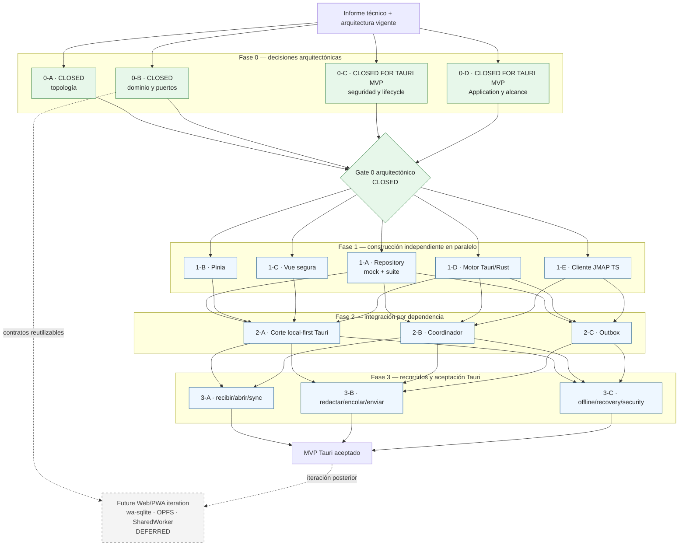

# Roadmap ejecutable del MVP Tauri

## 1. Propósito y estado

Este roadmap ordena dependencias reales; no asigna fechas ni confunde una decisión cerrada con código implementado. El MVP actual es **Tauri-only**. Web/PWA sigue siendo una dirección arquitectónica futura, pero no forma parte de sus fases ni de su aceptación.

### Gate status

| Gate | Estado | Qué quedó cerrado |
| --- | --- | --- |
| **0-A** | **CLOSED** | Cliente JMAP + Coordinador + Outbox: una implementación TypeScript en Worker; red directa; Rust solo persistencia/cifrado/secure store. |
| **0-B** | **CLOSED** | Modelo lógico y contratos `ReadRepository` + `SyncPort`, errores, `ensure…`, vistas, cursores y ciclo Outbox. |
| **0-C** | **CLOSED FOR TAURI MVP** | DEK aleatoria en Rust/secure store, auth Passkey separada, token memory-only, ciclos local/remoto independientes, recuperación por reset/resync y frontera Tauri. |
| **0-D** | **CLOSED FOR TAURI MVP** | Pinia efímero, drafts memory-only, solo `PendingMutation` para send, metadata de adjuntos y render HTML en defensa en profundidad. |

El Gate 0 arquitectónico está cerrado. El mock, la suite de conformidad, los stores y los motores siguen siendo **trabajo de implementación**; su ausencia no vuelve a abrir las decisiones.

La baseline de toolchains/dependencias del **13 de agosto de 2026** también está congelada en `docs/development/stack.md`. Esto cierra selección y pinning, no los PoCs de provisioning SQLCipher, conformance JMAP ni matriz WebView/OS.

## 2. Dependencias reales que justifican las fases

Solo se serializa en estas fronteras:

1. **Contratos cerrados antes de integración.** Los cinco frentes de Fase 1 pueden construirse en paralelo contra las interfaces congeladas. Sus cortes integrados sí esperan los artefactos concretos que conectan.
2. **Cliente JMAP antes de Coordinador y Outbox.** Ambos llaman a ese cliente y necesitan transporte, sesión y errores ejecutables.
3. **Componentes antes de recorridos verticales.** La prueba local Tauri necesita Vue, Pinia y Motor Tauri; sync necesita Cliente JMAP + Coordinador + Motor; send necesita Cliente JMAP + Outbox + Motor.
4. **Recorridos integrados antes de aceptación.** Offline, recuperación, seguridad y E2E verifican interacciones reales y no pueden cerrarse únicamente con contratos aislados.

No hay dependencia bloqueante entre Vue, Pinia, Motor Tauri, kit Repository y Cliente JMAP durante su construcción inicial. Vue usa un doble de la API pública del store; Pinia usa el mock de `ReadRepository`; Motor Tauri implementa los puertos; JMAP no depende de ninguno de ellos. Coordinador y Outbox pueden avanzar en paralelo una vez existe Cliente JMAP porque la solicitud de reconciliación ya cruza un contrato fijado.

## 3. Topología vigente del MVP

| Elemento | Decisión Tauri MVP |
| --- | --- |
| Runtime de JMAP/Coordinator/Outbox | Worker normal TypeScript dentro del webview |
| Persistencia | `SyncPort`/`ReadRepository` → `invoke()` validado → Rust → SQLite + SQLCipher |
| Red JMAP | `fetch` + WebSocket directos desde TypeScript; nunca por Rust |
| Cambios locales | Sistema de eventos de Tauri → `onChange` → relectura local |
| Clave local | DEK aleatoria 32 bytes, creada/recuperada y usada solo en Rust |
| Sesión remota | Passkey en navegador del sistema; token solo en memoria del Worker |
| Background | Política Tauri `backgroundThrottling: "throttle"`; riesgo acotado aceptado |

## 4. Diagrama de fases y paralelismo

Web/PWA no tiene una flecha hacia `MVP Tauri aceptado`. Su nodo documenta continuidad futura, no trabajo concurrente ni gate presente.

## 5. Fase 0 — decisiones y contratos arquitectónicos

### Gate de entrada

Fuentes de verdad disponibles y aceptación de que el informe técnico reciente sustituye las decisiones provisionales de 0-C/0-D para el MVP Tauri.

### Frentes de decisión cerrados

#### 0-A — topología

Una implementación TypeScript de Cliente JMAP, Coordinador y Outbox. En Tauri corre en Worker normal, usa JMAP directo y cruza a Rust solo para `ReadRepository`/`SyncPort`. Rust no aloja JMAP.

#### 0-B — dominio y Repository

`ReadRepository` sirve a Application y `SyncPort` a sync/outbox. `ensure…` es no bloqueante; errores, paginación, `MailboxView`, `SyncCursor`, `PendingMutation`, cuerpo `{ text, html }` y las dos invariantes transaccionales están congelados. Los tipos físicos SQL siguen perteneciendo a la implementación del motor.

#### 0-C — seguridad para Tauri

Passkey en navegador del sistema autentica la sesión remota. SQLCipher usa una DEK aleatoria guardada en el secure store y accesible solo por Rust. El token JMAP es memory-only. `LocalReady + RemoteAnonymous` es válido. La pérdida de DEK se recupera mediante reset explícito de caché, nueva DEK y full resync, advirtiendo sobre `PendingMutation` locales.

PRF-derived DB unlock, SQLCipher Web/OPFS y custodia Web están **DEFERRED / MOVED TO FUTURE WEB ITERATION**.

#### 0-D — Application y alcance

Pinia guarda proyecciones y estado efímero; SQLite es la fuente durable. Drafts son memory-only. Send pendiente existe solo como `PendingMutation` con identidad estable. Attachments conservan metadata, no bytes ni operaciones. HTML raw se cifra y se sanitiza en cada render dentro de sandbox + CSP, sin copia sanitizada persistente.

La idempotencia ante respuesta ambigua está **MOVED TO PHASE 2 · OUTBOX**; no bloquea el cierre arquitectónico de 0-D.

### Criterio de salida

Cumplido: los cuatro gates tienen una decisión inequívoca, sus exclusiones están registradas y ningún frente de Fase 1 necesita elegir política de seguridad, estado o dominio por su cuenta. Esto no afirma que exista código.

## 6. Fase 1 — construir componentes independientes

### Gate de entrada

Gate 0 cerrado y contratos versionados a nivel documental.

### Frentes paralelos

#### 1-A — Interfaz Repository

Materializar firmas de `ReadRepository`/`SyncPort`, mock en memoria y suite de conformidad. Cubrir errores, paginación, `ensure…`, transiciones legales y las dos atomicidades. La suite se ejecuta primero contra el mock y luego contra Tauri.

#### 1-B — Estado de aplicación (Pinia)

Implementar `runtime`, `mail` y `composer` contra el contrato. Verificar relectura por `onChange`, ausencia de persistencia/imports JMAP y la invariante “persistir Send antes de limpiar composer”.

#### 1-C — Presentación segura (Vue)

Construir lista, lector y compositor contra la API pública del store. Implementar la frontera DOMPurify + sandbox + CSP, bloqueo remoto, navegación controlada, estados offline/auth y limitaciones visibles de drafts/adjuntos.

#### 1-D — Motor Tauri/Rust

Implementar SQLite + SQLCipher con `rusqlite 0.40.2` + feature `sqlcipher` y SQLCipher externo `4.17.0`, migración inicial, DEK/secure store, comandos mínimos, transacciones y eventos. Pasar la suite Repository sin exponer clave, SQL, shell o filesystem genéricos. Probar cifrado real, versiones runtime, clave incorrecta y fallo cerrado. **OPEN:** provisioning/packaging reproducible en Windows, macOS y Linux; no se permite `bundled-sqlcipher` ni plaintext como atajo.

#### 1-E — Cliente JMAP TypeScript

Mantener primero una interfaz JMAP propia. `jmap-jam 0.13.3` es el candidato preferido, pero se instala y congela solo después de un spike contra Stalwart que cubra Session, Mailbox/Email, `*/changes`, batching/result references, EmailSubmission y reconnect push. Ningún tipo del paquete cruza al dominio. Después, implementar token memory-only, errores y normalización a `{ text, html }` + metadata `AttachmentRef`. No incluir binarios ni entrypoint Web en el MVP. El callback exacto navegador del sistema→aplicación se acuerda como contrato de integración antes del E2E.

### Criterio de salida

* Mock y Motor Tauri pasan la misma suite de puertos.
* Pinia/Vue recorren lectura y encolado con dobles, sin red ni persistencia paralela.
* SQLCipher y secure store fallan cerrados; la DEK no cruza IPC.
* Cliente JMAP pasa pruebas de transporte/parsing y no deja token en reposo.
* Cada frente compila o se valida de forma aislada según su frontera.

## 7. Fase 2 — integrar únicamente dependencias reales

### Gates de entrada por frente

* **2-A corte local-first:** 1-A + 1-B + 1-C + 1-D.
* **2-B Coordinador:** 1-A + 1-D + 1-E.
* **2-C Outbox:** 1-A + 1-D + 1-E y ciclo `PendingMutation` congelado.

2-B y 2-C avanzan en paralelo: Outbox no necesita la implementación interna del Coordinador para construir su máquina de estados; solo la operación contractual de reconciliación.

### Frentes paralelos

#### 2-A — corte local-first Tauri

Conectar Vue/Pinia/`ReadRepository`/Rust y demostrar lectura de bandeja/cuerpo, `onChange`, mutaciones optimistas y envío encolado sin red.

#### 2-B — Coordinador

Implementar sync inicial/incremental, deduplicación de `ensure…`, prioridades, batching, backoff, `queryChanges` y recuperación `stateInvalid`. Cada lote y nuevo cursor se confirman atómicamente.

#### 2-C — Outbox

Implementar toma exclusiva, transiciones, envío sin adjuntos, keywords/mailboxes, retry/backoff, conflictos, confirmación y limpieza posterior. Resolver aquí la idempotencia ante respuesta perdida usando la identidad local estable y la reconciliación del Coordinador; sigue **OPEN** hasta que este frente la cierre.

### Criterio de salida

* La UI responde solo desde SQLite y `ensure…` nunca espera red.
* Coordinator recupera cambios y estados inválidos sin avanzar cursor prematuramente.
* Outbox conserva payload en fallos, muestra errores terminales y evita duplicados según la estrategia ya implementada y probada.
* No existe `Email` ficticio ni envío/descarga/subida de adjuntos.

## 8. Fase 3 — validar recorridos completos Tauri

### Gate de entrada

Los tres cortes de Fase 2 están integrados con el Worker Tauri y el Motor Rust.

### Frentes paralelos de validación

#### 3-A — recibir, abrir y sincronizar

Validar `StateChange`, delta, cursor atómico, cache miss de body, relectura por evento y apertura offline.

#### 3-B — redactar, encolar y enviar

Validar composer memory-only, fallo de persistencia sin pérdida del texto, restart con pendiente durable, retry, idempotencia, `confirmed` hasta sync y aparición posterior del `Email` autoritativo.

#### 3-C — lifecycle y seguridad

Validar `LocalReady + RemoteAnonymous`, logout/token expirado sin cerrar DB, ausencia de token en reposo, clave incorrecta, reset/resync advertido, capabilities/Isolation, CSP/sandbox, cero requests remotos desde HTML y actualización firmada.

### Criterio de salida del MVP

* Recibir, abrir, redactar/encolar/enviar y sincronizar funcionan online/offline en Tauri.
* Toda lectura visible procede de SQLite local; JMAP nunca bloquea la UI.
* Las dos invariantes transaccionales y la idempotencia de send están probadas.
* SQLCipher no tiene fallback plaintext; DEK y token respetan sus fronteras.
* HTML hostil no alcanza el DOM privilegiado ni genera ejecución, forms o requests remotos.
* Drafts durables y operaciones/binarios de adjuntos permanecen ausentes, tal como define el alcance.

## 9. Tabla de trazabilidad de los ocho componentes

| Componente | Construcción principal | Integración / aceptación |
| --- | --- | --- |
| Presentación segura (Vue 3) | **Fase 1 · 1-C** | 2-A; 3-A/3-B/3-C |
| Estado de aplicación (Pinia) | **Fase 1 · 1-B** | 2-A; 3-A/3-B/3-C |
| `ReadRepository` + `SyncPort` | **Decisión 0-B; implementación Fase 1 · 1-A** | 2-A/2-B/2-C; suite en Fase 3 |
| Motor Tauri/Rust | **Fase 1 · 1-D** | 2-A/2-B/2-C; aceptación Fase 3 |
| Motor Web/OPFS | **MOVED TO FUTURE WEB ITERATION** | No participa en el MVP Tauri |
| Cliente JMAP | **Fase 1 · 1-E** | 2-B/2-C; 3-A/3-B/3-C |
| Coordinador de sincronización | **Fase 2 · 2-B** | 3-A/3-B/3-C |
| Procesador de Pending Mutations | **Fase 2 · 2-C** | 3-B/3-C |

## 10. Registro de decisiones heredadas

### De `docs/architecture/components.md`

| ID | Estado actual | Resultado / destino |
| --- | --- | --- |
| C-01 | **RESOLVED · 0-A** | JMAP/Coordinator/Outbox TypeScript únicos. |
| C-02 | **RESOLVED · 0-C FOR TAURI MVP** | Ciclos local/remoto independientes y recuperación local definida. |
| C-03 | **RESOLVED · 0-D** | Vocabulario de `runtime`, `mail` y `composer` fijado. |
| C-04 | **RESOLVED · 0-D** | Draft memory-only; sin autosave/JMAP/persistencia. |
| C-05 | **RESOLVED · 0-B** | Puertos, errores, paginación y `ensure…`; mock/suite se implementan en 1-A. |
| C-06 | **SPLIT** | Lifecycle local resuelto en 0-C; modelo de tareas/hilos es detalle de implementación 1-D. |
| C-07 | **MOVED TO 1-D** | Esquema físico, índices, migraciones y ubicación no son Gate 0. |
| C-08 | **RESOLVED · 0-A** | JMAP Tauri corre en Worker TS directo. |
| C-09 | **MOVED TO FUTURE WEB ITERATION** | Coordinación Web/multi-tab no bloquea MVP. |
| C-10 | **MOVED TO FUTURE WEB ITERATION** | SQLCipher/OPFS, cuotas y corrupción Web diferidos. |
| C-11 | **MOVED TO FUTURE WEB ITERATION** | Runtime JMAP `SharedWorker` futuro conservado. |
| C-12 | **MOVED TO 2-B** | Prioridades, batching, backoff y `stateInvalid`. |
| C-13 | **RESOLVED · 0-B** | Ciclo durable y limpieza posterior de `confirmed`. |
| C-14 | **OPEN · 2-C** | Idempotencia de send es implementación Outbox, no Gate 0-D. |
| C-15 | **RESOLVED · 0-C** | Token JMAP solo en memoria del Worker. |

### De `docs/architecture/domain.md`

| ID | Estado actual | Resultado / destino |
| --- | --- | --- |
| D-01 | **MOVED TO 1-D** | Tipos físicos, índices, migraciones y serialización Tauri. |
| D-02–D-06 | **RESOLVED · 0-B** | Account, Identity, rights, threads y marcas derivadas. |
| D-07 | **RESOLVED · 0-D** | Send pendiente solo como `PendingMutation`; no fake `Email`. |
| D-08 | **RESOLVED · 0-B** | Cuerpo `{ text, html }`; sin árbol MIME crudo. |
| D-09 | **RESOLVED · 0-D/0-C** | Raw cifrado; sanitización en cada render; sin copia sanitizada. |
| D-10 | **RESOLVED BY EXCLUSION · 0-D** | Metadata sí; binarios/operaciones fuera del MVP. |
| D-11 | **RESOLVED · 0-B** | Identidad de vista y `position + limit`. |
| D-12 | **MOVED TO 2-B** | Aplicación de `Email/queryChanges`. |
| D-13–D-14 | **RESOLVED · 0-B** | Vocabularios de cursor y mutación. |
| D-15 | **OPEN · 2-C** | Mismo trabajo de idempotencia que C-14. |
| D-16 | **OPEN · 2-C** | Política de conflictos se implementa en Outbox. |
| D-17 | **RESOLVED · 0-D** | No entidad Draft en MVP. |
| D-18 | **MOVED TO FUTURE WEB ITERATION** | SQLCipher Web/OPFS no bloquea Tauri. |
| D-19 | **RESOLVED · 0-C** | DEK/DB local separada de auth y token remoto. |
| D-20 | **RESOLVED FOR LOCAL CACHE · 0-C** | DEK perdida → reset explícito + nueva DB + full resync. Account recovery es servidor/auth. |

### De `docs/architecture/security.md` y overview

| ID | Estado actual | Resultado / destino |
| --- | --- | --- |
| S-01 | **SPLIT** | Recuperación de caché local resuelta; recuperación de cuenta/passkey queda fuera del cliente. |
| S-02 | **OUT OF CLIENT SCOPE** | Seguridad interna del servidor no bloquea este roadmap. |
| O-01 | **MOVED TO FUTURE WEB ITERATION** | Custodia de credenciales Web no bloquea el MVP Tauri. |

### OPEN de implementación que no reabren Gate 0

| ID | Debe cerrarse en | Razón |
| --- | --- | --- |
| AUTH-01 | **Antes de 3-C** | Callback exacto navegador del sistema→aplicación y contrato de entrega de sesión; la frontera y custodia ya están decididas. |
| C-14 / D-15 | **2-C Outbox** | Idempotencia de send ante respuesta ambigua. |
| D-12 | **2-B Coordinator** | Aplicación y desplazamiento de posiciones en `Email/queryChanges`. |
| D-16 | **2-C Outbox** | Conflictos concurrentes de keywords/mailboxes. |
| STACK-01 | **Antes de completar 1-D** | Provisioning/packaging de SQLCipher `4.17.0` en Windows, macOS y Linux. |
| STACK-02 | **Durante 1-E** | Conformance de `jmap-jam 0.13.3`; candidato no instalado ni congelado. |
| STACK-03 | **Antes de release / 3-C** | Versiones mínimas OS/WebView y target explícito de Vite. |
| STACK-04 | **Al implementar DEK / antes de 3-C** | Secret Service Linux y stores explícitos por plataforma. |

## 11. Trabajo deliberadamente diferido

* **Web/PWA:** wa-sqlite, OPFS, SQLCipher Web, credenciales en navegador, multi-tab, `SharedWorker` y aceptación del adaptador.
* **Producto posterior:** drafts durables/JMAP; caché, descarga, guardado, subida, envío y CID inline de adjuntos.
* **Compute-at-the-edge:** clasificación de spam y embeddings, opcional y apagado por defecto.
* **Fuera del cliente:** lógica del servidor, proveedor real, IMAP/SMTP y recuperación de cuenta Passkey.

No se crea aquí un backlog detallado para esos ámbitos y ninguno actúa como blocker del MVP Tauri.
