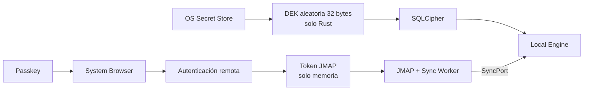
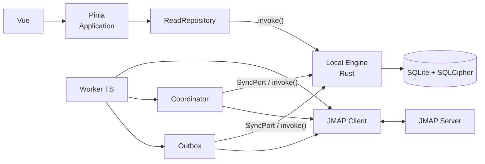
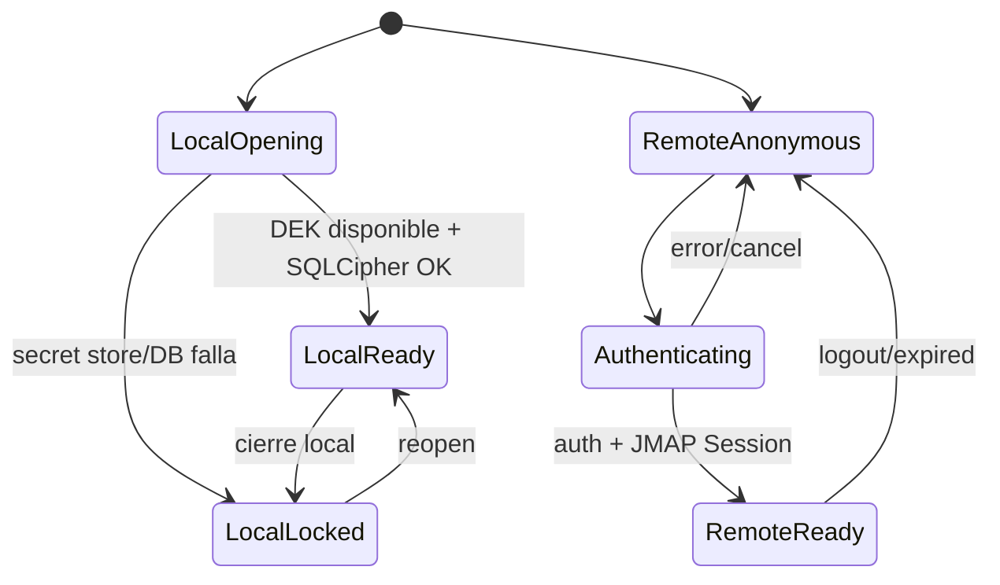
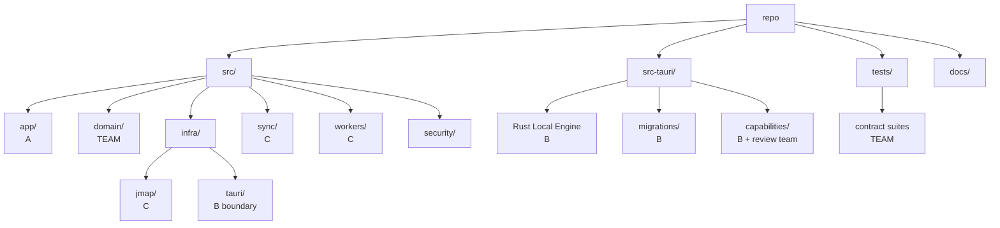

# Cierre crítico de 0-C y 0-D para el MVP Tauri-only

## Resumen ejecutivo

El recorte a **Tauri-only** elimina casi todo el riesgo que originalmente hacía grande al Gate 0-C: ya no importan `wa-sqlite`, OPFS, almacenamiento de credenciales Web, multi-tab ni SQLCipher en WASM. El Gate 0 restante es considerablemente más pequeño. fileciteturn0file46

Mi conclusión principal, sin embargo, cambia una decisión provisional que habíamos manejado antes:

> **No usaría WebAuthn PRF como mecanismo de desbloqueo de SQLCipher en este MVP Tauri.**

WebAuthn Level 3 sí define PRF precisamente como una primitiva que puede producir 32 bytes asociados a una credencial y menciona explícitamente la derivación de claves simétricas como caso de uso. citeturn15search1 El problema no es criptográfico: es **el runtime de Tauri**. El issue oficial de Tauri sobre soporte de Passkeys en WebView continúa abierto, y documentación reciente de Microsoft advierte explícitamente que los WebViews embebidos tienen soporte limitado o inexistente para WebAuthn y recomienda usar el navegador del sistema. citeturn15search0turn15search5

Por ello cerraría 0-C para el MVP con esta separación:



**Passkey autentica la cuenta. La clave local cifra la caché. No son la misma cosa en el MVP.**

SQLCipher acepta directamente una clave aleatoria exacta de 32 bytes; no necesitamos tratar una clave de alta entropía como una contraseña humana. Además, SQLCipher proporciona mecanismos concretos para verificar que la conexión está cifrada y que la clave es correcta. citeturn17search0turn17search1

La segunda decisión importante es desacoplar **sesión local** y **sesión remota**:

```text
Base local desbloqueada ≠ JMAP autenticado
```

Así la aplicación puede reiniciarse sin Internet y seguir leyendo correo local, que es precisamente la promesa local-first ya fijada en el dominio. fileciteturn0file29

Para 0-D recomiendo un recorte igualmente agresivo:

| Decisión | Cierre MVP |
|---|---|
| Pinia | Solo estado de aplicación/proyección; SQLite sigue siendo fuente local |
| Drafts | En memoria; sin autosave ni Draft JMAP |
| Send pendiente | `PendingMutation`; **sin Email falso/placeholder** |
| Attachments | Persistir metadata; binarios fuera del MVP |
| HTML | Persistir raw `{text, html}`; sanitizar siempre al render |
| Render HTML | DOMPurify + `iframe sandbox` + CSP + recursos remotos bloqueados |

Esta última decisión es más fuerte que simplemente “usar DOMPurify”. RFC 8621 recomienda defensa en profundidad para HTML de correo: sanitización allow-list, `iframe sandbox`, CSP y protección frente a recursos externos. citeturn20view0

La consecuencia organizativa es buena: una vez materializados los contratos y mocks de 0-B, **A puede construir Application, B Local Engine y C JMAP + Sync Layer prácticamente sin bloquearse**. Stormbox respalda directamente esta separación local-first y el patrón Composer → PendingMutation → Outbox; aerc respalda el aislamiento de red/sync en workers; Himalaya refuerza la idea de puertos compartidos, aunque su arquitectura stateless no debe copiarse para persistencia. fileciteturn0file37 fileciteturn0file41 fileciteturn0file2 fileciteturn0file15

## Alcance y criterio de cierre

El objetivo de 0-C/0-D no es anticipar todas las decisiones del producto. Es conseguir que **ninguno de los tres owners tenga que inventar una política compartida mientras implementa su sprint**. Ese era precisamente el criterio del Gate 0 original. fileciteturn0file46

La arquitectura Tauri que queda es:



Esto conserva exactamente la frontera que ya fijaron: Rust administra SQLite/SQLCipher y secretos locales; JMAP/Coordinator/Outbox permanecen en TypeScript; Vue no llama a red. fileciteturn0file30

Hay tres principios que considero no negociables.

**El primero es que ninguna clave SQLCipher atraviese IPC hacia TypeScript.** Tauri trata el WebView como una frontera potencialmente insegura y usa capabilities para restringir qué comandos puede invocar. La clave debe obtenerse y consumirse dentro de Rust. citeturn9search2

**El segundo es que ningún token de autenticación entre a Pinia, SQLite, logs ni `localStorage`.** JMAP exige requests autenticadas pero deliberadamente deja fuera de su especificación cómo se obtienen las credenciales; el almacenamiento es política del cliente. citeturn14view0turn14view1

**El tercero es que el estado durable no se replique en Pinia.** Pinia puede guardar proyecciones visibles y selección; los estados durables de sync/outbox siguen perteneciendo a SQLite. Esto es consistente con la arquitectura local-first ya especificada y con Stormbox. fileciteturn0file29 fileciteturn0file41

## Cierre de 0-C — seguridad, sesión y desbloqueo

**Decisión C — origen de la clave SQLCipher y mecanismo de desbloqueo**

Este punto bloquea directamente a B. Sin saber de dónde viene la clave, B no puede definir `openDatabase`, provisioning inicial, errores de desbloqueo, recuperación ni tests de cifrado. El documento de seguridad original proponía WebAuthn PRF como fuente de clave, pero dejaba pendiente su ciclo de vida y recuperación. fileciteturn0file28

| Opción | Ventajas | Coste / problemas | Seguridad y testabilidad |
|---|---|---|---|
| WebAuthn PRF → SQLCipher | Une passkey y cifrado; PRF entrega 32 bytes | Dependencia problemática del WebView Tauri; recuperación ligada a credencial | Criptográficamente elegante, operacionalmente riesgosa |
| Password → KDF → SQLCipher | Portátil; verdadero app-lock | Nueva contraseña, recuperación y UX; otro secreto humano | Fácil de probar; buena separación si KDF correcto |
| **DEK aleatoria → OS keychain → SQLCipher** | Simple, nativa, rápida, separa auth de cifrado | Seguridad depende del almacén del OS | Muy fácil de testear; menor complejidad |
| Tauri Stronghold | Plugin oficial de secretos | Stronghold necesita a su vez material para desbloquear su vault | Excelente si ya existe contraseña/factor; no soluciona por sí solo el problema |

WebAuthn PRF sí está diseñado para casos criptográficos: el estándar define outputs de exactamente 32 bytes y señala que pueden utilizarse como claves simétricas. citeturn15search1 Pero hoy no lo convertiría en dependencia crítica de un cliente Tauri cross-platform: el issue de Passkeys en Tauri WebView sigue abierto y Microsoft recomienda explícitamente navegador del sistema frente a embedded WebViews. citeturn15search0turn15search5

**Recomendación:** generar en Rust una **DEK criptográficamente aleatoria de 32 bytes** al provisionar la base y persistirla en el secure store nativo del OS. Una abstracción Rust como `keyring` actualmente puede delegar en Keychain Services en macOS, Windows Credential Manager y Secret Service en sistemas Unix. citeturn16search1turn16search12 Apple documenta Keychain como almacenamiento para contraseñas, claves criptográficas y otros secretos pequeños. citeturn16search17

SQLCipher puede consumir una clave exacta de 32 bytes directamente, siempre que la aplicación garantice su entropía; la clave debe establecerse antes de la primera operación sobre la base. citeturn17search0

**Done**

- Primera ejecución genera exactamente una DEK local y crea DB cifrada.
- La DEK nunca se serializa hacia JS/TS.
- Reinicio recupera DEK desde `SecretStore` y abre la misma DB.
- DB no puede abrirse con una clave distinta.
- Si el secure store no está disponible, se falla cerrado con `encryption_locked`/equivalente.
- No existe fallback a SQLite plaintext.

**Tests mínimos**

```text
create → write → close → reopen → read              PASS
open same DB with random wrong key                  FAIL
PRAGMA cipher_status                                == 1
PRAGMA cipher_integrity_check                       no rows
SELECT count(*) FROM sqlite_master after key        PASS
same query with wrong key                           FAIL
```

`cipher_status` permite comprobar que el handle está realmente funcionando con cifrado; `cipher_integrity_check` verifica los HMAC por página. citeturn17search0

**Artefactos:** `ADR-001-local-database-key.md`, `SecretStore` trait, diagrama unlock, suite `db-encryption.integration.rs`, fixture DB cifrada.

**Decisión C — ciclo local y ciclo remoto**

Aquí hay una trampa arquitectónica importante: hacer que “login JMAP” y “unlock SQLite” sean la misma máquina de estados rompe el caso de reiniciar la aplicación sin Internet.

| Opción | Pros | Contras | Seguridad / tests |
|---|---|---|---|
| DB abre solo después de auth JMAP | Modelo conceptual simple | Reinicio offline no puede leer caché | Reduce funcionalidad local-first |
| **DB local y auth remota independientes** | Offline real; fronteras limpias | Dos estados a representar | Muy testeable |
| Mantener token+DB siempre abiertos | Muy simple | Vida excesiva de secretos y sesión | Peor contención |

**Recomendación:** dos máquinas de estado independientes.



El estado válido:

```text
LocalReady + RemoteAnonymous
```

**es deliberadamente soportado**.

Puede leer caché y, si deciden permitirlo, encolar acciones locales. Simplemente no sincroniza hasta autenticarse.

JMAP distingue además su `Session` protocolaria —capabilities, accounts, `apiUrl`, `uploadUrl`, etc.— de las credenciales que permitieron obtenerla; la obtención de credenciales queda fuera de RFC 8620. citeturn14view0turn14view1

**Done**

- Inicio offline permite abrir datos existentes.
- Expiración/logout remoto no cierra SQLite.
- Fallo de DB no se disfraza como fallo de red.
- UI puede distinguir local-ready, auth y connectivity.
- Al salir del proceso se cierran DB/worker y se descartan secretos residentes en memoria.

**Tests mínimos**

```text
restart + network disabled → cached inbox readable
token expires             → cached inbox still readable
database unlock fails     → local error, no JMAP startup
logout                    → JMAP calls stop, DB stays readable
```

**Artefactos:** `session-lifecycle.md`, diagrama de estados anterior, fixtures de `offline`, `expired-token`, `locked-db`.

**Decisión C — Passkey y sesión JMAP**

JMAP requiere HTTP autenticado pero no especifica cómo se obtienen esas credenciales. citeturn11search0 Por ello esta es una política de vuestro sistema de autenticación, no del protocolo.

| Opción | Pros | Contras | Seguridad |
|---|---|---|---|
| Passkey dentro del WebView | UI simple | Soporte Tauri/WebView no suficientemente fiable | No lo aceptaría como gate |
| **Passkey en navegador del sistema** | WebAuthn real del navegador | Requiere callback al app | Mejor frontera |
| Password dentro de app | Fácil | Retroceso frente al objetivo passkey | Secretos humanos dentro del WebView |

**Recomendación:** autenticación Passkey en **system browser**. El mecanismo exacto por el que vuestro servidor devuelve la sesión/token a la aplicación debe pertenecer al protocolo de autenticación que definan; no asumiría OAuth si vuestro servidor no lo usa.

Críticamente:

> **El resultado PRF del navegador no se usa como DEK del MVP.**

Eso evita inventar un puente criptográfico entre el origen WebAuthn del navegador y Rust solo para desbloquear una caché local.

**Done**

- WebView no ejecuta la ceremonia Passkey.
- La aplicación recibe únicamente el resultado de autenticación necesario para iniciar sesión.
- Ningún credential private key ni PRF output entra en vuestro código.
- Login cancelado deja la aplicación en `LocalReady + RemoteAnonymous`.

**Tests mínimos:** login exitoso, cancelado, callback inválido, callback repetido y callback expirado.

**Artefactos:** `ADR-002-auth-boundary.md`, diagrama browser↔app↔server, test harness del callback.

**Decisión C — almacenamiento y vida del token**

| Opción | Pros | Contras | Riesgo |
|---|---|---|---|
| SQLite cifrada | Fácil persistencia | Mezcla cache y credencial; DB desbloqueada expone token | Medio |
| OS keychain | Persistencia segura | Añade refresh/session lifecycle | Bajo |
| **Solo memoria** | Mínima superficie; trivial | Login de nuevo al relanzar | **Bajo y MVP-friendly** |
| `localStorage` | Trivial | XSS/WebView puede leerlo | Inaceptable |

**Recomendación MVP:** **access/session token solo en memoria del Worker JMAP**.

No Pinia.  
No SQLite.  
No `localStorage`.  
No logs.

Al cerrar la aplicación desaparece. Al abrir de nuevo, la base local sigue disponible y el usuario vuelve a autenticarse para sincronizar.

Esto sacrifica “auto-login” pero no sacrifica offline. La separación anterior hace que el coste sea pequeño.

Si después necesitan sesión persistente, el siguiente paso sería **refresh credential en OS secure store**, no persistir indiscriminadamente el access token.

**Done**

- No existe columna SQL para auth tokens.
- Pinia no tiene campo token.
- Worker acepta token mediante API de inicialización y no lo devuelve.
- Logout sobrescribe/elimina la referencia en memoria.
- Token de prueba no aparece en archivos ni logs después de cerrar.

**Test mínimo especialmente útil:** iniciar con un token-canario único, cerrar la app y buscar ese canario en DB/config/logs del entorno de test. Debe haber cero ocurrencias.

**Artefactos:** `token-lifecycle.md`, test `no-token-at-rest`, política de logging/redaction.

**Decisión C — recuperación**

Al separar Passkey y DEK aparecen dos fallos distintos, que no deberían confundirse.

```text
Passkey perdido
    ↓
problema de autenticación de cuenta

DEK/keychain perdido
    ↓
problema de caché local
```

| Estrategia para DEK perdida | Pros | Contras |
|---|---|---|
| Backup remoto de DEK | Recupera DB | Convierte esto en sistema de key management |
| Wrapping por passkey | Elegante | Regresa al problema PRF/runtime |
| Recovery code | Posible | Nueva UX/secreto/protocolo |
| **Eliminar DB y resincronizar** | Extremadamente simple | Pierde estado exclusivamente local |

**Recomendación:** la DB local es **reconstruible**.

Esto ya encaja con el modelo: SQLite es fuente de verdad para la UI, pero JMAP sigue siendo la autoridad remota de correo. fileciteturn0file29 Stormbox adopta conceptualmente la misma distinción: SQLite alimenta la UI y el servidor JMAP es la autoridad cuya información permite reconstruir estado ante drift. fileciteturn0file38turn0file41

Si se pierde la DEK:

```text
encrypted DB
    ↓
unrecoverable locally
    ↓
user approves reset
    ↓
delete DB + secret entry
    ↓
new DEK
    ↓
new encrypted DB
    ↓
full JMAP resync
```

**Advertencia:** cualquier estado que solo exista localmente se pierde. Por eso una `PendingMutation` aún no enviada es el único punto delicado. En el MVP, debe advertirse al usuario si se detecta una DB inaccesible: **resetear puede destruir acciones pendientes**.

**Done:** nunca se intenta “adivinar” o degradar la clave; reset explícito crea DB nueva; cuenta puede sincronizar nuevamente.

**Tests:** borrar keychain secret → old DB no abre → reset → new DB abre → sync reconstruye fixture.

**Artefactos:** `local-cache-recovery.md`, UX de reset, test recovery.

**Decisión C — superficie Tauri**

Esta parte ya estaba esencialmente resuelta en vuestra documentación; conviene **confirmarla**, no rediscutirla. fileciteturn0file28

| Política | Cierre |
|---|---|
| Capabilities | Default-deny y comandos explícitos |
| Isolation Pattern | Sí |
| SQL/keychain | Solo Rust |
| JMAP | Worker TypeScript, directo |
| Secretos por IPC | Nunca |
| Shell genérico | No |
| FS genérico | No |
| CSP | Explícita y restrictiva |
| Remote assets de email | Bloqueados |

Tauri limita el acceso del WebView a capacidades configuradas y recomienda usar CSP/Isolation como controles de contención. citeturn9search2turn9search3 El Isolation Pattern añade otra frontera alrededor de IPC para limitar llamadas maliciosas desde frontend comprometido. citeturn0search1

Con esto, **0-C puede declararse cerrado para Tauri** siempre que el equipo acepte formalmente que **PRF-derived DB unlock queda diferido**. Si la condición de producto es “el passkey debe ser criptográficamente necesario para abrir la DB”, entonces no: 0-C todavía no está cerrado y hace falta primero un PoC real en todos los WebViews objetivo. Fingir lo contrario sería trasladar riesgo al sprint.

## Cierre de 0-D — Pinia, drafts, Outbox, adjuntos y HTML

**Decisión D — vocabulario y responsabilidad de Pinia**

El peligro no es cómo llamar a cinco estados. Es convertir Pinia en una segunda base de datos.

Pinia permite estado reactivo, getters derivados y actions asíncronas; su propia documentación también muestra cómo persistir estado mediante subscriptions, pero **no hay ninguna razón para utilizar esa persistencia aquí** porque ya existe SQLite. citeturn10search0turn10search1turn10search2

| Modelo | Pros | Contras |
|---|---|---|
| Copiar entidades completas a Pinia | Fácil para Vue | Dos fuentes de verdad |
| Un gran store global | Empieza rápido | Acoplamiento y estados imposibles |
| **Estado UI + proyecciones locales** | Encaja con local-first | Requiere re-read en `onChange` |
| Event sourcing en frontend | Potente | Completamente innecesario |

**Recomendación:** tres stores mínimos.

```text
runtime
  local: opening | ready | error
  auth: anonymous | authenticating | authenticated | expired
  connectivity: online | offline

mail
  selectedAccountId
  selectedMailboxId
  selectedEmailId
  visiblePage
  loadState: idle | loading | ready | error

composer
  editing fields
  phase: idle | editing | queueing | error
```

`syncing`, `retrying`, `failedTerminal`, etc. **no se vuelven estados independientes de Pinia**. Se proyectan desde `SyncCursor`/`PendingMutation`, que ya tienen vocabulario durable definido en 0-B. fileciteturn0file29

**Done**

- Pinia no persiste nada.
- Pinia no importa JMAP.
- Toda lista/email visible se obtiene mediante `ReadRepository`.
- `onChange` provoca relectura local.
- Estados Outbox se derivan de datos locales.

**Tests:** fake repository → load mailbox; emitir `onChange` → se reconsulta; offline → mismo contenido; verificar que package de stores no importa `jmap/`.

**Artefactos:** `application-state.md`, diagrama store/repository y `ReadRepositoryMock`.

**Decisión D — drafts**

RFC 8621 soporta explícitamente drafts mediante `Email/set` y `$draft`; no es una solución improvisada: es parte del modelo JMAP. citeturn9search0 Precisamente por eso introducir drafts reales significa introducir sincronización, server IDs, autosave y conflictos.

| Opción | Pros | Contras | Complejidad |
|---|---|---|---|
| Server-side JMAP Draft | Correcto y multi-device | Sync, conflictos, autosave | Alta |
| Draft local durable | Crash-safe | Nueva entidad/schema/migración | Media |
| **Solo memoria** | Casi cero infraestructura | Crash pierde composición | Muy baja |
| LocalStorage | Fácil | Rompe política de secretos/estado y duplica storage | Mala |

**Recomendación:** **draft solo en memoria durante el MVP**.

Stormbox, según el análisis aportado, mantiene la composición en `compose-store` y solo crea persistencia durable al pulsar enviar mediante `PendingMutation`. fileciteturn0file37

Flujo:

```text
open composer
     ↓
Pinia memory
     ↓
user clicks Send
     ↓
insert PendingMutation TRANSACTIONALLY
     ↓
success
     ↓
clear composer
```

El compositor **no se borra** hasta que `insertPendingMutation` haya confirmado persistencia.

**Done:** no tabla Draft; no `$draft` emitido por el cliente; cerrar compositor con contenido pide confirmación; crash antes de Send puede perder draft y esto consta como limitación MVP.

**Tests:** edición no toca Repository; fallo al encolar conserva composer; éxito lo limpia; cancelación con contenido requiere confirmación.

**Artefactos:** `ADR-003-drafts-mvp.md`, test del composer.

**Decisión D — representación de Outbox y envío pendiente**

El dominio ya definió `PendingMutation` como estado durable. La decisión abierta era si además crear un `Email` falso que aparezca como envío pendiente. fileciteturn0file29

| Opción | Pros | Contras |
|---|---|---|
| Fake Email con ID temporal | Aparece en Sent inmediatamente | Reconciliación compleja y doble identidad |
| Draft JMAP previo | ID servidor real | Requiere red antes de enviar |
| **Solo PendingMutation** | Modelo único y durable | UI necesita vista Outbox |
| Esperar respuesta de red | Muy simple | Destruye offline-first |

**Recomendación:** **solo `PendingMutation`**.

JMAP asigna IDs reales del objeto en el servidor; los “creation ids” de `/set` son identificadores temporales suministrados por el cliente para esa creación y resolución de referencias, no una razón para crear entidades Email locales falsas. citeturn14view2turn13view2

```text
Composer
   ↓
PendingMutation SEND
   ↓
pending
   ↓
inFlight
   ├── transient failure → retrying
   ├── permanent failure → failedTerminal
   └── success → confirmed
                    ↓
               next sync
                    ↓
             actual Email/Sent
```

Stormbox implementa exactamente el patrón conceptual de persistir la intención antes de tocar la red y procesarla posteriormente con un Outbox Runner. fileciteturn0file37

**Una precisión importante:** esto **no cierra aún la idempotencia de una respuesta perdida**. El roadmap correctamente la colocó en Sprint/Fase 2 como C-14/D-15. fileciteturn0file46 JMAP proporciona `Email/set`, `EmailSubmission/set`, creation IDs y actualización posterior del Email, pero el diseño de reintento tras una respuesta ambigua necesita una estrategia deliberada. citeturn9search0turn14view2

No la escondería bajo 0-D.

Sí añadiría desde ya:

```text
PendingMutation.id = UUID local estable
```

para que el algoritmo de Sprint 2 tenga una identidad durable sobre la que construir reconciliación.

**Done 0-D**

- `SEND` se persiste antes de cerrar composer.
- No se crea un Email ficticio.
- Reinicio conserva la mutación.
- UI puede presentar queued/retrying/failed usando PendingMutation.
- Confirmed se conserva hasta reconciliación posterior, según contrato existente.

**Tests:** persistencia tras restart; fallo de red no pierde payload; no hay fila `emails` falsa; transición ilegal de estado falla.

**Artefactos:** `outbox-contract.md`, state diagram, fixture con una mutación de cada estado, conformance tests de transición.

**Decisión D — attachments**

JMAP ya separa elegantemente metadata y blob binario. `EmailBodyPart` proporciona `blobId`, tamaño, nombre, tipo, disposition y `cid`; los blobs se cargan/descargan fuera del core API. citeturn19view0turn19view1turn19view2

Eso permite no construir toda la feature ahora.

| Alcance | Pros | Contras |
|---|---|---|
| Full download/cache/upload | Cliente completo | FS, límites, cleanup, upload, MIME |
| Download on-demand sin cache | Útil | Todavía introduce FS/capability |
| **Metadata únicamente** | Modelo correcto; casi sin riesgo | No abre/adjunta archivos todavía |
| Ignorar attachments | Más simple | Pierde información útil del modelo |

**Recomendación MVP:** persistir **AttachmentRef metadata**, no binarios.

```ts
type AttachmentRef = {
  partId: string;
  blobId: string;
  name: string | null;
  type: string;
  size: number;
  cid: string | null;
  disposition: string | null;
};
```

Fuera de estos 16 días:

```text
binary cache
download/save
upload
send attachment
inline cid rendering
cleanup/quota
```

JMAP hace que esta exclusión sea barata porque `blobId` es una referencia inmutable a datos binarios que pueden descargarse posteriormente. citeturn19view0

**Done:** un correo con attachments muestra nombre/tipo/tamaño; no guarda bytes en SQLite; schema no contiene blob binario; compositor no permite adjuntar.

**Tests:** parsear fixture con 2 attachments; metadata round-trip; verificar que DB no contiene bytes del fixture.

**Artefactos:** `ADR-004-attachments-scope.md`, fixture JMAP con attachment y schema `attachment_refs`.

**Decisión D — HTML almacenado y HTML renderizado**

Aquí sería más estricto que el plan inicial.

RFC 8621 identifica explícitamente JavaScript, recursos remotos de tracking, CSS capaz de interferir con la UI, phishing mediante links/forms y fugas de referrer como amenazas del HTML de correo. citeturn19view3turn20view0

| Opción | Seguridad | Complejidad | UX |
|---|---|---|---|
| Plain text únicamente | Máxima | Mínima | Limitada |
| DOMPurify + `v-html` mismo DOM | Buena frente XSS | Baja | Buena |
| **DOMPurify + sandboxed iframe + CSP** | Defensa en profundidad | Media | Buena |
| Persistir HTML sanitizado | No elimina render risk | Media/alta | Sin ganancia MVP |

**Recomendación:**

```text
JMAP HTML RAW
     ↓
SQLCipher
     ↓
ReadRepository
     ↓
DOMPurify
     ↓
strict policy
     ↓
iframe sandbox
     ↓
render
```

**No persistir HTML sanitizado.**

Guardar únicamente raw `{text, html}` cifrado. Sanitizar inmediatamente antes del sink final.

Esto permite que una actualización de DOMPurify o un cambio de política se aplique a todos los mensajes sin migrar una caché sanitizada antigua. DOMPurify además advierte que modificar HTML después de sanitizar puede invalidar las garantías de la sanitización. citeturn8search1

RFC 8621 recomienda explícitamente un enfoque de defensa en profundidad con sanitizer allow-list, `iframe sandbox` y CSP. El sandbox deshabilita JavaScript y forms, separa CSS del UI y crea un origen anónimo separado si no se reactivan permisos peligrosos. citeturn20view0

Para el MVP usaría una política deliberadamente austera:

```text
scripts                 REMOVE
forms                   REMOVE
iframe/object/embed     REMOVE
SVG/MathML              REMOVE
style tags              REMOVE
style attributes        REMOVE
remote img              REMOVE
remote media            REMOVE
event handlers          REMOVE
javascript: URLs        REMOVE
```

Enlaces `http/https` pueden conservarse, pero abrirse desde código controlado, nunca navegar el WebView principal.

Además, DOMPurify ha recibido varios fixes de seguridad durante 2026, lo cual refuerza dos reglas: mantenerlo actualizado y no asumir que sanitización sustituye al sandbox/CSP. citeturn8search2turn8search5turn8search7

Hay un detalle arquitectónico todavía más sutil: RFC 8621 dice que múltiples body parts deben renderizarse **aisladamente** y no concatenarse como HTML raw. citeturn20view0 El contrato cerrado `{text, html}` no debería implementarse concatenando arbitrariamente múltiples partes MIME. Para no reabrir 0-B, en el MVP recomiendo que el JMAP adapter elija **un único cuerpo HTML preferido**; si no puede producir uno inequívoco, usa texto plano. No concatenen raw HTML multipart.

**Done**

- Raw HTML solo existe cifrado en DB.
- Cada render llama al sanitizer.
- Email se renderiza dentro de sandbox.
- Remote images/resources no cargan.
- Scripts/forms/event handlers no sobreviven.
- Ningún HTML del email alcanza directamente el DOM de la aplicación.
- Actualizar sanitizer no requiere migración de DB.

**Tests mínimos**

```text
<script>alert()</script>                 removed
            no network request
                  no handler
<form action=https://evil>               removed
<a href=javascript:...>                  blocked
<style>...position:fixed...</style>      removed
malicious SVG                            removed
benign <p><strong>...</strong></p>       preserved
```

Y un test particularmente importante:

> levantar un pequeño HTTP server canario; renderizar un correo que intente cargarlo; **debe recibir cero requests**.

**Artefactos:** `email-rendering-security.md`, `sanitize-email-html.ts`, corpus de payloads maliciosos y suite `email-renderer.security.test.ts`.

Con estas decisiones, **0-D queda cerrado** sin necesidad de construir drafts, blobs ni un modelo visual ficticio de Sent.

## Contratos y starter objects para trabajar en paralelo

La meta de estos objetos no es diseñar un framework. Es permitir que mañana A, B y C puedan clonar `main` y empezar sin tocarse constantemente.

El patrón de Stormbox valida la dirección: Application consume una abstracción local, la sincronización escribe background y SQLite alimenta la UI. fileciteturn0file34turn0file41 Aerc aporta una lección complementaria: aislar el protocolo detrás de workers/mensajes tipados reduce el acoplamiento entre UI y red. fileciteturn0file1turn0file2 Himalaya demuestra el valor de una Shared API estable, aunque su carácter stateless significa que no es referencia para la caché local. fileciteturn0file14turn0file15

**Esquema SQLite inicial**

No intentaría optimizarlo antes de medir. Un primer esquema defendible es:

```sql
-- src-tauri/migrations/0001_initial.sql

CREATE TABLE accounts (
    id              TEXT PRIMARY KEY,
    username        TEXT NOT NULL,
    name            TEXT NOT NULL,
    capabilities    TEXT NOT NULL DEFAULT '{}'
);

CREATE TABLE identities (
    id              TEXT PRIMARY KEY,
    account_id      TEXT NOT NULL REFERENCES accounts(id) ON DELETE CASCADE,
    name            TEXT,
    email           TEXT NOT NULL,
    reply_to        TEXT
);

CREATE TABLE mailboxes (
    id              TEXT PRIMARY KEY,
    account_id      TEXT NOT NULL REFERENCES accounts(id) ON DELETE CASCADE,
    parent_id       TEXT,
    name            TEXT NOT NULL,
    role            TEXT,
    sort_order      INTEGER NOT NULL DEFAULT 0,
    total_emails    INTEGER NOT NULL DEFAULT 0,
    unread_emails   INTEGER NOT NULL DEFAULT 0
);

CREATE TABLE emails (
    id              TEXT PRIMARY KEY,
    account_id      TEXT NOT NULL REFERENCES accounts(id) ON DELETE CASCADE,
    thread_id       TEXT,
    blob_id         TEXT,
    subject         TEXT,
    from_json       TEXT NOT NULL DEFAULT '[]',
    to_json         TEXT NOT NULL DEFAULT '[]',
    cc_json         TEXT NOT NULL DEFAULT '[]',
    received_at     TEXT NOT NULL,
    preview         TEXT,
    keywords_json   TEXT NOT NULL DEFAULT '{}',
    has_attachment  INTEGER NOT NULL DEFAULT 0,
    size            INTEGER NOT NULL DEFAULT 0
);

CREATE INDEX idx_emails_account_received
ON emails(account_id, received_at DESC);

CREATE TABLE email_mailboxes (
    email_id        TEXT NOT NULL REFERENCES emails(id) ON DELETE CASCADE,
    mailbox_id      TEXT NOT NULL REFERENCES mailboxes(id) ON DELETE CASCADE,
    PRIMARY KEY (email_id, mailbox_id)
);

CREATE INDEX idx_email_mailboxes_mailbox
ON email_mailboxes(mailbox_id, email_id);

CREATE TABLE email_bodies (
    email_id        TEXT PRIMARY KEY REFERENCES emails(id) ON DELETE CASCADE,
    text_body       TEXT,
    html_body       TEXT,
    fetched_at      TEXT NOT NULL
);

CREATE TABLE attachment_refs (
    email_id        TEXT NOT NULL REFERENCES emails(id) ON DELETE CASCADE,
    part_id         TEXT NOT NULL,
    blob_id         TEXT NOT NULL,
    name            TEXT,
    media_type      TEXT NOT NULL,
    size            INTEGER NOT NULL,
    cid             TEXT,
    disposition     TEXT,
    PRIMARY KEY (email_id, part_id)
);

CREATE TABLE mailbox_views (
    id              TEXT PRIMARY KEY,
    account_id      TEXT NOT NULL,
    mailbox_id      TEXT NOT NULL,
    filter_hash     TEXT NOT NULL,
    sort_hash       TEXT NOT NULL,
    query_state     TEXT
);

CREATE TABLE mailbox_view_items (
    view_id         TEXT NOT NULL REFERENCES mailbox_views(id) ON DELETE CASCADE,
    email_id        TEXT NOT NULL REFERENCES emails(id) ON DELETE CASCADE,
    position        INTEGER NOT NULL,
    PRIMARY KEY (view_id, email_id),
    UNIQUE (view_id, position)
);

CREATE TABLE sync_cursors (
    account_id      TEXT NOT NULL,
    data_type       TEXT NOT NULL,
    state           TEXT,
    status          TEXT NOT NULL DEFAULT 'idle',
    last_error      TEXT,
    updated_at      TEXT NOT NULL,
    PRIMARY KEY (account_id, data_type)
);

CREATE TABLE pending_mutations (
    id              TEXT PRIMARY KEY,
    account_id      TEXT NOT NULL,
    kind            TEXT NOT NULL,
    target_email_id TEXT,
    payload_json    TEXT NOT NULL,
    status          TEXT NOT NULL DEFAULT 'pending',
    attempt_count   INTEGER NOT NULL DEFAULT 0,
    next_attempt_at TEXT,
    last_error      TEXT,
    created_at      TEXT NOT NULL,
    updated_at      TEXT NOT NULL
);

CREATE INDEX idx_pending_mutations_runnable
ON pending_mutations(status, next_attempt_at, created_at);
```

No hay:

```text
tokens
drafts
attachment blobs
sanitized_html
fake sent emails
```

Eso no es una omisión accidental. **Es el scope.**

Dos invariantes sí deben vivir desde el primer día en B:

```text
remote changes + new SyncCursor state
           =
       one SQL transaction
```

y:

```text
optimistic local change + PendingMutation
           =
       one SQL transaction
```

Ambas ya están formuladas en vuestro dominio. fileciteturn0file29

**ReadRepository mínimo**

La nomenclatura exacta debe respetar la versión congelada de 0-B; el siguiente sketch muestra la forma, no pretende reemplazar el contrato versionado existente.

```ts
// src/domain/ports/read-repository.ts

export type LoadPage = {
  accountId: string;
  mailboxId: string;
  position: number;
  limit: number;
};

export type MailboxViewPage = {
  ids: string[];
  position: number;
  hasMore: boolean;
};

export type RepositoryChange =
  | { type: "mailboxes"; accountId: string }
  | { type: "mailbox-view"; accountId: string; mailboxId: string }
  | { type: "email"; accountId: string; emailId: string }
  | { type: "outbox"; accountId: string };

export interface ReadRepository {
  listMailboxes(accountId: string): Promise<Mailbox[]>;
  getMailboxView(input: LoadPage): Promise<MailboxViewPage>;
  getEmail(accountId: string, emailId: string): Promise<Email | null>;
  getBody(accountId: string, emailId: string): Promise<EmailBody | null>;

  // Non-blocking respecto de red: registra/deduplica la necesidad.
  ensureMailboxView(input: LoadPage): Promise<void>;
  ensureEmailBody(accountId: string, emailId: string): Promise<void>;

  insertPendingMutation(
    mutation: NewPendingMutation,
  ): Promise<PendingMutation>;

  listPendingMutations(accountId: string): Promise<PendingMutation[]>;

  onChange(
    listener: (change: RepositoryChange) => void,
  ): () => void;
}
```

La semántica de `ensure…` debe permanecer como la acordada: resolver al registrar la necesidad y entregar el resultado posteriormente mediante cambio local, no convertir la UI en una espera de red. fileciteturn0file46

**SyncPort mínimo**

Aquí evitaría métodos CRUD diminutos que permiten accidentalmente avanzar un cursor sin persistir sus datos.

```ts
// src/domain/ports/sync-port.ts

export type SyncBatch = {
  accountId: string;

  mailboxes?: {
    upsert: Mailbox[];
    destroy: string[];
  };

  emails?: {
    upsert: Email[];
    destroy: string[];
  };

  bodies?: EmailBody[];

  viewChanges?: MailboxViewChange[];

  cursor: {
    dataType: "Mailbox" | "Email";
    oldState: string | null;
    newState: string;
  };
};

export interface SyncPort {
  // MUST be atomic: data + cursor.
  applySyncBatch(batch: SyncBatch): Promise<void>;

  claimNextPendingMutation(
    accountId: string,
  ): Promise<PendingMutation | null>;

  transitionPendingMutation(
    id: string,
    transition: PendingMutationTransition,
  ): Promise<void>;

  storeBody(
    accountId: string,
    emailId: string,
    body: EmailBody,
  ): Promise<void>;
}
```

Este diseño refleja directamente el modelo delta de JMAP: `/changes` produce `oldState`, `newState`, `created`, `updated` y `destroyed`; el nuevo state solo es válido localmente cuando los cambios correspondientes ya quedaron aplicados. citeturn11search0

**Pinia mínimo**

```ts
// src/app/stores/mail.ts

import { defineStore } from "pinia";
import type { ReadRepository } from "@/domain/ports/read-repository";

export type LoadState = "idle" | "loading" | "ready" | "error";

export function createMailStore(repo: ReadRepository) {
  return defineStore("mail", {
    state: () => ({
      accountId: null as string | null,
      mailboxId: null as string | null,
      emailId: null as string | null,

      mailboxes: [] as Mailbox[],
      visibleEmailIds: [] as string[],
      currentEmail: null as Email | null,

      listState: "idle" as LoadState,
      readerState: "idle" as LoadState,
      error: null as string | null,
    }),

    actions: {
      async openMailbox(accountId: string, mailboxId: string) {
        this.accountId = accountId;
        this.mailboxId = mailboxId;
        this.listState = "loading";

        try {
          const page = await repo.getMailboxView({
            accountId,
            mailboxId,
            position: 0,
            limit: 50,
          });

          this.visibleEmailIds = page.ids;
          this.listState = "ready";

          // Does not wait for network.
          await repo.ensureMailboxView({
            accountId,
            mailboxId,
            position: 0,
            limit: 50,
          });
        } catch (error) {
          this.listState = "error";
          this.error = String(error);
        }
      },
    },
  });
}
```

A puede implementar toda Application contra el in-memory repository de 0-B antes de que B tenga SQL funcional.

**JMAP client mínimo**

No construiría todavía veinte wrappers.

```ts
// src/infra/jmap/client.ts

export type JmapInvocation = [
  method: string,
  args: Record<string, unknown>,
  callId: string,
];

export interface JmapTransport {
  get<T>(url: string, token: string): Promise<T>;

  post<T>(
    url: string,
    token: string,
    body: unknown,
  ): Promise<T>;
}

export class JmapClient {
  private token: string | null = null;
  private session: JmapSession | null = null;

  constructor(private readonly transport: JmapTransport) {}

  setToken(token: string | null): void {
    this.token = token;
  }

  async discover(sessionUrl: string): Promise<JmapSession> {
    const token = this.requireToken();
    const session =
      await this.transport.get<JmapSession>(sessionUrl, token);

    this.session = session;
    return session;
  }

  async call(
    methodCalls: JmapInvocation[],
  ): Promise<JmapResponse> {
    const token = this.requireToken();
    const session = this.requireSession();

    return this.transport.post<JmapResponse>(
      session.apiUrl,
      token,
      {
        using: [
          "urn:ietf:params:jmap:core",
          "urn:ietf:params:jmap:mail",
        ],
        methodCalls,
      },
    );
  }

  clearSession(): void {
    this.token = null;
    this.session = null;
  }

  private requireToken(): string {
    if (!this.token) throw new Error("not_authenticated");
    return this.token;
  }

  private requireSession(): JmapSession {
    if (!this.session) throw new Error("session_not_loaded");
    return this.session;
  }
}
```

RFC 8620 define la Session precisamente como el descubrimiento de capabilities/accounts/endpoints y exige que los POST de API vayan al `apiUrl` autenticado. citeturn14view0turn14view1

Sobre este cliente C puede construir rápidamente:

```text
fetchSession
Mailbox/get
Email/query + Email/get
Email/changes
Email/queryChanges
Email/set
EmailSubmission/set
StateChange/WebSocket
```

Los tests unitarios pueden inyectar un `JmapTransport` falso para errores y parsing. **No construiría un servidor JMAP mock.** Para integración usaría el Stalwart local que ya tienen identificado; el valor de un fake está en probar vuestro código, no en reimplementar RFC 8620/8621.

## Estructura mínima del repositorio y paralelización

Propongo deliberadamente pocos directorios:

```text
repo/
├── src/
│   ├── app/
│   │   ├── stores/
│   │   │   ├── mail.ts
│   │   │   ├── composer.ts
│   │   │   └── runtime.ts
│   │   └── components/
│   │
│   ├── domain/
│   │   ├── models.ts
│   │   ├── errors.ts
│   │   └── ports/
│   │       ├── read-repository.ts
│   │       └── sync-port.ts
│   │
│   ├── infra/
│   │   ├── jmap/
│   │   │   ├── client.ts
│   │   │   ├── transport.ts
│   │   │   └── types.ts
│   │   └── tauri/
│   │       └── repository.ts
│   │
│   ├── sync/
│   │   ├── coordinator.ts
│   │   └── outbox.ts
│   │
│   ├── security/
│   │   └── sanitize-email-html.ts
│   │
│   └── workers/
│       └── sync-worker.ts
│
├── src-tauri/
│   ├── src/
│   │   ├── lib.rs
│   │   ├── commands.rs
│   │   ├── secrets.rs
│   │   └── db/
│   │       ├── mod.rs
│   │       └── repository.rs
│   ├── migrations/
│   │   └── 0001_initial.sql
│   ├── capabilities/
│   │   └── main.json
│   └── tauri.conf.json
│
├── tests/
│   ├── contracts/
│   │   ├── read-repository.contract.ts
│   │   └── sync-port.contract.ts
│   ├── fixtures/
│   │   └── mail.ts
│   └── security/
│       └── email-html.test.ts
│
├── docs/
│   ├── decisions/
│   └── diagrams/
│
└── docker-compose.yml
```

Visualmente:



Ownership inicial:

| Área | Owner primario | Qué debe poder cambiar sin esperar |
|---|---|---|
| `src/app` | **A — Application** | Vue/Pinia/composer |
| `src-tauri` + adapter Tauri | **B — Local Engine** | SQLite/SQLCipher/secrets/invoke |
| `src/infra/jmap`, `src/sync`, worker | **C — JMAP + Sync Layer** | protocolo, Coordinator, Outbox |
| `src/domain` | **Equipo** | Contratos: cambio requiere review cruzado |
| contract tests | **Equipo** | Definen significado de los puertos |

La clave para el paralelismo no es que nadie toque el código del otro. Es que estos dos artefactos existan **antes de empezar**:

```text
InMemoryRepository
       +
Repository Conformance Suite
```

A trabaja contra el primero.

B hace que Rust pase la segunda.

C trabaja contra un `SyncPort` in-memory mientras B termina.

Después:

```text
mock        ─┐
Tauri/Rust  ─┼── misma suite contractual
future Web  ─┘
```

Ese patrón es más valioso que cien tickets de Jira.

Para las PR establecería un gate mecánico:

```text
implementation
     +
tests
     +
contract suite if boundary affected
     +
small doc/diagram if architecture changed
     ↓
review
     ↓
squash merge → main
```

No exigiría documentación nueva por cada getter. **Solo cuando una PR introduce o modifica una frontera, invariante o decisión.**

## Matriz final de cierre y fuentes prioritarias

La matriz que llevaría mañana a la sesión de Gate 0 es esta:

| ID | Decisión final para MVP | Estado |
|---|---|---|
| C — DB key | DEK aleatoria 32B, Rust + OS secure store | **CERRAR** |
| C — Passkey/PRF | Passkey para auth; PRF no cifra DB en MVP | **CERRAR con ADR de desviación** |
| C — unlock | Local DB independiente de JMAP auth | **CERRAR** |
| C — token | Solo memoria del Worker | **CERRAR** |
| C — logout | Limpia sesión remota; conserva cache local | **CERRAR** |
| C — DEK perdida | Reset cache + full resync | **CERRAR** |
| C — app lock | DB handle/key residency, no prometer factor separado | **CERRAR alcance** |
| C — capabilities/CSP | Default-deny + Isolation + CSP estricta | **CONFIRMAR** |
| D — Pinia | UI/projection state, no durable duplication | **CERRAR** |
| D — Draft | Solo memoria | **CERRAR** |
| D — pending send | Solo PendingMutation; no fake Email | **CERRAR** |
| D — send idempotency | Contrato preparado; algoritmo en Sprint 2 | **NO es Gate 0** |
| D — attachments | Metadata solamente | **CERRAR** |
| D — binary cache | Fuera MVP | **CERRAR exclusión** |
| D — attachment sending | Fuera MVP | **CERRAR exclusión** |
| D — HTML storage | Persistir raw; no sanitized cache | **CERRAR** |
| D — HTML render | DOMPurify + iframe sandbox + CSP | **CERRAR** |
| D — remote images | Bloqueadas | **CERRAR** |

La única decisión de la lista que considero realmente **controvertida** es desligar la DEK del Passkey. Pero para 16 días es, en mi opinión, el cierre técnicamente correcto. El propio estándar PRF es sólido; el problema es convertir una feature de WebAuthn cuya interoperabilidad depende del User Agent en la raíz criptográfica de una aplicación Tauri cuando el soporte de Passkeys en embedded WebViews sigue siendo una zona problemática. citeturn15search1turn15search0turn15search5

Y además esa separación mejora el diseño:

```text
AUTHENTICATION
"¿puede esta persona acceder a la cuenta?"
          │
          └── Passkey / servidor

LOCAL CONFIDENTIALITY
"¿puede alguien leer este archivo SQLite robado?"
          │
          └── random DEK / OS secure store / SQLCipher
```

Son problemas distintos. El diseño original los estaba intentando resolver con el mismo secreto.

### Fuentes primarias prioritarias

La base normativa de protocolo debería ser [RFC 8620 — JMAP Core](https://datatracker.ietf.org/doc/html/rfc8620) y [RFC 8621 — JMAP Mail](https://datatracker.ietf.org/doc/html/rfc8621). El primero define Session, capabilities, `/get`, `/set`, `/changes`, creación, estados y blobs; el segundo define Mailbox, Email, attachments, drafts, EmailSubmission y, especialmente importante para este cliente, las recomendaciones de seguridad al mostrar HTML. citeturn11search0turn9search1

Para la capa local cifrada, [SQLCipher API](https://www.zetetic.net/sqlcipher/sqlcipher-api/) y [SQLCipher Design](https://www.zetetic.net/sqlcipher/design/) deberían ser la autoridad. Documentan claves raw de 32 bytes, orden de inicialización, verificación de clave, HMAC por página, `cipher_integrity_check` y `cipher_status`. citeturn17search0turn17search1

Para Tauri, las referencias operativas son [Tauri Security](https://v2.tauri.app/security/), [Tauri CSP](https://v2.tauri.app/security/csp/) y [Tauri Stronghold](https://v2.tauri.app/plugin/stronghold/). Tauri deja claro que la frontera WebView debe contenerse mediante capabilities y controles de hardening, no tratarse como código inherentemente confiable. citeturn9search2turn9search3turn9search5

Para Passkeys/PRF, la autoridad es [WebAuthn Level 3](https://www.w3.org/TR/webauthn-3/). Para la limitación práctica de la arquitectura Tauri actual deben leerse también el [issue Tauri #7926](https://github.com/tauri-apps/tauri/issues/7926) y la documentación reciente de Microsoft sobre [Passkeys en embedded WebViews](https://learn.microsoft.com/en-us/entra/external-id/customers/how-to-sign-in-with-passkey). citeturn15search1turn15search0turn15search5

Para sanitización, [DOMPurify](https://github.com/cure53/DOMPurify) sigue siendo una referencia apropiada, pero RFC 8621 es la fuente más importante para el **modelo de defensa completo**: sanitizer, sandbox, CSP y bloqueo de contenido externo. citeturn8search1turn20view0

Como referencias arquitectónicas secundarias, **Stormbox es la más importante** para esta iteración: SQLite local-first, Vue/Pinia desacoplado de red, bodies cacheados y Outbox durable son prácticamente el mismo problema. fileciteturn0file32turn0file37turn0file41turn0file44 **Aerc** aporta especialmente bien el aislamiento actor/worker y la sincronización diferencial JMAP. fileciteturn0file0turn0file6turn0file12 **Himalaya** es útil como evidencia de que los puertos/adaptadores deben permanecer pequeños y tipados, pero no como modelo de persistencia porque deliberadamente es stateless. fileciteturn0file14turn0file15turn0file26

Con este cierre, el Gate 0 deja de ser “resolver seguridad y UX” y se reduce a unos entregables concretos antes del Sprint 1:

```text
ADR de key/auth
+
SecretStore abstraction
+
schema 0001
+
ReadRepository
+
SyncPort
+
InMemoryRepository
+
conformance suites
+
Pinia API
+
HTML security policy
```

Después de eso, **A, B y C ya no deberían estar tomando decisiones arquitectónicas fundamentales mientras implementan**. Ese es el criterio correcto para declarar cerrado el gate y empezar a construir.