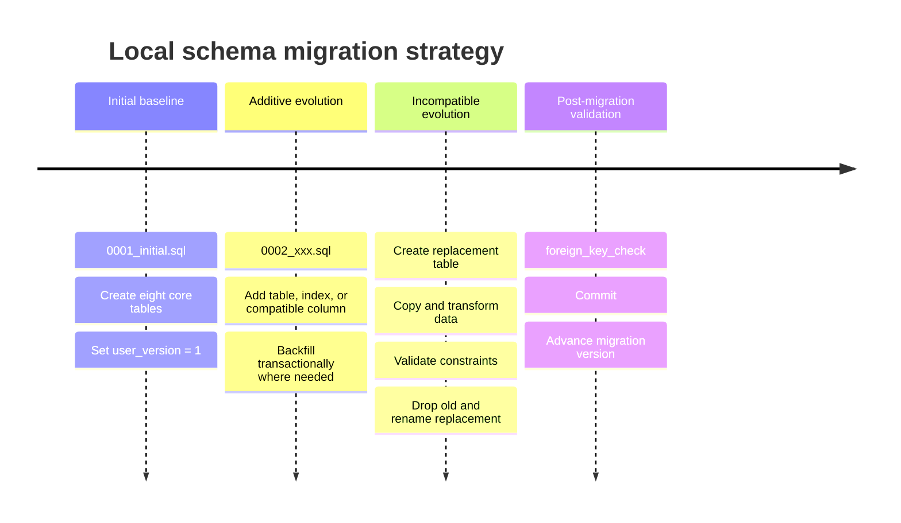

# Minimal, Secure, and Compatible Initial SQL Schema for the Tauri Mail Client

## Executive summary

The recommended `0001_initial.sql` is deliberately small: eight tables—`accounts`, `mailboxes`, `emails`, `email_mailboxes`, `email_bodies`, `attachment_refs`, `pending_mutations`, and `sync_cursors`—plus only the indexes needed for the first expected read/write paths. This matches the architecture already chosen for the project: SQLite/SQLCipher is the durable local source of truth, while JMAP synchronization and the outbox operate around it. JMAP itself models mailboxes as named collections and permits an Email to belong to multiple Mailboxes simultaneously, so a many-to-many `email_mailboxes` table is not optional if the local model is intended to represent JMAP faithfully. citeturn21view3turn21view4

The schema should use **database-local `INTEGER PRIMARY KEY` identifiers** and store JMAP identifiers separately as `TEXT`. JMAP IDs are server-assigned, immutable, between 1 and 255 octets, but are guaranteed unique only for the same record type within the same account; they may collide across accounts or types. Thunderbird's current Panorama database design independently reached the same architectural conclusion for mail: server IDs should be tracked separately while the local database assigns its own keys. citeturn20view0turn19view6turn20view7

The recommended first schema is **normalized rather than prematurely optimized**. In particular, `emails` should contain message-list metadata, `email_bodies` should contain potentially large body text, and `email_mailboxes` should contain membership only. Mailspring uses the same large-body separation specifically so metadata and thread-list queries do not have to inflate message bodies, and it uses join tables for queryable collections. citeturn21view0turn21view1

A significant compatibility conclusion emerged from the version policy: **do not use SQLite `STRICT` tables in `0001_initial.sql` yet**. `STRICT` is attractive and is fully supported by the release baseline SQLite 3.53.3, but it was introduced only in SQLite 3.37.0. The project's current development policy says "SQLCipher 4.x" rather than specifying a minimum underlying SQLite version. Therefore `STRICT` would silently introduce an additional compatibility floor not currently expressed by that policy. Current Arch development SQLCipher 4.14.0 uses SQLite 3.51.3 and would support it, but arbitrary older SQLCipher 4.x builds are not guaranteed to do so. Either the project should later formalize `SQLite >= 3.37.0` for development or keep ordinary tables with explicit `NOT NULL` and `CHECK` constraints, as recommended here. citeturn16search0turn19view8

The release cryptographic baseline remains **external SQLCipher 4.17.0, based on SQLite 3.53.3**. SQLCipher 4.17.0 was released July 8, 2026 and incorporates SQLite 3.53.3. Development may link another SQLCipher 4.x build, but schema syntax should therefore avoid relying unnecessarily on SQLite 3.53-only features such as the new `ALTER TABLE ... ALTER COLUMN ... SET/DROP NOT NULL`. citeturn19view8turn17search1

The schema file itself should contain **no key material, no SQLCipher cryptographic PRAGMAs, no authentication token, and no journal configuration**. Keying, `foreign_keys`, journal mode, and other connection-level settings belong in the Rust database-open path. SQLCipher requires the key to be supplied before the first real database operation. citeturn15search0

The resulting model is intentionally a foundation rather than the final mail database. It does **not** yet add full address normalization, full MIME/body-part normalization, an FTS index, thread tables, drafts, query-state caches, attachment binary storage, or denormalized mailbox-list views. Those can be introduced through migrations only when a concrete product requirement or measured query plan justifies them.

## Recommended schema shape and constraints

The most important distinction is between a **local identity** and a **remote identity**:

```text
Local database identity                JMAP identity
───────────────────────                ─────────────
emails.id INTEGER                      emails.jmap_id TEXT
mailboxes.id INTEGER                   mailboxes.jmap_id TEXT

stable for local joins                 assigned by server
compact                                protocol identifier
owned by our database                  scoped to account/type
can exist before remote mapping        may be absent before synchronization
```

That separation is useful beyond efficiency. JMAP explicitly says an object ID is immutable and server-assigned, but only unique within a particular type and account. It is therefore unsuitable as the sole globally unique key in a multi-account local database. citeturn19view6turn20view0

For `mailboxes` and `emails`, I recommend permitting `jmap_id` to be `NULL`. Remote objects will have one, but this gives the future local-first layer room to materialize a local object before the server assigns its JMAP ID. The unique indexes apply only where `jmap_id IS NOT NULL`. This is a project-level design recommendation rather than a JMAP requirement; JMAP itself assigns IDs server-side. citeturn20view0

**`accounts`**

| Column | Type / constraint | Purpose |
|---|---|---|
| `id` | `INTEGER PRIMARY KEY` | Compact local identity used by all child tables. |
| `session_url` | `TEXT NOT NULL` | Non-secret endpoint identity used to distinguish JMAP installations/accounts locally. |
| `jmap_account_id` | `TEXT NOT NULL`, length 1–255 | Remote JMAP account identifier. |
| `(session_url, jmap_account_id)` | `UNIQUE` | Prevents accidentally registering the same remote account twice under the same JMAP endpoint. |

No authentication credential or bearer token belongs here. JMAP IDs use the JMAP `Id` type and are limited to 1–255 octets. JMAP IDs contain only ASCII characters from a restricted URL-safe alphabet, so SQLite's character-counting `length()` is also an octet count for these identifiers. citeturn20view0

`session_url` has intentionally **no artificial SQL length limit**. SQLite does not enforce `VARCHAR(n)` lengths anyway—numeric length declarations such as `VARCHAR(255)` are ignored—so the schema should use `TEXT` and add `CHECK` constraints only where the external protocol itself defines a meaningful bound. citeturn17search0

**`mailboxes`**

| Column | Type / constraint | Purpose |
|---|---|---|
| `id` | `INTEGER PRIMARY KEY` | Local mailbox identity. |
| `account_id` | `INTEGER NOT NULL`, FK | Owning local account. |
| `jmap_id` | `TEXT NULL`, JMAP-length check | Remote Mailbox ID once known. |
| `parent_id` | `INTEGER NULL`, self-FK | Local hierarchy without repeatedly joining on remote strings. |
| `name` | `TEXT NOT NULL`, non-empty | User-visible mailbox name. |
| `role` | `TEXT NULL` | JMAP special role such as `inbox`, `sent`, or `trash`. |
| `sort_order` | `INTEGER NOT NULL DEFAULT 0`, `0 <= n < 2^31` | Server-provided mailbox ordering. |

JMAP requires mailbox names to be non-empty; parent relationships form an acyclic forest; there may not be two mailboxes with the same role in an account; and `sortOrder` is restricted to `0 <= value < 2^31`. These properties justify the non-empty-name check, the bounded integer, a self-reference for `parent_id`, and a partial unique index on `(account_id, role)`. citeturn21view3turn20view5

The schema should **not** attempt to enforce acyclicity with triggers in `0001`. Nor should it try to implement JMAP's sibling-name semantics with a custom collation. Those are useful validations, but they introduce implementation machinery beyond a minimal foundation. Hierarchy validation belongs in the synchronization/repository layer initially. JMAP's mailbox display ordering also uses `sortOrder` followed by locale-appropriate alphabetical ordering, so a platform-independent binary SQL collation is not a complete replacement for UI-side locale ordering. citeturn21view3

The self-FK can be `DEFERRABLE INITIALLY DEFERRED`, allowing a complete mailbox hierarchy to be inserted within one transaction even if parent rows do not happen to arrive first. SQLite supports deferred foreign keys that are validated at commit. citeturn16search1

**`emails`**

| Column | Type / constraint | Purpose |
|---|---|---|
| `id` | `INTEGER PRIMARY KEY` | Local email identity. |
| `account_id` | `INTEGER NOT NULL`, FK | Owning account. |
| `jmap_id` | `TEXT NULL` | JMAP Email ID when known. |
| `blob_id` | `TEXT NULL` | JMAP identifier for the raw RFC message blob. |
| `thread_id` | `TEXT NULL` | Server thread identity; not a local thread table. |
| `message_id` | `TEXT NULL` | First/canonical RFC `Message-ID` value for lookup; **not identity**. |
| `subject` | `TEXT NULL` | Lightweight message-list/view metadata. |
| `preview` | `TEXT NULL` | Lightweight message preview when fetched. |
| `received_at_ms` | `INTEGER NOT NULL` | Local normalized sort/filter value. |
| `size_bytes` | `INTEGER NOT NULL CHECK >= 0` | JMAP raw-message size. |
| `keywords_json` | `TEXT NOT NULL DEFAULT '{}'` | Opaque preservation of arbitrary JMAP keywords. |
| `has_attachment` | `INTEGER NOT NULL DEFAULT 0 CHECK IN (0,1)` | Lightweight list/filter metadata. |

JMAP distinguishes its Email object `id` from the RFC `Message-ID`; it also exposes immutable `blobId`, `threadId`, `size`, and `receivedAt`, plus `mailboxIds`, arbitrary keywords, `hasAttachment`, subject, preview and other metadata. The standard query model requires sorting by `receivedAt` and commonly filters by mailbox, which makes a normalized integer representation of `receivedAt` appropriate for a local read model. citeturn21view4turn21view5turn20view5

`message_id` must **not** be unique. JMAP represents `messageId` as `String[]|null`, and the protocol explicitly contemplates multiple Email objects coexisting with the same RFC Message-ID. In a deliberately minimal schema, storing one canonical/first value provides a useful lookup key without adding another relationship table. If lossless preservation of all `messageId` values becomes a requirement, add an `email_message_ids` table in a later migration rather than treating this convenience field as authoritative. citeturn20view3

`keywords_json` is intentionally an opaque `TEXT` value rather than an initial `email_keywords` table. JMAP keywords are an extensible set, so hard-coding only `$seen` and `$flagged` would lose information. The database does not need to understand the JSON in `0001`; the application owns its serialization. If keyword filtering becomes a proven local hot path, a normalized keyword table or materialized flags can be added later. JMAP defines keywords as a string-to-boolean set and allows additional keywords beyond the standard system values. citeturn21view4turn20view5

`received_at_ms` is a **local representation**, not the JMAP wire representation. JMAP defines `receivedAt` as a `UTCDate`; storing Unix milliseconds as `INTEGER` provides deterministic numeric ordering and avoids depending on lexical ordering among RFC3339 strings with potentially differing fractional precision. The exact JMAP value can always be re-fetched; the database does not need to be a byte-for-byte protocol archive. JMAP requires `receivedAt` and uses it as the mandatory Email/query sort property. citeturn21view5turn20view5

**`email_mailboxes`**

```text
email_id   INTEGER NOT NULL
mailbox_id INTEGER NOT NULL

PRIMARY KEY (email_id, mailbox_id)
```

This table is fundamental, not an optimization artifact. JMAP Email-to-Mailbox membership is many-to-many: an Email must belong to at least one Mailbox and may belong to more than one, while its Email ID remains unchanged when mailbox membership changes. citeturn21view3turn21view4

The primary key prevents duplicate memberships. Both columns reference their parent tables with `ON DELETE CASCADE`.

A simple FK cannot express the higher-level rule "every Email must always have at least one row in `email_mailboxes`". Implementing that with triggers would make deletion and mailbox moves considerably more complex. Instead, the repository/synchronization transaction must ensure the invariant at commit: membership replacement and Email mutation happen atomically. This mirrors JMAP's own requirement that a stored Email belong to one or more Mailboxes. citeturn21view4

**`email_bodies`**

| Column | Type / constraint | Purpose |
|---|---|---|
| `email_id` | `INTEGER PRIMARY KEY`, FK | Exactly zero or one cached body record per Email. |
| `text_body` | `TEXT NULL` | Preferred/fetched plain-text representation. |
| `html_body` | `TEXT NULL` | Preferred/fetched HTML representation. |

The **absence of a row** can mean the body has not yet been cached. The table is deliberately a presentation cache rather than a complete MIME tree. JMAP itself distinguishes preferred `textBody` and `htmlBody` representations and separately exposes body values and attachment/body-part metadata. citeturn21view4

Separating large body content from metadata is a sound local-mail design. Mailspring uses a separate body table specifically because message bodies can be large and keeping them apart allows metadata/thread-list objects to be fetched without inflating their bodies. citeturn21view1

HTML stored here must still be treated as **untrusted content on render**. SQLCipher protects data at rest; it does not make email HTML safe to execute. That distinction belongs to the rendering/security layer, not the SQL schema.

**`attachment_refs`**

| Column | Type / constraint | Purpose |
|---|---|---|
| `id` | `INTEGER PRIMARY KEY` | Local attachment-reference identity. |
| `email_id` | `INTEGER NOT NULL`, FK | Owning Email. |
| `part_id` | `TEXT NULL` | JMAP body-part identifier, scoped to the Email. |
| `blob_id` | `TEXT NULL` | Remote blob identifier where applicable. |
| `name` | `TEXT NULL` | Suggested attachment name. |
| `media_type` | `TEXT NOT NULL` | MIME media type. |
| `size_bytes` | `INTEGER NOT NULL CHECK >= 0` | Attachment/body-part size. |

JMAP Email body parts expose `partId`, `blobId`, `size`, `name`, and media `type`; the attachments collection is derived from body parts that should be presented as attachments. citeturn21view4

A partial unique index on `(email_id, part_id)` where `part_id IS NOT NULL` prevents duplicate mapping for downloaded JMAP body parts without preventing future locally created attachment references that have not yet obtained a remote part ID.

`0001` should **not store absolute filesystem paths** for attachment payloads. Cross-platform binary-cache layout has not yet been decided. A later storage layer can add an opaque storage key once that contract exists.

**`pending_mutations`**

| Column | Type / constraint | Purpose |
|---|---|---|
| `id` | `INTEGER PRIMARY KEY` | Durable local queue identity. |
| `account_id` | `INTEGER NOT NULL`, FK | Account against which mutation will be sent. |
| `kind` | `TEXT NOT NULL` | Project-defined mutation operation. |
| `target_type` | `TEXT NULL` | Project-defined entity category for diagnostics/coalescing. |
| `target_local_id` | `INTEGER NULL` | Local target identity; deliberately no polymorphic FK. |
| `payload` | `BLOB NOT NULL` | Opaque durable operation payload. |
| `payload_version` | `INTEGER NOT NULL DEFAULT 1 CHECK > 0` | Allows mutation encoding evolution. |
| `status` | `TEXT NOT NULL DEFAULT 'pending'` | Queue lifecycle value. |
| `created_at_ms` | `INTEGER NOT NULL` | Stable FIFO/tie-break metadata. |
| `next_attempt_at_ms` | `INTEGER NOT NULL` | Retry scheduling key. |
| `attempt_count` | `INTEGER NOT NULL DEFAULT 0 CHECK >= 0` | Retry accounting. |
| `last_error` | `TEXT NULL` | Diagnostic information, not secret material. |

`payload` is recommended as `BLOB` rather than a schema-visible JSON structure because the database does not need to understand operation-specific fields. The serialization codec is intentionally **unspecified at this stage**; `payload_version` ensures the future implementation can freeze and evolve it without overloading the table schema.

Do not add a SQL `CHECK` enumerating every allowed `kind` or `status` in `0001`. Those vocabularies will evolve as the Outbox acquires operations. An early rigid enumeration would turn application-level state additions into unnecessary structural migrations.

**`sync_cursors`**

```text
account_id    INTEGER NOT NULL
data_type     TEXT NOT NULL
state         TEXT NOT NULL
updated_at_ms INTEGER NOT NULL

PRIMARY KEY (account_id, data_type)
```

JMAP state is scoped to **a data type within an account**. When the state changes, a client must either discard its cached objects of that type or call that type's `/changes` method. Both Email and Mailbox define `/changes`, so one row per `(account, data_type)` naturally supports cursors such as `Email` and `Mailbox` while leaving space for future JMAP types. citeturn22view1turn22view3turn22view4

`state` is intentionally unconstrained `TEXT`; JMAP describes it as an opaque, preferably short string and gives no fixed maximum. `data_type` is also not given an enum `CHECK`, allowing future types/extensions without a migration. citeturn22view1

**Type and length policy.** Use only `INTEGER`, `TEXT`, and `BLOB` in this first schema. SQLite ignores `VARCHAR(n)` bounds, so `TEXT` is preferable. Use explicit `CHECK` constraints for booleans, nonnegative byte counts, and JMAP's defined ID/sort-order limits rather than pretending that SQL type declarations enforce them. citeturn17search0

The schema deliberately avoids arbitrary maximum lengths for subjects, body text, previews, filenames, errors, URLs, and state strings. Such limits should be imposed by application/network resource policy when necessary; they are not protocol-independent invariants of the stored model.

## Query paths, indexes, and design alternatives

Indexes in `0001` should correspond to known access paths rather than hypothetical future features. SQLite's query planner benefits from multi-column indexes whose leftmost fields correspond to equality predicates and subsequent fields correspond to sorting; it can also scan an index backwards to satisfy descending order. Redundant prefix indexes should generally be avoided. citeturn17search3

The recommended initial index set is:

```text
accounts
└── UNIQUE(session_url, jmap_account_id)

mailboxes
├── UNIQUE(account_id, jmap_id) WHERE jmap_id IS NOT NULL
├── UNIQUE(account_id, role) WHERE role IS NOT NULL
└── INDEX(account_id, parent_id, sort_order, id)

emails
├── UNIQUE(account_id, jmap_id) WHERE jmap_id IS NOT NULL
├── INDEX(account_id, received_at_ms DESC, id DESC)
└── INDEX(account_id, message_id) WHERE message_id IS NOT NULL

email_mailboxes
├── PRIMARY KEY(email_id, mailbox_id)
└── INDEX(mailbox_id, email_id)

attachment_refs
└── INDEX(email_id)

pending_mutations
└── PARTIAL INDEX(account_id, next_attempt_at_ms, id)
    WHERE status = 'pending'

sync_cursors
└── PRIMARY KEY(account_id, data_type)
```

**Mailbox listing.** The index on `(account_id, parent_id, sort_order, id)` efficiently selects one account/hierarchy level and returns rows in server-defined numeric order. JMAP explicitly defines `sortOrder`; any locale-aware name tie-breaking can remain outside SQL initially. citeturn21view3turn17search3

**Message lookup by remote JMAP ID.** The partial unique index on `(account_id, jmap_id)` matches JMAP's actual uniqueness scope rather than incorrectly assuming global uniqueness. citeturn19view6

**RFC Message-ID lookup.** `(account_id, message_id)` is deliberately non-unique because different messages may have the same RFC Message-ID. citeturn20view3

**Pending queue.** The partial index contains only pending operations and sorts by retry time and durable queue identity for a particular account. SQLite partial indexes exclude rows that do not satisfy their predicate, reducing irrelevant entries for a narrowly defined hot query. The exact Outbox scheduling query remains an application concern.

**Message list by mailbox and date requires one deliberate compromise.** In a fully normalized model, `mailbox_id` lives in `email_mailboxes` while `received_at_ms` lives in `emails`; SQLite cannot build a single ordinary B-tree index spanning columns in two tables. The minimal query is therefore:

```sql
SELECT e.*
FROM email_mailboxes AS em
JOIN emails AS e ON e.id = em.email_id
WHERE em.mailbox_id = ?1
ORDER BY e.received_at_ms DESC, e.id DESC
LIMIT ?2;
```

The two supporting indexes—`email_mailboxes(mailbox_id, email_id)` and `emails(account_id, received_at_ms DESC, id DESC)`—give the planner good access paths, but a very large or sparse mailbox may still require sorting/filter work because no one index simultaneously owns both the mailbox and date. SQLite's planner documentation explains why a single multi-column index is strongest when filtering and sort fields are in the same indexed relation. citeturn17search3

That is acceptable for `0001`. Do **not** duplicate `received_at_ms` into `email_mailboxes` merely in anticipation of scale. Once realistic datasets exist, use `EXPLAIN QUERY PLAN` and timing. If this path is demonstrably hot, a future migration can materialize the immutable `receivedAt` into the membership relation and create:

```sql
CREATE INDEX ...
ON email_mailboxes(mailbox_id, received_at_ms DESC, email_id DESC);
```

Because JMAP defines `receivedAt` as immutable, that would be one of the safer fields to duplicate if profiling ultimately warrants it. citeturn21view5

The broader design choices compare as follows:

| Design | Benefits | Costs / risks | Recommendation |
|---|---|---|---|
| **Normalized `emails` + `email_mailboxes`** | Faithful many-to-many JMAP model; one canonical copy of email metadata; low write complexity. | Mailbox+date ordering spans two tables. | **Use in `0001`.** |
| **Denormalized mailbox membership with copied `received_at_ms`** | Gives ideal `(mailbox_id, received_at_ms)` list index. | Duplicate field and consistency obligation; more rows/writes. | Defer until profiling proves need. |
| **Single `emails` table with body columns** | Simplest apparent schema; no body join. | Large bodies occupy metadata rows/pages and make common list reads heavier. | Reject for initial design. |
| **Separate `email_bodies` table** | Metadata reads remain small; body is fetched only when needed. Proven pattern in a desktop mail client. | One extra lookup when opening a body. | **Use in `0001`.** citeturn21view1 |
| **Normalized keyword/address/body-part tables immediately** | Highest relational fidelity and SQL queryability. | Much larger schema and migration surface before use cases are settled. | Defer. |
| **Opaque JSON/BLOB for everything** | Extremely easy ingestion and schema evolution. | Poor indexed querying, weaker relational integrity, hard-to-evolve read paths. | Use only selectively (`keywords_json`, mutation `payload`). |

Mailspring provides useful precedent for both sides of this balance: it stores general model data flexibly, creates queryable/indexed columns for values used in local queries, separates large message bodies, and uses join tables for queryable collections. Its documentation also describes the database as a central source of truth for application views. This is design evidence, not a schema to copy verbatim. citeturn21view0turn21view1

Thunderbird's Panorama work similarly favors a global database with database-local identity rather than server IDs as primary database keys, reinforcing the choice to keep local and remote identity separate. citeturn20view7

## Migration strategy and local-first transaction invariants

`0001_initial.sql` should be treated as **immutable once committed as an applied migration**. Future changes become `0002_...sql`, `0003_...sql`, and so on. The Rust migration runner should key/open the encrypted database first, enable foreign keys, inspect the current application migration version, and apply unapplied files sequentially inside explicit transactions. `PRAGMA user_version` is sufficient for a small linear migration history at this stage; a dedicated migration ledger can be introduced later only if checksums, branches, or richer audit metadata become necessary. SQLite provides `user_version` specifically as an application-controlled database-header integer. citeturn17search2

Do not put `IF NOT EXISTS` on every object in versioned migrations. A migration that unexpectedly encounters an existing table or index should fail visibly rather than silently normalize an unknown schema state. Idempotency belongs in the migration runner's version check, not by suppressing DDL errors.

The project's development compatibility policy is important for later migrations. SQLite 3.53 added `ALTER TABLE ... ALTER COLUMN ... SET/DROP NOT NULL`, but the current Arch development environment is SQLite 3.51.3 and the policy presently accepts SQLCipher 4.x without specifying a minimum SQLite version. Therefore future migrations should use conservative operations unless and until a minimum underlying SQLite version is frozen. SQLite's official generalized migration procedure for otherwise unsupported/incompatible changes is to create the replacement table, copy data, drop the old table, rename the new one, rebuild dependent indexes/views/triggers, and validate foreign keys. citeturn17search1



SQLite foreign-key enforcement must be turned on **for every connection**; the documentation explicitly warns applications not to rely on its default setting. Child-key indexes are also recommended for efficient parent delete/update checks. citeturn16search1turn17search2

That means a future Rust connection bootstrap should conceptually perform:

```text
open SQLCipher connection
        ↓
apply key
        ↓
verify key by touching schema
        ↓
PRAGMA foreign_keys = ON
        ↓
connection/runtime PRAGMAs
        ↓
run pending migrations
        ↓
normal repository use
```

The key local-first invariants are **transactional invariants**, not table constraints.

For an optimistic user action:

```text
BEGIN write transaction
    update durable local state
    insert pending_mutation
COMMIT
```

If either statement fails, neither should survive. SQLite explicit transactions provide exactly this all-or-nothing boundary, and a write transaction serializes the writer against competing writers. `BEGIN IMMEDIATE` can be useful when the application deliberately wants to acquire the write transaction before beginning a multi-statement operation. citeturn16search3

For inbound synchronization:

```text
BEGIN write transaction
    apply remote creates
    apply remote updates
    apply remote destroys
    update email/mailbox memberships
    replace sync_cursors.state with newState
COMMIT
```

The cursor must never advance in a transaction that does not also commit every local change corresponding to that remote state. Otherwise a crash could leave the database claiming to have consumed a JMAP state that it has only partially materialized. JMAP explicitly defines a state string as representing the complete state of a data type in an account and tells clients to use `/changes` or discard the corresponding cache when the state differs. citeturn22view1turn22view3

Similarly, an Email mailbox move must update its `email_mailboxes` rows in one transaction. A simple foreign-key schema cannot enforce the JMAP invariant that an Email always have at least one mailbox membership; the transaction/repository API must guarantee that the committed state satisfies it. citeturn21view4

The schema therefore provides the **mechanism** for local-first correctness but should not attempt to simulate application workflows through SQL triggers in `0001`. This keeps transaction semantics explicit in Rust and keeps the schema understandable for the person implementing the Local Engine.

## SQLCipher, rusqlite, and cross-platform compatibility

The release target is **SQLCipher 4.17.0 with its SQLite 3.53.3 baseline**. Zetetic's July 2026 release notes identify SQLite 3.53.3 as the 4.17.0 upstream baseline and include improved handling of incorrect keys so incorrect-key access consistently returns `SQLITE_NOTADB`. citeturn19view8

The project is correctly using `rusqlite` with its external `sqlcipher` path rather than treating SQLCipher as ordinary SQLite. `rusqlite`/`libsqlite3-sys` supports externally linked SQLCipher and allows explicit discovery through `SQLCIPHER_LIB_DIR` and `SQLCIPHER_INCLUDE_DIR`; its build tooling also supports the platform discovery mechanisms used around `pkg-config` and Microsoft's vcpkg ecosystem. This keeps the schema itself platform-independent while leaving the still-open 4.17.0 provisioning problem in build/packaging rather than SQL. citeturn15search3

**Keying comes before the schema.** SQLCipher requires `PRAGMA key` or the corresponding native key API before the first operation that actually reads or writes database pages. Zetetic specifically recommends touching `sqlite_master` after keying as a way to force the first-page read and therefore verify that a supplied key is correct. `PRAGMA key` must not appear inside `0001_initial.sql`; the DEK belongs to the Rust connection-opening path and must not be written into migration logs or source code. citeturn15search0

For this project, the connection ordering should eventually be approximately:

```text
sqlite/open
    ↓
SQLCipher key
    ↓
optional cipher settings that MUST precede first page access
    ↓
force schema read / verify key
    ↓
foreign_keys = ON
    ↓
journal/runtime configuration
    ↓
migrations
```

**Do not enable plaintext-header mode.** Normal SQLCipher storage does not expose the standard `SQLite format 3\0` database header; the database begins with salt/ciphertext instead. SQLCipher offers `cipher_plaintext_header_size` for unusual compatibility requirements, but using it requires special salt handling on every open. There is no reason for this Tauri desktop database to opt into that complexity. The existing PoC test that checks the file does not begin with SQLite's plaintext magic is therefore exactly the right invariant to keep. citeturn15search0turn19view7

**Keep SQLCipher's 4096-byte cipher page size initially.** SQLCipher documents 4096 bytes as its default. A custom `cipher_page_size` must be set after the key and before the first actual database operation, and the same value must then be reapplied every time the database is opened. Nothing in this minimal mail schema justifies introducing that configuration dependency. citeturn15search0

Likewise, do not tune KDF or HMAC settings in `0001`. SQLCipher documents cryptographic settings as connection-level properties whose non-default values can have to be supplied whenever the database is reopened. The safest initial compatibility policy is therefore to use SQLCipher 4 defaults and alter them only through an explicit cryptographic migration decision, never through schema DDL. citeturn15search0

**WAL is compatible with SQLCipher**, and SQLCipher states that database-page data stored in WAL files is encrypted using the database key. WAL is attractive for a desktop local-first application because readers and one writer can proceed concurrently, although SQLite still allows only one writer at a time. WAL also creates `-wal` and `-shm` companion state and requires all cooperating readers to be on the same machine, so the DB must remain ordinary local application data rather than a database directly hosted on a network filesystem. citeturn19view7turn16search2

However, `PRAGMA journal_mode=WAL` should **not be inside `0001_initial.sql`**. Journal mode is a connection/database operating policy, not a schema-version operation. Enabling it in Rust after keying allows the implementation to verify that SQLite actually returned `wal`, handle platform/filesystem failures, and develop checkpoint policy independently of migrations. SQLite explicitly documents that requesting WAL may fail and leave the prior journal mode unchanged. citeturn16search2

There is also an important SQLCipher packaging issue beyond the main database and WAL: Zetetic states that while database pages, rollback-journal pages, WAL page data, and statement journals are encrypted, other transient files may not be. Its build guidance therefore recommends disabling file-backed temporary storage. Because this project currently links **external** SQLCipher, the exact compile-time temp-store configuration of a distro-provided development package is not controlled by Cargo and should be considered **unspecified until inspected**. The eventual reproducible SQLCipher 4.17.0 build should explicitly verify its temp-store configuration rather than assuming all external packages used the same flags. citeturn19view7

The schema itself does not need column-level encryption. SQLCipher encrypts database pages below SQLite's relational layer, so `TEXT`, `BLOB`, indexes, table definitions, email bodies, queue payloads, and other page content all receive database-level encryption. Splitting bodies into a separate table is therefore an I/O/query-shape choice, not a different encryption boundary. citeturn19view7

Cross-platform SQL design should remain conservative:

| Concern | Recommendation |
|---|---|
| Linux | External SQLCipher may be discovered via the system/build environment; controlled 4.17.0 provisioning remains OPEN. citeturn15search3 |
| macOS | Same schema; external SQLCipher packaging/provider choice belongs to the build layer, not SQL. SQLCipher's crypto provider depends on platform/build configuration. citeturn19view7turn19view8 |
| Windows | Same schema; native library discovery/linkage must be made reproducible separately. `rusqlite` documents support around externally supplied libraries and vcpkg-related build discovery. citeturn15search3 |
| Integers | Use SQLite `INTEGER` for local IDs, byte sizes, booleans, and normalized milliseconds. |
| Strings | Use `TEXT`; avoid OS-specific collations and filesystem path semantics in the core schema. |
| Binary operation payloads | Use `BLOB`; codec remains application-owned. |
| Schema syntax | Avoid release-only 3.53 features while development's minimum SQLite version remains unspecified. citeturn17search1turn16search0 |

One final compatibility point is worth freezing in documentation: **"SQLCipher 4.x" is not itself a complete SQLite feature-version guarantee.** SQLCipher releases track particular SQLite baselines, and those change over time—4.14.0, for example, used SQLite 3.51.3 while 4.17.0 uses 3.53.3. citeturn19view8 Therefore the project should eventually either:

> formally define a minimum underlying SQLite version for development,

or

> continue restricting migration syntax to features available across the development builds it supports.

For this `0001`, the latter is the safer option.

## Ready-to-drop initial migration and PoC validation

The following is the recommended minimal `src-tauri/src/db/migrations/0001_initial.sql`.

It intentionally contains **no transaction wrapper** because the future Rust migration runner should own the transaction; this avoids nesting conflicts if the SQL is passed to `execute_batch` within a `rusqlite::Transaction`. It also contains no `PRAGMA key`, `journal_mode`, or `foreign_keys` setting because those are connection initialization responsibilities. SQLite requires foreign-key enforcement to be enabled per connection, and SQLCipher requires keying before the first actual database operation. citeturn16search1turn15search0

```sql
-- 0001_initial.sql
--
-- Minimal durable schema for the local-first desktop mail client.
--
-- IMPORTANT CONNECTION PRECONDITIONS:
--
--   1. Rust has already opened the database through SQLCipher.
--   2. The SQLCipher key has already been applied.
--   3. The key has been verified by forcing a schema read.
--   4. PRAGMA foreign_keys = ON has already been set for this connection.
--   5. The migration runner executes this migration atomically.
--
-- DO NOT put key material, authentication tokens, or SQLCipher PRAGMA key
-- statements in migration files.
--
-- This migration intentionally avoids SQLite STRICT tables while the
-- development policy accepts SQLCipher 4.x without specifying a minimum
-- underlying SQLite version.

-------------------------------------------------------------------------------
-- Accounts
-------------------------------------------------------------------------------

CREATE TABLE accounts (
    id              INTEGER PRIMARY KEY,
    session_url     TEXT NOT NULL,
    jmap_account_id TEXT NOT NULL,

    -- Prevent accidental duplication of the same remote account endpoint.
    UNIQUE (session_url, jmap_account_id),

    -- JMAP Id: 1..255 ASCII octets.
    CHECK (length(jmap_account_id) BETWEEN 1 AND 255)
);

-------------------------------------------------------------------------------
-- Mailboxes
-------------------------------------------------------------------------------

CREATE TABLE mailboxes (
    id         INTEGER PRIMARY KEY,
    account_id INTEGER NOT NULL,
    jmap_id    TEXT,
    parent_id  INTEGER,
    name       TEXT NOT NULL,
    role       TEXT,
    sort_order INTEGER NOT NULL DEFAULT 0,

    FOREIGN KEY (account_id)
        REFERENCES accounts(id)
        ON DELETE CASCADE,

    -- Deferred so a complete mailbox hierarchy can be inserted in one
    -- transaction without requiring parent-first insertion order.
    FOREIGN KEY (parent_id)
        REFERENCES mailboxes(id)
        ON DELETE SET NULL
        DEFERRABLE INITIALLY DEFERRED,

    CHECK (jmap_id IS NULL OR length(jmap_id) BETWEEN 1 AND 255),
    CHECK (length(name) > 0),
    CHECK (sort_order >= 0 AND sort_order < 2147483648)
);

-- JMAP ids are unique only within their account/type.
CREATE UNIQUE INDEX ux_mailboxes_account_jmap_id
    ON mailboxes(account_id, jmap_id)
    WHERE jmap_id IS NOT NULL;

-- JMAP permits at most one mailbox with a given role per account.
CREATE UNIQUE INDEX ux_mailboxes_account_role
    ON mailboxes(account_id, role)
    WHERE role IS NOT NULL;

-- Supports account mailbox listing and hierarchy traversal.
CREATE INDEX ix_mailboxes_account_parent_sort
    ON mailboxes(account_id, parent_id, sort_order, id);

-------------------------------------------------------------------------------
-- Emails
-------------------------------------------------------------------------------

CREATE TABLE emails (
    id                INTEGER PRIMARY KEY,
    account_id        INTEGER NOT NULL,

    -- Remote identifiers. jmap_id may be NULL before a local object has
    -- acquired its server identity.
    jmap_id            TEXT,
    blob_id            TEXT,
    thread_id          TEXT,

    -- Convenience lookup value for the first/canonical RFC Message-ID.
    -- This is NOT the JMAP Email id and is intentionally NOT UNIQUE.
    message_id         TEXT,

    -- Lightweight message-list metadata.
    subject            TEXT,
    preview            TEXT,

    -- Local normalized representation used for ordering/filtering.
    -- Unix epoch milliseconds.
    received_at_ms     INTEGER NOT NULL,

    size_bytes         INTEGER NOT NULL,
    keywords_json      TEXT NOT NULL DEFAULT '{}',
    has_attachment     INTEGER NOT NULL DEFAULT 0,

    FOREIGN KEY (account_id)
        REFERENCES accounts(id)
        ON DELETE CASCADE,

    CHECK (jmap_id IS NULL OR length(jmap_id) BETWEEN 1 AND 255),
    CHECK (blob_id IS NULL OR length(blob_id) BETWEEN 1 AND 255),
    CHECK (thread_id IS NULL OR length(thread_id) BETWEEN 1 AND 255),
    CHECK (size_bytes >= 0),
    CHECK (has_attachment IN (0, 1))
);

CREATE UNIQUE INDEX ux_emails_account_jmap_id
    ON emails(account_id, jmap_id)
    WHERE jmap_id IS NOT NULL;

-- Primary metadata ordering path.
CREATE INDEX ix_emails_account_received
    ON emails(account_id, received_at_ms DESC, id DESC);

-- RFC Message-ID is not unique; this index is for lookup only.
CREATE INDEX ix_emails_account_message_id
    ON emails(account_id, message_id)
    WHERE message_id IS NOT NULL;

-------------------------------------------------------------------------------
-- Email ↔ Mailbox membership
-------------------------------------------------------------------------------

CREATE TABLE email_mailboxes (
    email_id   INTEGER NOT NULL,
    mailbox_id INTEGER NOT NULL,

    PRIMARY KEY (email_id, mailbox_id),

    FOREIGN KEY (email_id)
        REFERENCES emails(id)
        ON DELETE CASCADE,

    FOREIGN KEY (mailbox_id)
        REFERENCES mailboxes(id)
        ON DELETE CASCADE
);

-- The PRIMARY KEY starts with email_id; the reverse index is required for
-- efficient "list all emails in this mailbox" lookups.
CREATE INDEX ix_email_mailboxes_mailbox_email
    ON email_mailboxes(mailbox_id, email_id);

-------------------------------------------------------------------------------
-- Cached Email bodies
-------------------------------------------------------------------------------

CREATE TABLE email_bodies (
    email_id  INTEGER PRIMARY KEY,
    text_body TEXT,
    html_body TEXT,

    FOREIGN KEY (email_id)
        REFERENCES emails(id)
        ON DELETE CASCADE
);

-------------------------------------------------------------------------------
-- Attachment references
-------------------------------------------------------------------------------

CREATE TABLE attachment_refs (
    id         INTEGER PRIMARY KEY,
    email_id   INTEGER NOT NULL,
    part_id    TEXT,
    blob_id    TEXT,
    name       TEXT,
    media_type TEXT NOT NULL,
    size_bytes INTEGER NOT NULL,

    FOREIGN KEY (email_id)
        REFERENCES emails(id)
        ON DELETE CASCADE,

    CHECK (blob_id IS NULL OR length(blob_id) BETWEEN 1 AND 255),
    CHECK (length(media_type) > 0),
    CHECK (size_bytes >= 0)
);

CREATE UNIQUE INDEX ux_attachment_refs_email_part
    ON attachment_refs(email_id, part_id)
    WHERE part_id IS NOT NULL;

CREATE INDEX ix_attachment_refs_email
    ON attachment_refs(email_id);

-------------------------------------------------------------------------------
-- Durable local mutation / Outbox queue
-------------------------------------------------------------------------------

CREATE TABLE pending_mutations (
    id                  INTEGER PRIMARY KEY,
    account_id          INTEGER NOT NULL,

    -- Project-owned operation identifiers.
    -- Examples are intentionally not frozen by this migration.
    kind                TEXT NOT NULL,
    target_type         TEXT,
    target_local_id     INTEGER,

    -- Opaque, versioned mutation representation.
    payload             BLOB NOT NULL,
    payload_version     INTEGER NOT NULL DEFAULT 1,

    -- Queue lifecycle.
    status              TEXT NOT NULL DEFAULT 'pending',
    created_at_ms       INTEGER NOT NULL,
    next_attempt_at_ms  INTEGER NOT NULL,
    attempt_count       INTEGER NOT NULL DEFAULT 0,
    last_error          TEXT,

    FOREIGN KEY (account_id)
        REFERENCES accounts(id)
        ON DELETE CASCADE,

    CHECK (length(kind) > 0),
    CHECK (payload_version > 0),
    CHECK (attempt_count >= 0)
);

-- Main Outbox dequeue path:
--
-- SELECT ...
-- FROM pending_mutations
-- WHERE account_id = ?
--   AND status = 'pending'
--   AND next_attempt_at_ms <= ?
-- ORDER BY next_attempt_at_ms, id;
CREATE INDEX ix_pending_mutations_queue
    ON pending_mutations(account_id, next_attempt_at_ms, id)
    WHERE status = 'pending';

-------------------------------------------------------------------------------
-- JMAP synchronization cursors
-------------------------------------------------------------------------------

CREATE TABLE sync_cursors (
    account_id    INTEGER NOT NULL,
    data_type     TEXT NOT NULL,
    state         TEXT NOT NULL,
    updated_at_ms INTEGER NOT NULL,

    PRIMARY KEY (account_id, data_type),

    FOREIGN KEY (account_id)
        REFERENCES accounts(id)
        ON DELETE CASCADE,

    CHECK (length(data_type) > 0),
    CHECK (length(state) > 0)
);

-------------------------------------------------------------------------------
-- Application-owned schema version
-------------------------------------------------------------------------------

PRAGMA user_version = 1;
```

There are several intentional omissions from this migration:

```text
NO Thread table
NO Identity table yet
NO EmailSubmission table yet
NO full address normalization
NO full MIME tree
NO FTS5 index
NO body search
NO downloaded attachment storage layout
NO drafts table
NO denormalized mailbox list view
NO triggers
NO SQLCipher configuration
NO authentication secrets
NO schema-migration framework table
```

Those are not missing because they are unimportant; they are missing because `0001` is intended to define a stable **minimum structural floor** and nothing more.

The main PoC checklist for the person implementing the Local Engine is:

- **Open and key:** create a fresh database, apply the DEK before any schema operation, and force a schema read. SQLCipher says the key must precede the first real operation. citeturn15search0
- **Verify runtime:** record `PRAGMA cipher_version` and `SELECT sqlite_version()` diagnostically; development requires supported SQLCipher 4.x, while the controlled release target remains 4.17.0 / SQLite 3.53.3. citeturn19view8
- **Migrate:** enable `PRAGMA foreign_keys=ON`, apply `0001_initial.sql` in one transaction, then verify `PRAGMA user_version`. SQLite requires explicit per-connection FK activation. citeturn16search1
- **Round trip:** insert an account, mailbox, email, mailbox membership, body and attachment reference; query them back through the expected indexes.
- **Local-first atomicity:** in a single transaction, update one Email/mailbox relationship and insert a `pending_mutations` row; roll the transaction back once and confirm neither change survives. SQLite explicit transactions provide the required atomic boundary. citeturn16search3
- **Sync atomicity:** apply a mock remote update plus a `sync_cursors.state` advance in one transaction; rollback and verify neither survives. This preserves the semantics required by JMAP state strings. citeturn22view1
- **Encryption:** close and reopen with the correct key; verify reads succeed. Reopen with the wrong key and force a schema read; verify failure. SQLCipher documents schema access as a way to validate a key. citeturn15search0
- **Physical file:** verify the main DB does not begin with `SQLite format 3\0`. If WAL is later enabled, also validate the runtime/packaging configuration for WAL and temporary files. SQLCipher encrypts WAL page data but warns that other transient files require appropriate temp-store configuration. citeturn19view7

Passing that PoC does **not** close the existing release-packaging issue. It demonstrates schema correctness and SQLCipher use on the development machine. Reproducibly supplying SQLCipher 4.17.0 across Linux, Windows and macOS remains a separate OPEN build-engineering task.

## References

The primary protocol reference is **RFC 8620, JMAP Core**, especially its definitions of JMAP `Id`, account/type-scoped ID uniqueness, state strings, `/changes`, and conditional state operations. citeturn20view0turn19view6turn22view1

The mail data-model reference is **RFC 8621, JMAP for Mail**. Its Mailbox and Email sections establish the one-or-more-mailboxes rule, many-to-many membership, immutable Email ID across mailbox moves, Mailbox hierarchy/roles/sort order, Email metadata, keywords, received date, Message-ID distinction, bodies and attachments. citeturn21view3turn21view4turn21view5turn20view3

For the Rust binding boundary, the **rusqlite project documentation** describes external SQLite/SQLCipher linkage and the `SQLCIPHER_LIB_DIR` / `SQLCIPHER_INCLUDE_DIR` controls used when linking an externally provisioned SQLCipher library. citeturn15search3

For encryption configuration, Zetetic's **SQLCipher API reference** documents `PRAGMA key`, key-validation behavior, raw-key semantics, `cipher_page_size`, KDF/HMAC configuration, and plaintext-header mode. citeturn15search0

Zetetic's **SQLCipher Design** documentation describes encryption of the main database, rollback-journal pages, WAL page data and statement journals, and explicitly calls out temporary-file configuration as part of a secure deployment. citeturn19view7

The **SQLCipher 4.17.0 release documentation** establishes the target combination used by this project: SQLCipher 4.17.0 with SQLite 3.53.3, released July 8, 2026. It also documents the incorrect-key handling improvement in that release. citeturn19view8

SQLite's **Datatypes** documentation explains why `VARCHAR(n)` does not enforce a length and why `TEXT`, `INTEGER`, and `BLOB` plus explicit constraints are preferable for this schema. citeturn17search0

SQLite's **STRICT Tables** documentation establishes the SQLite 3.37.0 compatibility floor for `STRICT`, which is why this report does not recommend using it until the project's minimum development SQLite version is explicitly defined. citeturn16search0

SQLite's **Foreign Key Support** documentation covers per-connection FK activation, parent-key requirements, child-key indexing and deferred constraints. citeturn16search1

SQLite's **Transaction** documentation covers explicit write transactions and the behavior of `BEGIN IMMEDIATE`, which underpins the recommended Pending Mutation and sync-cursor atomicity rules. citeturn16search3

SQLite's **Write-Ahead Logging** documentation covers reader/writer concurrency, one-writer-at-a-time semantics, checkpointing, WAL companion files and the same-machine/filesystem requirement. citeturn16search2

SQLite's **Query Planning** documentation explains multi-column indexes, leftmost-prefix behavior, combined search/sort optimization and reverse index scans. citeturn17search3

SQLite's **ALTER TABLE** documentation provides the conservative create-copy-drop-rename procedure recommended for incompatible future migrations and also documents that `ALTER COLUMN ... SET/DROP NOT NULL` is only available beginning with SQLite 3.53.0. citeturn17search1

As an open-source desktop-mail design precedent, **Mailspring's database documentation** describes keeping message bodies in a secondary table because of their size, using join tables for collections, making only selected attributes queryable/indexed, and treating the database as a source of truth for UI state. citeturn21view0turn21view1

As a second independent mail-client precedent, **Thunderbird's Panorama database documentation** explicitly notes that server-assigned message identifiers should be tracked separately while the database owns its own global keys, and it maintains a backend-controlled database boundary rather than giving the front end unrestricted write access. citeturn20view7turn21view2