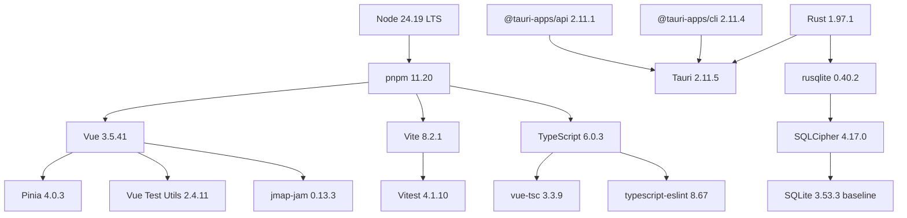
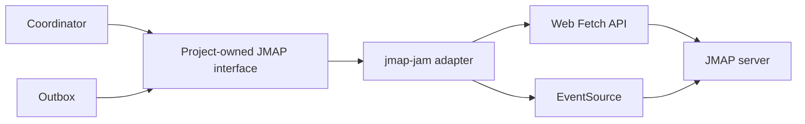
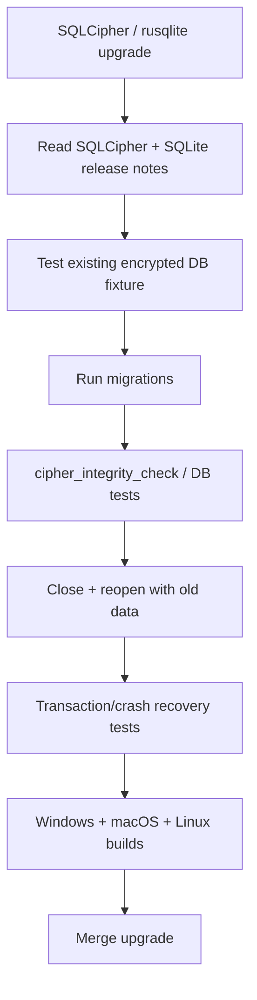

# Secure, Compatible Version Baseline for the Tauri Mail Client

## Executive summary

As of **August 13, 2026**, I would freeze the project on a deliberately conservative combination: **Node 24 LTS, pnpm 11, Vue 3.5, Vite 8, TypeScript 6, Tauri 2.11, Rust 1.97.1, rusqlite 0.40.2, and SQLCipher 4.17.0**. This avoids current pre-release lines such as Vue 3.6 RC and pnpm 12 RC while retaining current security fixes. Node 24.19.0 is the current LTS shown by Node.js; Node 24.18.1 was a security release addressing multiple high- and medium-severity CVEs, so the later 24.19.0 baseline includes those fixes. citeturn27search2turn27search4

The most important compatibility finding is on the database side: **do not use rusqlite's bundled SQLCipher for this project yet**. rusqlite 0.40.2 is current, but its bundled SQLCipher path trails the current SQLCipher release. SQLCipher 4.17.0 is based on SQLite 3.53.3 and contains both upstream security fixes and SQLCipher-specific hardening. Therefore I recommend `rusqlite 0.40.2` with the **external/system `sqlcipher` feature**, while provisioning and asserting SQLCipher 4.17.0 ourselves. citeturn9search2turn10search0turn9search4turn9search5

The frontend stack is unusually clean right now. Vue's latest stable line is **3.5.41** while 3.6 remains RC; Pinia is **4.0.3** and explicitly peers with Vue `^3.5.11` and TypeScript `>=5.6`; `vue-tsc 3.3.9` accepts TypeScript `>=5`; and `typescript-eslint 8.67.0` supports TypeScript `<6.1.0` and ESLint 10. This makes **TypeScript 6.0.3 + Vue 3.5.41 + Pinia 4.0.3 + ESLint 10.8.1** a coherent combination. citeturn19search0turn31view0turn30view1turn18search1turn17search2

For JMAP, because your agreed architecture places protocol/network work in TypeScript, my preferred external client candidate is **`jmap-jam 0.13.3`**, not a Rust client. It is strongly typed, supports RFC 8620/8621, batching/result references, uses the Fetch API, and includes an EventSource connection API while keeping a very small dependency surface. The alternative `jmap-kit 1.0.3` has stronger validation infrastructure but explicitly lists built-in EventSource handling as future work, which is a material mismatch with your push-driven sync architecture. citeturn30view0turn25view2turn25view1turn26view1

The baseline I would actually commit is:

| Layer | Recommended baseline |
|---|---|
| Node.js | **24.19.0 LTS** |
| pnpm | **11.20.0** |
| Vue | **3.5.41** |
| Vite | **8.2.1** |
| TypeScript | **6.0.3** |
| Pinia | **4.0.3** |
| DOMPurify | **3.4.13** |
| Tauri Rust crate | **2.11.5** |
| `@tauri-apps/api` | **2.11.1** |
| `@tauri-apps/cli` | **2.11.4** |
| Rust | **1.97.1** |
| rusqlite | **0.40.2** |
| SQLCipher | **4.17.0** |
| SQLCipher SQLite baseline | **3.53.3** |
| JMAP TS candidate | **jmap-jam 0.13.3** |
| Tokio | **do not add directly yet** |

The versions of Tauri's Rust crate, JS API and CLI intentionally do **not** have identical patch numbers. Tauri releases those artifacts independently; current official release data shows core `2.11.5`, npm API `2.11.1`, and npm CLI `2.11.4`. They should be pinned to their actual current stable releases rather than artificially synchronized. citeturn1view0



This dependency relationship is based on the current release and peer-dependency metadata discussed below. citeturn1view0turn19search0turn31view0turn30view1turn30view0turn9search2turn9search4

## Recommended package pins

### Frontend and development stack

| Package/tool | Pin | Role | Recommendation |
|---|---:|---|---|
| Node.js | **24.19.0** | Dev runtime | Pin current LTS, not Node 26 Current. Node 24 remains the conservative tooling line and incorporates the July 2026 security fixes. citeturn0search2turn27search2turn27search4 |
| pnpm | **11.20.0** | Package manager | Stable documented pnpm 11 baseline; includes package-substitution and malicious-lockfile hardening. Do not adopt pnpm 12 while it is RC. citeturn17search0turn17search3 |
| Vue | **3.5.41** | UI framework | Latest stable found; 3.6.0-rc.3 is still prerelease. Stay on stable 3.5 for MVP. citeturn19search0 |
| Pinia | **4.0.3** | Application state | Current v4 package. Requires Vue `^3.5.11`; therefore 3.5.41 fits. citeturn31view0 |
| `@vue/devtools-api` | **8.1.5** | Required Pinia peer | Pin at Pinia's declared compatible floor initially; update together with Pinia. citeturn31view0 |
| Vite | **8.2.1** | Dev/build | Stable Vite 8 line; Node 24 satisfies Vite 8's Node requirements. citeturn2search1turn5search0 |
| `@vitejs/plugin-vue` | **6.0.8** | Vue SFC compiler integration | Current official Vue plugin for Vite. citeturn21search0 |
| TypeScript | **6.0.3** | Language/compiler | Current stable; compatible with the current type-check/lint tool ranges. citeturn2search2turn18search1turn30view1 |
| `vue-tsc` | **3.3.9** | `.vue` type checking | Current source package accepts TypeScript `>=5.0`, and its own development dependency tracks current TypeScript. citeturn30view1 |
| DOMPurify | **3.4.13** | Email HTML sanitizer | Use latest hardened patch. Several 3.4.x releases addressed sanitizer bypass/hardening issues, making exact patch pinning particularly important. citeturn3search1 |
| Vitest | **4.1.10** | TS/unit tests | Current stable 4.x; Vitest 5 is still RC, so do not move the MVP to it. citeturn4search0turn4search3 |
| `@vue/test-utils` | **2.4.11** | Vue component tests | Current Vue 3 Test Utils release. citeturn3search2 |
| ESLint | **10.8.1** | Linting | Current stable. `typescript-eslint` explicitly supports ESLint 10. citeturn4search1turn18search1 |
| `typescript-eslint` | **8.67.0** | TypeScript lint integration | Current release and officially supports ESLint 10 plus TypeScript `<6.1.0`, which includes 6.0.3. citeturn17search2turn18search1turn28search1 |
| `eslint-plugin-vue` | **10.10.0** | Vue lint rules/parser integration | Current official Vue ESLint plugin; use its flat config. citeturn21search1turn18search0 |
| Prettier | **3.9.6** | Formatting | Current stable. Keep formatting separate from semantic lint rules. citeturn4search2 |
| `@tauri-apps/api` | **2.11.1** | TS↔Tauri API | Current Tauri JS API release. citeturn1view0 |
| `@tauri-apps/cli` | **2.11.4** | Desktop build/dev CLI | Current npm CLI release. citeturn1view0 |
| `jmap-jam` | **0.13.3** | JMAP client candidate | Preferred TS candidate; typed RFC 8620/8621 client, Fetch/ESM compatible, includes EventSource API. Exact pin because it remains pre-1.0. citeturn30view0turn25view2 |

One frontend choice deserves emphasis: **do not use Vue 3.6 RC merely because it is newer**. Vue 3.6 introduces a substantial reactivity refactor and Vapor Mode work and remains explicitly marked prerelease; Vue 3.5.41 is the current stable release. The project gains nothing by making the MVP an early adopter here. citeturn19search0

TypeScript 6.0.3 is less risky than its major-version number might suggest for this exact stack. Current `typescript-eslint` supports `>=4.8.4 <6.1.0`, Pinia requires TypeScript `>=5.6.0` when TypeScript is present, and `vue-tsc 3.3.9` declares TypeScript `>=5.0.0`. That creates an explicitly overlapping supported range containing 6.0.3. citeturn18search1turn31view0turn30view1

### Native stack

| Package/tool | Pin | Recommendation |
|---|---:|---|
| Rust toolchain | **1.97.1** | Pin this exact compiler. 1.97.1 is the current stable patch and fixes issues in 1.97.0, including compiler/security corrections. citeturn6search3turn6search9 |
| `rustfmt` | **from Rust 1.97.1** | Manage as a rustup component, not a separately versioned dependency. citeturn6search9 |
| `clippy` | **from Rust 1.97.1** | Same toolchain as the compiler; CI should reject warnings. citeturn6search9 |
| `tauri` | **2.11.5** | Current core release. Tauri 2's ecosystem has a much lower MSRV, so Rust 1.97.1 is comfortably inside the supported range. citeturn1view0turn8search3 |
| `rusqlite` | **0.40.2** | Preferred SQLite API for this architecture. Small synchronous abstraction; avoid adding an async pool when all persistent operations are mediated by a local Rust engine. citeturn9search2turn10search0 |
| SQLCipher | **4.17.0** | Current SQLCipher release; provision externally rather than use rusqlite's older bundled SQLCipher snapshot. citeturn9search4turn9search5turn10search0 |
| SQLite via SQLCipher | **3.53.3** | This is SQLCipher 4.17.0's upstream baseline. Do not independently link a different SQLite into the same DB layer. citeturn9search4 |
| Standalone SQLite reference | **3.53.4** | Current upstream SQLite, useful as reference only; the encrypted runtime should follow SQLCipher's baseline. citeturn9search0 |
| `serde` | **1.0.228** | Minimal serialization dependency for typed Tauri command payloads. citeturn16search3 |
| `thiserror` | **2.0.20** | Recommended for typed native error boundaries instead of ad-hoc strings. citeturn16search1 |
| Tokio | **none directly** | Do not add until native code actually needs an async runtime. Tauri already uses Tokio internally and JMAP remains TypeScript-side. citeturn7search0turn16search0 |

I would choose **rusqlite over SQLx** for the first implementation. Your Local Engine is intentionally a small command-driven transactional store, not a remote concurrent SQL service. rusqlite offers direct SQLite/SQLCipher control without forcing an async database pool or runtime into your own API. The critical issue is its linking mode, not its query API. citeturn10search0

For secure-store access there are two viable strategies. The simpler bootstrap is `keyring 4.1.6`; however the project's own current guidance says applications wanting control over the credential stores should use `keyring-core` plus the platform-specific implementations instead of relying on the wrapper's choice. The corresponding current implementations are `keyring-core 1.0.0`, `apple-native-keyring-store 1.0.2`, `windows-native-keyring-store 1.1.0`, and `zbus-secret-service-keyring-store 1.0.0`. citeturn13search0turn15search11turn15search7turn15search0turn15search1turn15search2

For this project's security model I favor the **explicit platform-store form before release**, because it makes it obvious what is responsible for the SQLCipher DEK on each platform:

```toml
[target.'cfg(target_os = "macos")'.dependencies]
apple-native-keyring-store = "=1.0.2"

[target.'cfg(target_os = "windows")'.dependencies]
windows-native-keyring-store = "=1.1.0"

[target.'cfg(target_os = "linux")'.dependencies]
zbus-secret-service-keyring-store = "=1.0.0"

[dependencies]
keyring-core = "=1.0.0"
```

The Linux adapter needs special validation because the Secret Service implementation has runtime/crypto feature choices and Linux desktop environments do not all provide identical secret-service behavior. That is a release-engineering concern rather than a reason to weaken the design. citeturn15search2turn15search12

## Platform compatibility matrix

Tauri does not ship a Chromium runtime on all three desktop platforms. It intentionally uses **operating-system WebViews**: Edge WebView2 on Windows, WKWebView/WebKit on macOS, and WebKitGTK on Linux. The current Tauri codebase uses `webview2-com` on Windows, Apple's WebKit APIs on macOS, and WebKitGTK bindings with the `v2_40` API level on Linux. citeturn27search0turn27search7turn27search9turn7search0

| OS | Tauri rendering engine | Recommended project baseline | Rust | Tauri | DB runtime | Status |
|---|---|---|---:|---:|---|---|
| **Windows** | Microsoft Edge **WebView2** | Windows 10/11 with Evergreen WebView2 maintained by OS/runtime updater | 1.97.1 | 2.11.5 | rusqlite 0.40.2 → SQLCipher 4.17.0 → SQLite 3.53.3 | **SUPPORTED**. Tauri explicitly uses WebView2; current Windows 10 versions normally already contain it. citeturn27search0turn7search0 |
| **macOS** | **WKWebView** / system WebKit | Current supported macOS with security updates | 1.97.1 | 2.11.5 | same | **SUPPORTED**, but exact minimum OS is **OPEN** until product policy is chosen. Tauri inherits the OS WebKit version. citeturn27search7turn27search9turn7search0 |
| **Linux** | **WebKitGTK** | Supported desktop distro with WebKitGTK 4.1/API level compatible with current Tauri/Wry requirements | 1.97.1 | 2.11.5 | same | **SUPPORTED**, but exact distro/minimum WebKit patch set is **OPEN**. Current Tauri source requests WebKitGTK API `v2_40`. citeturn7search0turn27search9 |

This means the app cannot genuinely “pin the browser” in `package.json`. Windows WebView2 Evergreen, macOS WKWebView, and Linux WebKitGTK are external runtime dependencies whose security versions are ultimately controlled by the host OS/distribution. Tauri's own process model explicitly describes the WebView as an OS-provided rendering process. citeturn27search7

There is a related Vite issue worth resolving consciously. Vite 8's default production baseline targets contemporary browsers including Edge/Chromium 111+ and Safari 16.4+. A Tauri application that intends to support older operating systems should **not simply inherit that browser assumption by accident**; select the minimum supported OSes first, then set an explicit Vite build target and test those actual WebViews. citeturn5search17

So I would record this as:

> **OPEN — Minimum desktop OS versions.**  
> Before the first public binary, define a minimum Windows, macOS and Linux support policy and turn it into an E2E WebView test matrix.

The database column deserves a second clarification. SQLite upstream is now at 3.53.4, but SQLCipher 4.17.0 incorporates SQLite 3.53.3. For this project the authoritative encrypted database version therefore becomes:

```text
rusqlite 0.40.2
        │
        │ sqlcipher feature
        ▼
SQLCipher 4.17.0
        │
        └── SQLite 3.53.3
```

Do **not** interpret SQLite 3.53.4 being newer as a reason to link both libraries or overwrite SQLCipher's SQLite amalgamation. The SQLCipher release is the relevant encrypted-database unit. citeturn9search0turn9search4turn10search0

## Security advisories and gaps

The selected baseline was chosen specifically to sit **after** several recent security fixes.

| Component | Relevant issue/advisory | Position of chosen baseline |
|---|---|---|
| **Node.js** | Node 24.18.1 on July 29, 2026 fixed high-severity HTTP/2 and permission-model issues plus several medium/low CVEs. | **24.19.0 is later** and is the current LTS shown by Node.js. citeturn27search4turn27search2 |
| **pnpm** | pnpm fixed repository `.npmrc` environment-variable secret exposure in 11.5.3; later 11.x releases fixed path traversal and 11.20 hardened cross-registry package substitution and malicious lockfile handling. | **11.20.0 contains these fixes**. citeturn17search0 |
| **Tauri** | Older Tauri/Wry versions had an iframe IPC origin-bypass advisory allowing script-enabled subframes to reach IPC under affected conditions. The fix introduced stronger iframe isolation/invoke-key protection. | **Tauri 2.11.5 is far beyond the patched line**, but capabilities and sandboxed email rendering remain mandatory defense in depth. citeturn27search1turn1view0 |
| **DOMPurify** | The 3.4 series has received multiple security/hardening fixes; 3.4.5 was explicitly a security fix for a sanitizer bypass and later releases added further clobbering/hook protections. | Pin **3.4.13**, not a loose `^3.4.x` baseline. citeturn3search1 |
| **Rust** | Rust 1.97.1 is a corrective stable patch over 1.97.0 and includes compiler/security fixes. | Pin **1.97.1**, never simply `1.97`. citeturn6search3turn6search9 |
| **SQLite** | SQLite's 3.53 line fixed a WAL-reset corruption issue; subsequent 3.53.x releases addressed regressions. | SQLCipher 4.17.0 incorporates SQLite 3.53.3; appropriate for the encrypted engine. citeturn9search0turn9search4 |
| **SQLCipher** | Recent SQLCipher releases incorporated upstream SQLite security fixes and fixed SQLCipher-specific CSPRNG/thread-safety issues; earlier releases also fixed a defensive-mode bypass. | **4.17.0** is the appropriate current line. citeturn9search4turn9search5turn9search7 |
| **rusqlite** | 0.40.1 fixed SQL injection when attacker-tainted values were used as SAVEPOINT names. | **0.40.2 includes the fix**. citeturn9search2 |
| **ESLint** | Recent ESLint 10 patches include performance/regex hardening fixes. | Use **10.8.1**, not an earlier 10.x lock. citeturn4search1 |

There are four remaining security/compatibility gaps I would explicitly document rather than pretend are solved.

**OPEN — SQLCipher packaging.** rusqlite's current bundled SQLCipher source is behind SQLCipher 4.17.0. Therefore the secure choice creates a build-system responsibility: provision SQLCipher 4.17.0 consistently on Windows, macOS and Linux and link rusqlite against it. The repository should not switch to `bundled-sqlcipher` merely because it makes local builds easier. citeturn9search2turn10search0turn9search4

**OPEN — Minimum WebView versions.** The actual browser engine is outside Cargo/pnpm locking. OS patch level therefore becomes part of your security support policy. Windows should use Evergreen WebView2, macOS requires a supported patched macOS/WebKit, and Linux requires a supported WebKitGTK package from the chosen distributions. citeturn27search0turn27search7turn27search9

**OPEN — Linux secret-store behavior.** Secret Service is the correct abstraction for mainstream Linux desktops, but its availability and unlock behavior must be tested on the exact distros you intend to support. The keyring ecosystem provides the zbus Secret Service implementation, but that does not guarantee every Linux environment has a usable keyring daemon. citeturn15search2turn15search12

**OPEN — JMAP client adoption.** `jmap-jam 0.13.3` looks architecturally better aligned than the alternatives I inspected, but it is still a pre-1.0 package. Before making it part of the frozen architecture, run your planned conformance spike against Stalwart for `Session`, `Mailbox/query`, `Mailbox/get`, `Email/query`, `Email/get`, `*/changes`, batching/result references, `EmailSubmission`, and EventSource reconnect behavior. citeturn30view0turn25view2

This last point is important because a JMAP library should remain an **implementation detail behind your JMAP adapter**, not become your domain model. That makes replacement feasible if the conformance spike exposes a protocol or error-taxonomy mismatch.

## JMAP and minimal dependency choices

### Preferred JMAP approach

For the architecture you have already settled on, I would rank the options this way:

| Option | Version | Fit | Assessment |
|---|---:|---|---|
| **jmap-jam** | **0.13.3** | TypeScript/WebView | **Preferred candidate.** Typed JMAP Core/Mail, batching/result references, Fetch, ESM, EventSource connection API, small runtime surface. citeturn30view0turn25view2 |
| **jmap-kit** | **1.0.3** | TypeScript/WebView | Strong typed/validation design, but built-in EventSource connection management is explicitly still on its roadmap. Not ideal for your current sync design. citeturn25view1turn26view1 |
| **linagora/jmap-client-ts** | current repo | TypeScript/WebView | Implements Mailbox, Email, Thread and EmailSubmission and has Fetch transport, but the inspected API does not give us the same explicit push fit. citeturn25view0 |
| **stalwart `jmap-client`** | **0.4.1** | Rust | Mature Rust alternative/full JMAP implementation, but adopting it would move protocol networking into Rust and conflict with the present architecture. citeturn23search1turn23search5 |
| Handwritten thin client | project-owned | TypeScript/WebView | Viable because JMAP is HTTP/JSON, but unnecessary until the library spike shows a real problem. |

`jmap-jam` also explicitly supports `connectEventSource()`, whereas `jmap-kit` currently says EventSource connection management is planned and only URL generation exists. That is the decisive difference for a design where `StateChange → Coordinator → SyncPort` is central. citeturn25view2turn25view1

I would wrap whichever library wins behind something approximately this small:

```text
src/jmap/
├── client/
│   ├── jmap-client.ts
│   └── jmap-session.ts
├── transport/
├── errors/
└── types/
```



The benefit is that **Coordinator and Outbox depend on your semantics**, while `jmap-jam` remains replaceable. Its 0.x version then becomes substantially less risky architecturally.

### Minimal npm set

The initial application does not need Axios, RxJS, TanStack Query, Lodash, an ORM, a router framework, or a component framework. Native `fetch`, Vue, Pinia, and your repository ports already cover those responsibilities.

The minimal set I would commit is:

```json
{
  "dependencies": {
    "@tauri-apps/api": "2.11.1",
    "@vue/devtools-api": "8.1.5",
    "dompurify": "3.4.13",
    "jmap-jam": "0.13.3",
    "pinia": "4.0.3",
    "vue": "3.5.41"
  },
  "devDependencies": {
    "@tauri-apps/cli": "2.11.4",
    "@vitejs/plugin-vue": "6.0.8",
    "@vue/test-utils": "2.4.11",
    "eslint": "10.8.1",
    "eslint-plugin-vue": "10.10.0",
    "prettier": "3.9.6",
    "typescript": "6.0.3",
    "typescript-eslint": "8.67.0",
    "vite": "8.2.1",
    "vitest": "4.1.10",
    "vue-tsc": "3.3.9"
  }
}
```

Those versions correspond to current stable packages and compatible peer ranges in the primary release/package metadata reviewed above. citeturn1view0turn19search0turn31view0turn21search0turn21search1turn30view1turn18search1turn3search1turn4search0turn3search2

I would **not add `jmap-jam` in the very first bootstrap commit** unless you are immediately starting JMAP work. There is no benefit to having a dependency merely sitting unused. Freeze it as the preferred candidate in `stack.md`; add it when the JMAP conformance spike starts.

### Minimal Rust set

For the first real Local Engine:

```toml
[dependencies]
tauri = { version = "=2.11.5" }
rusqlite = { version = "=0.40.2", features = ["sqlcipher"] }
serde = { version = "=1.0.228", features = ["derive"] }
thiserror = "=2.0.20"
```

Then add the OS secret-store dependencies when the DEK lifecycle is implemented. `tokio` should **not** appear in your direct dependencies merely because Tauri itself uses it. Add it only if application-owned Rust code acquires a genuine async requirement. Current Tauri internally depends on Tokio 1.x, but that does not require your crate to expose it as part of its own architecture. citeturn7search0turn16search0

Likewise I would initially avoid `serde_json` unless code actually manipulates generic JSON values. Typed Tauri command arguments can be serialized through Serde without making generic JSON your native-domain representation.

## Upgrade and migration policy

The lock should not mean “never upgrade.” It should mean **upgrades happen as intentional PRs with evidence**.

For npm dependencies, exact direct pins plus `pnpm-lock.yaml` give you a reviewable resolution. pnpm 11 also introduced supply-chain protections such as a default package publication-age delay and blocking exotic transitive dependencies, while later 11.x releases hardened repository-controlled configuration and lockfile behavior. Keep those protections enabled rather than weakening them for convenience. citeturn0search9turn17search0

I would classify upgrades into three risk classes:

| Upgrade | Required validation |
|---|---|
| Patch: Vue `3.5.41 → 3.5.42`, Tauri `2.11.5 → 2.11.6` | CI + E2E smoke on all OSes |
| Minor/tooling: Vite `8.2 → 8.3`, pnpm `11.20 → 11.21` | CI + lockfile review + build on all OSes |
| Major: Vue 3.6 stable, Vite 9, TypeScript 7, pnpm 12, Tauri 3 | Explicit upgrade PR + migration notes + conformance/E2E suite |

Vue itself recommends care around minor compiler/runtime coupling; for a TypeScript-heavy application, keeping compiler/runtime pieces on a deliberately validated line is preferable to broad floating ranges. citeturn5search1

Do not upgrade to **Vue 3.6 RC** or **pnpm 12 RC** in the MVP. Vue 3.6 currently contains a major reactivity implementation change and new Vapor behavior, while pnpm 12 is a Rust rewrite still described as release-candidate software. Both are interesting later, but neither solves a current product requirement. citeturn19search0turn17search3

Vite 8 itself was already a meaningful change because it moved its build internals to Rolldown/Oxc. It is stable now, but future Vite major updates deserve a build/test pass rather than blind automated merging. citeturn5search0turn5search4

The **database upgrade rule should be stricter than frontend dependencies**:



This matters because SQLite/SQLCipher versions define the persistence substrate rather than merely developer tooling. SQLCipher releases can change the embedded SQLite baseline, cipher behavior and migration considerations. citeturn9search4turn9search5

Before you ever have real user DBs, upgrades are cheap. After release, preserve encrypted DB fixtures created by previous app versions and require all future database releases to open and migrate them.

## Repository pinning, CI, and local setup

### Files to commit

I would create:

**`.node-version`**

```text
24.19.0
```

Node 24.19.0 is the current LTS baseline found in the official Node release pages. citeturn27search2

**`package.json`**

```json
{
  "packageManager": "pnpm@11.20.0",
  "engines": {
    "node": "24.19.0",
    "pnpm": "11.20.0"
  }
}
```

pnpm 11 supports Node 24; pnpm 11's compatibility floor is lower, so Node 24.19.0 is safely within its supported runtime range. citeturn0search3turn17search0

**`rust-toolchain.toml`**

```toml
[toolchain]
channel = "1.97.1"
profile = "minimal"
components = ["rustfmt", "clippy"]
```

Rust 1.97.1 is current stable and is well above Tauri 2's documented 1.77.2 MSRV. citeturn6search9turn8search3

### Installation commands

With pnpm already available:

```bash
pnpm add -E \
  vue@3.5.41 \
  pinia@4.0.3 \
  @vue/devtools-api@8.1.5 \
  dompurify@3.4.13 \
  @tauri-apps/api@2.11.1
```

Add JMAP when its spike begins:

```bash
pnpm add -E jmap-jam@0.13.3
```

Development tooling:

```bash
pnpm add -D -E \
  vite@8.2.1 \
  @vitejs/plugin-vue@6.0.8 \
  typescript@6.0.3 \
  vue-tsc@3.3.9 \
  vitest@4.1.10 \
  @vue/test-utils@2.4.11 \
  eslint@10.8.1 \
  eslint-plugin-vue@10.10.0 \
  typescript-eslint@8.67.0 \
  prettier@3.9.6 \
  @tauri-apps/cli@2.11.4
```

The package choices and compatibility ranges are supported by the current Vue, Vite, Tauri, TypeScript and lint-tool metadata. citeturn19search0turn1view0turn30view1turn18search1turn21search0turn21search1

Cargo:

```bash
cd src-tauri

cargo add tauri@=2.11.5
cargo add rusqlite@=0.40.2 --features sqlcipher
cargo add serde@=1.0.228 --features derive
cargo add thiserror@=2.0.20
```

The critical caveat is that `rusqlite --features sqlcipher` expects the external SQLCipher library; it does **not** by itself guarantee SQLCipher 4.17.0. Provisioning that native dependency has to be encoded in your platform setup/build scripts. citeturn10search0turn9search4

### Runtime database assertion

I would put this into the Local Engine integration suite immediately:

```sql
SELECT sqlite_version();
SELECT sqlcipher_version();
```

and assert:

```text
SQLite:    3.53.3
SQLCipher: 4.17.0
```

This turns a potentially invisible linker mistake into an immediate failing test. SQLCipher 4.17.0's published SQLite baseline is 3.53.3. citeturn9search4

It also catches the particularly dangerous error where a developer believes the program is using SQLCipher but the binary has actually linked against ordinary SQLite.

### Standard scripts

I recommend turning `package.json` into the single human-facing command interface:

```json
{
  "scripts": {
    "dev": "tauri dev",
    "build": "vue-tsc --noEmit && tauri build",

    "typecheck": "vue-tsc --noEmit",

    "test": "vitest run",
    "test:watch": "vitest",

    "test:rust": "cargo test --locked --manifest-path src-tauri/Cargo.toml",

    "lint": "eslint .",
    "lint:rust": "cargo clippy --locked --manifest-path src-tauri/Cargo.toml --all-targets -- -D warnings",

    "format": "prettier --write .",
    "format:check": "prettier --check .",
    "format:rust": "cargo fmt --manifest-path src-tauri/Cargo.toml --check",

    "check": "pnpm format:check && pnpm typecheck && pnpm lint && pnpm test && pnpm format:rust && pnpm lint:rust && pnpm test:rust"
  }
}
```

`vue-tsc` is the official Vue language-tools command-line type-check path; the current package is 3.3.9 and supports TypeScript 6 through its `>=5.0.0` peer constraint. citeturn17search1turn30view1

### CI enforcement

Each PR should at minimum execute:

```bash
node --version
pnpm --version
rustc --version

pnpm install --frozen-lockfile

pnpm typecheck
pnpm format:check
pnpm lint
pnpm test

cargo fmt \
  --manifest-path src-tauri/Cargo.toml \
  --check

cargo clippy \
  --locked \
  --manifest-path src-tauri/Cargo.toml \
  --all-targets \
  -- -D warnings

cargo test \
  --locked \
  --manifest-path src-tauri/Cargo.toml
```

pnpm's frozen-lockfile behavior is specifically suited to CI because it refuses an install when the manifest and lockfile disagree rather than silently regenerating dependency resolution. citeturn0search15

Once SQLCipher is wired, CI should add:

```text
db opens encrypted
↓
expected SQLCipher version
↓
expected SQLite baseline
↓
migrations run
↓
transaction tests
↓
close
↓
reopen
↓
data intact
```

And CI should build the native application on **all three desktop families**, because WebView and native-linker behavior is intrinsically platform-specific in Tauri. Tauri uses WebView2 on Windows and the corresponding system WebKit implementations on macOS/Linux. citeturn27search0turn27search7turn27search9

### Security-oriented pnpm settings

I would preserve pnpm 11's supply-chain hardening rather than disabling it. pnpm 11 introduced a default package release-age delay and blocking of exotic transitive dependencies; later releases fixed environment-variable leakage from repository-controlled config, path traversal, lockfile attacks, and cross-registry substitution. citeturn0search9turn17search0

A security-conscious repository should therefore avoid exceptions such as:

```text
minimumReleaseAge = 0
trust everything
allow arbitrary install scripts
disable frozen lockfile in CI
```

unless a specific package has been reviewed and documented.

### Local development checklist

A new developer's environment is healthy when these conditions hold:

- `.node-version` resolves to **24.19.0**, `package.json#packageManager` resolves to **pnpm 11.20.0**, and `rustup show` selects **Rust 1.97.1** inside the repository. citeturn27search2turn17search0turn6search9
- `pnpm install --frozen-lockfile` succeeds without rewriting `pnpm-lock.yaml`; Cargo commands with `--locked` do not alter `Cargo.lock`. pnpm explicitly treats lockfile mismatch as an error in CI. citeturn0search15
- Tauri's OS prerequisites are installed. On Windows that means WebView2 plus the required native build tooling; on Linux it includes the WebKitGTK/system development packages required by Tauri. citeturn27search0
- `pnpm check` passes before opening a PR.
- The application does not silently fall back from SQLCipher to plaintext SQLite.
- Database integration tests assert `sqlcipher_version()` and `sqlite_version()`.
- The production app never uses test/mock secret-store backends. The keyring project explicitly distinguishes test/sample stores from secure native credential stores. citeturn15search7
- No JMAP token, SQLCipher DEK, bearer authorization header or email credential is logged.
- Email HTML continues to cross DOMPurify and the sandboxed rendering boundary even though DOMPurify itself is current; the Tauri iframe IPC advisory demonstrates why untrusted frames and privileged IPC must remain separate. citeturn3search1turn27search1
- Windows WebView2 and host OSes remain patched. A lockfile cannot freeze or secure the WebView runtime because Tauri deliberately relies on OS WebViews. citeturn27search0turn27search7

The practical outcome is a development environment with **four explicit reproducibility anchors**:

```text
.node-version
      │
      └── Node 24.19.0

package.json + pnpm-lock.yaml
      │
      └── pnpm 11.20.0 + exact npm packages

rust-toolchain.toml + Cargo.lock
      │
      └── Rust 1.97.1 + exact Rust graph

native dependency provisioning
      │
      └── SQLCipher 4.17.0 / SQLite 3.53.3
```

The first three are straightforward. The fourth—**reproducibly supplying SQLCipher 4.17.0 to all three desktop targets—is the only significant unresolved dependency-management problem in the baseline**. I would solve that before implementing meaningful persistence, because accepting rusqlite's older bundled SQLCipher solely for build convenience would undermine the very reason the project chose SQLCipher. citeturn10search0turn9search4turn9search5

### Priority source set

The sources I would keep linked from `docs/development/stack.md` rather than documenting versions from memory are the [Tauri release index](https://v2.tauri.app/release/), [Tauri prerequisites](https://v2.tauri.app/start/prerequisites/), [Node.js release index](https://nodejs.org/en/about/previous-releases), [pnpm release blog](https://pnpm.io/blog), [Vue releases](https://github.com/vuejs/core/releases), [Vite releases](https://github.com/vitejs/vite/releases), [TypeScript releases](https://github.com/microsoft/TypeScript/releases), [SQLCipher release notes](https://www.zetetic.net/sqlcipher/), [SQLite changes](https://sqlite.org/changes.html), [rusqlite releases](https://github.com/rusqlite/rusqlite/releases), and [Rust releases](https://github.com/rust-lang/rust/releases). Those sources establish the major runtime and compatibility decisions above. citeturn1view0turn27search0turn0search2turn17search0turn19search0turn2search1turn2search2turn9search4turn9search0turn9search2turn6search3