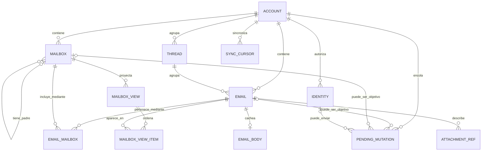

# Modelo de dominio local del cliente

## 1. Alcance y criterio de modelado

Este documento define el modelo que vive en el SQLite local del cliente. No modela el servidor, su base de datos, su acceso al proveedor real ni sus interfaces IMAP/SMTP.

El modelo sigue la semántica de JMAP porque JMAP es el único protocolo entre este cliente y el servidor propio. La compatibilidad IMAP existe detrás del servidor y no introduce UIDs, carpetas IMAP ni reglas de traducción en el cliente.

La fuente de verdad para cada lectura de la interfaz es el SQLite local cifrado con SQLCipher. El servidor sigue siendo la autoridad remota: sus cambios se proyectan en SQLite mediante sincronización, mientras que las acciones del usuario se representan primero de forma local y se sincronizan después. Una ausencia local nunca autoriza a la UI a consultar la red directamente.

Se usan cuatro marcas de autoridad:

*   **`[SERVIDOR → LOCAL]`:** dato emitido por JMAP y proyectado localmente. La UI puede leerlo, pero no editarlo por sí sola.
*   **`[LOCAL → SERVIDOR]`:** dato respaldado por el servidor que el cliente puede cambiar de forma optimista. El cambio local y su `PendingMutation` deben persistirse juntos.
*   **`[SOLO LOCAL]`:** dato operativo del cliente que no se publica como entidad del servidor.
*   **`[DERIVADO]`:** dato reconstruible a partir de otras filas locales.

Los nombres de campos descritos aquí son semánticos, no un esquema SQL definitivo. Tipos SQL, claves sustitutas, índices, nombres físicos, estrategia de migraciones y serialización exacta quedan **[PENDIENTE]**.

## 2. Vista de relaciones

La relación `Email`–`Mailbox` es N:M. Un correo JMAP puede pertenecer a varias carpetas sin duplicarse. `MailboxView` no reemplaza esa relación: conserva una ventana ordenada de resultados para responder rápidamente a la vista actual y poder aplicar `Email/queryChanges`.

## 3. Entidades proyectadas desde JMAP

### 3.1 Account

Representa una cuenta JMAP accesible durante la sesión. Es la raíz de pertenencia de mailboxes, identidades, mensajes, cursores y mutaciones.

**Campos mínimos**

*   `accountId` — **`[SERVIDOR → LOCAL]`**. Identificador JMAP estable dentro de la sesión.
*   `name` — **`[SERVIDOR → LOCAL]`**. Nombre presentado por el servidor.
*   `isPersonal` — **`[SERVIDOR → LOCAL]`**, si la sesión JMAP lo suministra.
*   `isReadOnly` — **`[SERVIDOR → LOCAL]`**, si aplica.
*   `capabilities` y límites necesarios — **`[SERVIDOR → LOCAL]`**. Solo se persiste lo que el bloque mínimo necesite para correo y envío; la forma exacta queda **[PENDIENTE]**.

**Invariantes**

*   Ninguna credencial, clave PRF ni clave SQLCipher forma parte de `Account`.
*   Todo registro sincronizable pertenece a una cuenta para evitar mezclar estados o mutaciones entre cuentas.
*   La selección de cuenta actual es estado efímero de Pinia, no autoridad de dominio.

### 3.2 Identity

Representa una identidad autorizada por JMAP para redactar y enviar.

**Campos mínimos**

*   `identityId` — **`[SERVIDOR → LOCAL]`**.
*   `accountId` — **`[SERVIDOR → LOCAL]`** como pertenencia.
*   `name` — **`[SERVIDOR → LOCAL]`**.
*   `email` — **`[SERVIDOR → LOCAL]`**.
*   Los demás campos JMAP requeridos para construir un envío válido — **`[SERVIDOR → LOCAL]`** y **[PENDIENTE]** hasta fijar el alcance exacto del compositor.

**Invariantes**

*   El cliente no inventa una dirección remitente ni asume que cualquier dirección de la cuenta puede enviar.
*   La edición o administración de identidades no forma parte del bloque mínimo.

### 3.3 Mailbox

Representa una carpeta JMAP. Su jerarquía es una relación padre–hijo entre mailboxes; la pertenencia de correos se expresa aparte mediante `EmailMailbox`.

**Campos mínimos**

*   `mailboxId` — **`[SERVIDOR → LOCAL]`**.
*   `accountId` — **`[SERVIDOR → LOCAL]`** como pertenencia.
*   `name` — **`[SERVIDOR → LOCAL]`**.
*   `parentId` — **`[SERVIDOR → LOCAL]`**, anulable para una raíz.
*   `role` — **`[SERVIDOR → LOCAL]`**, por ejemplo inbox, drafts, sent o trash cuando el servidor lo declare.
*   `sortOrder` — **`[SERVIDOR → LOCAL]`**.
*   `totalEmails` y `unreadEmails` — **`[SERVIDOR → LOCAL]`** como contadores proyectados.
*   Derechos necesarios para habilitar o deshabilitar acciones — **`[SERVIDOR → LOCAL]`**; el subconjunto exacto queda **[PENDIENTE]**.

**Invariantes**

*   La organización de mailboxes es JMAP, no IMAP.
*   Crear, renombrar, mover o borrar carpetas está fuera del flujo mínimo y no se especifica aquí.
*   Mover un mensaje significa cambiar su conjunto de `mailboxIds`; no copiar una fila `Email`.

### 3.4 Thread

Representa la agrupación de conversación que entrega JMAP.

**Campos mínimos**

*   `threadId` — **`[SERVIDOR → LOCAL]`**.
*   `accountId` — **`[SERVIDOR → LOCAL]`** como pertenencia.

La lista de mensajes de un hilo puede materializarse mediante la relación `Email.threadId`; duplicarla en otra estructura solo se justificaría por rendimiento y queda **[PENDIENTE]**.

**Invariantes**

*   El cliente no calcula hilos comparando asuntos o cabeceras.
*   El orden de presentación de un hilo es una proyección local, no una nueva autoridad.

### 3.5 Email

Es la entidad central. Conserva metadatos suficientes para listar, buscar dentro del alcance mínimo ya sincronizado y decidir si el cuerpo debe solicitarse en background.

**Identidad y contenido de solo lectura**

*   `emailId` — **`[SERVIDOR → LOCAL]`**. Identificador JMAP del correo confirmado.
*   `accountId` — **`[SERVIDOR → LOCAL]`** como pertenencia.
*   `threadId` — **`[SERVIDOR → LOCAL]`**.
*   `blobId` — **`[SERVIDOR → LOCAL]`**, cuando JMAP lo suministre.
*   `messageId`, `inReplyTo` y `references` — **`[SERVIDOR → LOCAL]`**.
*   `from`, `sender`, `replyTo`, `to`, `cc` y `bcc` — **`[SERVIDOR → LOCAL]`**.
*   `subject`, `sentAt`, `receivedAt`, `size` y `preview` — **`[SERVIDOR → LOCAL]`**.
*   Estructura de partes y el indicador de adjuntos — **`[SERVIDOR → LOCAL]`**.

**Campos mutables de forma optimista**

*   `keywords` — **`[LOCAL → SERVIDOR]`**. Incluye, entre otros, el estado de leído o destacado admitido por JMAP.
*   La pertenencia a mailboxes — **`[LOCAL → SERVIDOR]`**, representada por filas `EmailMailbox`.

**Estado operativo local**

*   `bodyAvailability` — **`[DERIVADO]`** de la presencia de `EmailBody`; si se materializa como columna, debe poder reconstruirse.
*   Marcas locales de actualización o error requeridas para refrescar la UI — **`[SOLO LOCAL]`**; su forma exacta queda **[PENDIENTE]**.

**Invariantes**

*   Un cambio optimista de `keywords` o mailboxes y la creación de su `PendingMutation` ocurren en una sola transacción local. No puede existir una apariencia de éxito sin intención durable de sincronizar.
*   Los campos de cabecera, remitentes, fechas, cuerpo y estructura MIME nunca se editan sobre un correo recibido.
*   Un `emailId` confirmado no se reutiliza para otra cuenta.
*   La política exacta para representar en la lista un envío todavía no confirmado —placeholder optimista o solo estado de Outbox— queda **[PENDIENTE]**.

### 3.6 EmailMailbox

Es la tabla de unión que materializa `Email.mailboxIds`.

**Campos mínimos**

*   `emailId` — referencia a `Email`.
*   `mailboxId` — referencia a `Mailbox`.

La relación es **`[LOCAL → SERVIDOR]`** cuando el usuario mueve, archiva o restaura un correo; fuera de una mutación pendiente es una proyección **`[SERVIDOR → LOCAL]`**.

**Invariantes**

*   La pareja `(emailId, mailboxId)` es única.
*   Añadir o quitar pertenencia localmente exige una `PendingMutation` en la misma transacción.
*   La reconciliación posterior no duplica `Email`, aunque cambie su pertenencia a varias carpetas.

### 3.7 EmailBody

Es la caché opcional del contenido descargado bajo demanda. Su ausencia es un estado normal: permite listar mensajes sin descargar cuerpos pesados.

**Campos mínimos**

*   `emailId` — referencia única a `Email`.
*   `textBody` — **`[SERVIDOR → LOCAL]`**, cuando exista una representación de texto.
*   `htmlBody` — **`[SERVIDOR → LOCAL]`** y siempre considerado contenido no confiable.
*   Datos mínimos para resolver las partes que JMAP identificó — **`[SERVIDOR → LOCAL]`**; la normalización exacta queda **[PENDIENTE]**.
*   `fetchedAt` — **`[SOLO LOCAL]`**, diagnóstico de disponibilidad, no criterio autónomo de verdad remota.

**Invariantes de seguridad**

*   `htmlBody` almacenado no se considera sanitizado ni apto para el DOM.
*   Cada inserción de HTML de correo en el DOM pasa por DOMPurify, incluso si el cuerpo ya se había mostrado antes.
*   La CSP estricta sigue activa como segunda barrera y las imágenes remotas permanecen bloqueadas por defecto.
*   Persistir además una versión sanitizada sería una optimización; su necesidad e invalidación quedan **[PENDIENTE]** y nunca reemplazan la sanitización en la frontera de renderizado.

### 3.8 AttachmentRef

Describe un adjunto o una parte inline sin asumir que su contenido binario ya está descargado.

**Campos mínimos**

*   `emailId` — referencia a `Email`.
*   `partId` y/o `blobId` — **`[SERVIDOR → LOCAL]`**, según la respuesta JMAP.
*   `name`, `mediaType`, `size`, `disposition` y `cid` — **`[SERVIDOR → LOCAL]`** cuando existan.

**Invariantes**

*   Los metadatos pueden vivir en SQLite sin que el binario exista localmente.
*   La política de caché de binarios, límites de tamaño, ubicación y limpieza queda **[PENDIENTE]**. No se presupone que los adjuntos se guarden como BLOB en SQLite.
*   Cargar una imagen remota o una parte inline no permite ejecutar HTML ni eludir DOMPurify/CSP.

## 4. Proyecciones y estado exclusivo del cliente

### 4.1 MailboxView

Representa una consulta ordenada y paginada de una carpeta, necesaria para que `listMessagesForView` responda solo con SQLite y `ensureFolderWindow` pueda mantener una ventana en background.

**Campos mínimos**

*   `viewId` — **`[SOLO LOCAL]`**.
*   `accountId` y `mailboxId` — referencias locales.
*   Identidad semántica de filtro, orden y ventana — **`[SOLO LOCAL]`**; su forma y paginación exactas quedan **[PENDIENTE]**.
*   `queryState` — token **`[SERVIDOR → LOCAL]`** emitido por JMAP para esa consulta.
*   `total` — **`[SERVIDOR → LOCAL]`** cuando la respuesta JMAP lo incluya.
*   Indicador local de cobertura de la ventana — **`[SOLO LOCAL]`**.

**Invariantes**

*   Una vista es una proyección descartable; `Email` y `EmailMailbox` conservan los objetos locales.
*   Si JMAP rechaza el `queryState` o la vista diverge, el cliente puede reconstruir esta proyección sin borrar innecesariamente los correos cacheados.
*   Abrir una carpeta primero devuelve la ventana disponible; completar huecos se agenda en background.

### 4.2 MailboxViewItem

Une una vista con un mensaje y conserva su posición estable dentro de la ventana conocida.

**Campos mínimos**

*   `viewId` — referencia a `MailboxView`.
*   `emailId` — referencia a `Email`.
*   `position` — **`[DERIVADO]`** de la consulta JMAP aplicada localmente.

La clave y la estrategia para desplazar posiciones al aplicar `Email/queryChanges` quedan **[PENDIENTE]**.

### 4.3 SyncCursor

Conserva los tokens necesarios para pedir únicamente cambios incrementales.

**Campos mínimos**

*   `accountId` — ámbito del cursor.
*   `dataType` — **`[SOLO LOCAL]`**; distingue al menos los estados requeridos para Mailbox, Email y vistas de consulta.
*   `state` o `queryState` — **`[SERVIDOR → LOCAL]`**.
*   `lastSuccessfulSyncAt` — **`[SOLO LOCAL]`**.
*   Estado diagnóstico del último intento — **`[SOLO LOCAL]`**; vocabulario exacto **[PENDIENTE]**.

**Invariantes**

*   Un cursor avanza en la misma transacción que aplica completamente los cambios que representa.
*   Si la transacción falla, el cursor anterior se conserva y el lote puede repetirse.
*   Un evento WebSocket `StateChange` es una señal para sincronizar, no un sustituto del cursor ni el contenido del cambio.

### 4.4 PendingMutation

Representa una intención durable creada por el cliente que aún no ha sido confirmada por JMAP. Es la base del Outbox y de las actualizaciones optimistas.

**Campos mínimos**

*   `mutationId` — **`[SOLO LOCAL]`**, único y estable durante todos los reintentos.
*   `accountId` — ámbito obligatorio.
*   `kind` — **`[SOLO LOCAL]`**. El bloque mínimo necesita como mínimo envío, cambio de keywords y cambio de pertenencia a mailboxes.
*   `targetEmailId` — **`[SOLO LOCAL]`**, cuando la mutación actúa sobre un correo ya confirmado.
*   `payload` — **`[SOLO LOCAL]`**. Contiene solo los datos necesarios para traducir la intención a JMAP.
*   `status`, `attemptCount`, `nextAttemptAt` y `lastError` — **`[SOLO LOCAL]`**. Los nombres y estados exactos quedan **[PENDIENTE]**, pero deben distinguir pendiente, en vuelo, fallo reintentable, fallo terminal y confirmada antes de limpieza.
*   `createdAt` y `updatedAt` — **`[SOLO LOCAL]`**.

**Contenido mínimo de una intención de envío**

*   Identidad remitente seleccionada.
*   Destinatarios, asunto y representaciones de cuerpo necesarias.
*   Referencias a adjuntos o partes inline cuando el alcance del compositor las admita.
*   Un identificador local estable que permita correlacionar reintentos y la posterior confirmación.

**Invariantes**

*   Todo el payload queda cifrado en reposo por SQLCipher porque puede contener el correo completo.
*   El procesador toma una mutación de forma exclusiva para impedir dos envíos simultáneos dentro de una misma entrega.
*   Un fallo de transporte no elimina la mutación ni revierte silenciosamente la intención visible.
*   Un fallo terminal queda visible para la UI mediante datos locales; no se oculta como éxito.
*   La estrategia de idempotencia que evita duplicar un envío después de una respuesta perdida queda **[PENDIENTE]** y debe resolverse antes de considerar completo el flujo de producción.
*   La política de conflicto para cambios concurrentes de keywords o mailboxes —rebase, reversión o intervención del usuario— queda **[PENDIENTE]**. La siguiente sincronización siempre vuelve a obtener la autoridad del servidor.

## 5. Redacción antes de pulsar Enviar

El texto que el usuario está editando puede existir temporalmente en el store de composición de Pinia. Al pulsar **Enviar**, el contenido necesario se convierte en una `PendingMutation` durable antes de que la UI informe que quedó encolado.

No se introduce una entidad `Draft` local en este bloque porque la política de autoguardado, recuperación tras cierre y sincronización con el mailbox Drafts no está fijada. Esa decisión queda **[PENDIENTE]**. Si se adopta, deberá añadirse como entidad de dominio y no como uso accidental de `localStorage`.

## 6. Ciclos de vida mínimos

### 6.1 Correo recibido

1.  WebSocket informa un `StateChange`.
2.  El coordinador usa el `SyncCursor` anterior para solicitar `Email/changes` y los `Email/get` necesarios por HTTPS.
3.  En una transacción local se insertan o actualizan `Email`, `EmailMailbox`, `Thread` y las vistas afectadas.
4.  Solo al finalizar se avanza el cursor y se emite una señal de cambio local.
5.  Pinia vuelve a leer mediante Repository; Vue no consume la respuesta JMAP directamente.

### 6.2 Correo abierto

1.  Repository devuelve `Email` y, si existe, `EmailBody` desde SQLite.
2.  Si el cuerpo falta, `ensureMessageBody` registra o agenda el trabajo en background y retorna sin convertir la red en dependencia de la UI.
3.  Cuando JMAP devuelve el cuerpo, el motor lo persiste y notifica el cambio.
4.  La UI vuelve a leer, sanitiza `htmlBody` con DOMPurify y solo entonces lo inserta en el DOM.
5.  Marcar como leído actualiza `keywords` y crea su `PendingMutation` en una transacción local independiente del fetch del cuerpo.

### 6.3 Correo enviado

1.  Pinia entrega la intención a Repository.
2.  El motor guarda la `PendingMutation` de envío cifrada.
3.  El procesador de pendientes traduce la intención a las operaciones estándar de JMAP para crear y enviar el correo.
4.  La confirmación actualiza el estado local y la sincronización posterior incorpora el `Email` autoritativo del servidor.
5.  Sin red, la mutación permanece durable y la UI muestra su estado desde SQLite.

## 7. Límites de persistencia y seguridad

*   Las dos entregas implementan el mismo modelo lógico y las mismas operaciones Repository.
*   Tauri usa SQLite nativo cifrado con SQLCipher; no usa WASM ni OPFS.
*   Web/PWA usa `wa-sqlite` sobre OPFS. La compilación e integración concreta que haga efectivo SQLCipher en esta ruta queda **[PENDIENTE]**; no se acepta como fallback una base de correo en texto plano.
*   La clave derivada mediante WebAuthn PRF no se guarda dentro de la base que desbloquea ni en `localStorage`.
*   En Tauri, cualquier material de credencial persistente usa el keychain nativo conforme a `security.md`; la política exacta de vida de la clave derivada y de la sesión queda **[PENDIENTE]**.
*   El identificador público de una credencial, tokens de sesión u otros metadatos de autenticación solo se persistirán cuando se defina su necesidad y ubicación segura. No forman parte de este modelo de correo.
*   La recuperación de cuenta o del acceso a la base cuando se pierde el passkey sigue **[PENDIENTE]**, tal como establece `security.md`.

## 8. Fuera del bloque mínimo

*   Entidades o lógica del servidor, proveedor real, IMAP o SMTP.
*   Contactos y agenda: no son necesarios para sostener el flujo mínimo; el autocompletado queda fuera hasta que se solicite.
*   Reglas, filtros, calendario, múltiples perfiles de caché y administración de carpetas.
*   Clasificación de spam y embeddings de búsqueda. Compute-at-the-edge queda únicamente como punto de extensión futuro de Fase 2, apagado por defecto; no altera este modelo.
